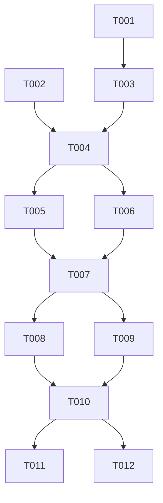

# Implementation Tasks Template

**Feature**: [feature-branch-name]
**Created**: [DATE]
**Total Tasks**: [number]

## Task Tags Legend *(Principle 10-18)*

- **[REFACTOR-DRY]**: 抽取重复逻辑为共享模块的任务 (Principle 10)
- **[SHARED-CREATE]**: 创建新共享组件的任务 (Principle 10)
- **[SHARED-UPDATE]**: 更新已有共享模块的任务 (Principle 10)
- **[SRP]**: 单一职责拆分任务 (Principle 11)
- **[TRANSACTION]**: 需事务保护的任务 (Principle 14)
- **[TEST-COVERAGE]**: 测试覆盖率要求>80%的任务 (Principle 16)
- **[DOC-REQUIRED]**: 需编写JSDoc/README的任务 (Principle 18)
- **[LINT-CONFIG]**: 需配置ESLint规则的任务 (Principle 17)
- **[API-VERSIONING]**: 涉及API版本变更的任务 (Principle 15)
- **[DEPENDENCY-INJECT]**: 需要依赖注入设计的任务 (Principle 12)

## Phase 1: Setup & Infrastructure

### T001: 初始化项目结构
**Description**: [Task description]
**Depends on**: None
**Parallel**: No
**Estimated Time**: [time]
**Task Tags**: [LINT-CONFIG]
**Done When**:
- [ ] [Completion criteria 1]
- [ ] [Completion criteria 2]
- [ ] [Completion criteria 3]
- [ ] ESLint配置完成并验证通过

### T002: [P] 配置开发环境
**Description**: [Task description]
**Depends on**: None
**Parallel**: Yes
**Estimated Time**: [time]
**Done When**:
- [ ] [Completion criteria 1]
- [ ] [Completion criteria 2]

### T003: 数据库初始化
**Description**: [Task description]
**Depends on**: T001
**Parallel**: No
**Estimated Time**: [time]
**Done When**：
- [ ] [Completion criteria 1]
- [ ] [Completion criteria 2]
- [ ] [Completion criteria 3]

## Phase 2: Core Features

### T004: [SHARED-CREATE][TRANSACTION] 实现核心业务逻辑
**Description**: [Task description]
**Depends on**: T001, T002, T003
**Parallel**: No
**Estimated Time**: [time]
**Task Tags**: [SHARED-CREATE] [TRANSACTION] [TEST-COVERAGE]
**Done When**:
- [ ] [Completion criteria 1]
- [ ] [Completion criteria 2]
- [ ] [Completion criteria 3]
- [ ] [单元测试通过]
- [ ] [测试覆盖率>80%]
- [ ] [涉及数据库操作使用事务保护]
- [ ] [创建的Service类可被其他MVP复用]
- [ ] [所有导出函数包含JSDoc注释]

### T005: [P][API-VERSIONING][DEPENDENCY-INJECT] 实现API端点
**Description**: [Task description]
**Depends on**: T004
**Parallel**: Yes
**Estimated Time**: [time]
**Task Tags**: [API-VERSIONING] [DEPENDENCY-INJECT] [DOC-REQUIRED]
**Done When**:
- [ ] [Completion criteria 1]
- [ ] [Completion criteria 2]
- [ ] [集成测试通过]
- [ ] [API路径包含版本前缀/api/v1/]
- [ ] [使用shared/utils/apiResponse.js统一响应格式]
- [ ] [使用shared/middleware/authMiddleware.js认证]
- [ ] [所有API端点包含JSDoc注释]
- [ ] [API文档自动生成]

### T006: 实现前端页面
**Description**: [Task description]
**Depends on**: T004, T005
**Parallel**: No
**Estimated Time**: [time]
**Done When**:
- [ ] [Completion criteria 1]
- [ ] [Completion criteria 2]
- [ ] [端到端测试通过]

## Phase 3: Integration & Testing

### T007: 集成测试
**Description**: [Task description]
**Depends on**: T004, T005, T006
**Parallel**: No
**Estimated Time**: [time]
**Done When**:
- [ ] [Completion criteria 1]
- [ ] [Completion criteria 2]
- [ ] [所有测试通过]

### T008: [P] 性能优化
**Description**: [Task description]
**Depends on**: T007
**Parallel**: Yes
**Estimated Time**: [time]
**Done When**:
- [ ] [Completion criteria 1]
- [ ] [性能指标达标]

### T009: 安全检查
**Description**: [Task description]
**Depends on**: T007
**Parallel**: No
**Estimated Time**: [time]
**Done When**:
- [ ] [安全清单检查通过]
- [ ] [漏洞扫描通过]

## Phase 4: Polish & Documentation

### T010: 代码审查和重构
**Description**: [Task description]
**Depends on**: T008, T009
**Parallel**: No
**Estimated Time**: [time]
**Done When**:
- [ ] [代码审查完成]
- [ ] [重构优化完成]

### T011: [P] 文档编写
**Description**: [Task description]
**Depends on**: T010
**Parallel**: Yes
**Estimated Time**: [time]
**Done When**:
- [ ] [API文档完成]
- [ ] [用户文档完成]

### T012: 部署准备
**Description**: [Task description]
**Depends on**: T010, T011
**Parallel**: No
**Estimated Time**: [time]
**Done When**:
- [ ] [部署脚本完成]
- [ ] [环境配置完成]

## Task Dependencies

## Parallel Execution Groups

- **Group 1**: T002 (可与T001并行)
- **Group 2**: T005 (可与T004完成后并行)
- **Group 3**: T008 (可与T009并行)
- **Group 4**: T011 (可与T012并行)

## Quality Gates

### Phase 1 Gate
- [ ] 项目结构符合宪法Principle 3
- [ ] 数据库设计符合宪法Principle 2
- [ ] 开发环境配置完成

### Phase 2 Gate
- [ ] 核心功能通过单元测试
- [ ] API响应格式符合统一规范
- [ ] 前端组件符合单一职责原则

### Phase 3 Gate
- [ ] 集成测试覆盖率 > 80%
- [ ] 性能指标达到预期
- [ ] 安全检查清单全部通过

### Phase 4 Gate
- [ ] 代码审查无重大问题
- [ ] 文档完整且准确
- [ ] 部署流程验证通过

## Risk Mitigation

- **技术风险**: [Mitigation strategy]
- **进度风险**: [Mitigation strategy]
- **质量风险**: [Mitigation strategy]

## Notes

- [Important notes about implementation]
- [Special considerations]
- [External dependencies]