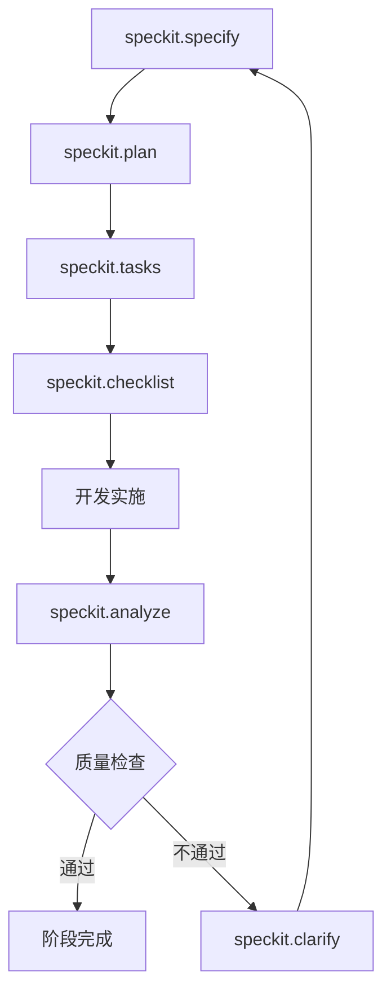
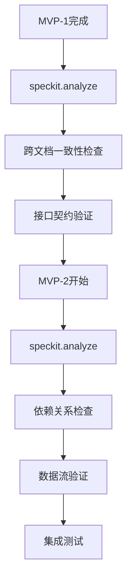

# 百适体操馆小程序 - 8阶段开发路线图

**项目版本**: v2.1
**创建日期**: 2025-11-04
**最后更新**: 2025-11-05
**预计总周期**: 19周（参考，无硬性Deadline）
**文档状态**: Active

---

## 📋 项目概览

### 项目目标
构建一个完整的百适体操馆小程序系统，包含用户管理、课程预约、支付集成、候补管理、运营后台等核心功能，为体操馆提供数字化运营解决方案。

### 核心原则
- **用户为中心**: 优先保证用户体验和功能易用性
- **数据驱动**: 基于智能标签匹配实现个性化推荐
- **运营友好**: 提供完善的运营管理后台
- **技术稳定**: 确保系统高可用和数据安全性

### 技术栈 (已确认最新)
- **小程序前端**: 微信原生框架(MINA) + Skyline渲染引擎
- **管理后台**: React + TypeScript + Ant Design Pro
- **后端**: Python FastAPI 0.100+ + SQLAlchemy 2.x
- **数据库**: MySQL 8.0+ + Redis缓存
- **认证**: JWT + 微信OpenID双重验证
- **支付**: 微信支付API v3 (wechatpayv3)
- **工具**: Speckit开发工具链 + AI Coding

### 核心业务规则 (已确认最新)
- **匹配规则**: 3维硬匹配（等级+年龄+性别），课程类型作为软标签
- **时间边界**: 6小时请假/候补边界（无30分钟缓冲）
- **补课券**: 14天有效期，一次性使用，不可拆分
- **体验课**: 固定200元，走微信支付直连，不经过钱包
- **钱包**: 禁止透支，余额不足直接阻止预约
- **管理后台**: 单一管理员角色，所有账号权限一致

### AI Coding执行原则
- **技术栈统一**: 严格遵循CONSTITUTION.md定义的技术栈
- **优先功能完整性**: 进度可动态调整，确保每个MVP功能完整
- **质量保证**: 遵循18项核心原则，代码重复率<5%，测试覆盖率>80%

---

## 🗺️ 8阶段实施规划

### P0: MVP-1 用户身份系统 (2周) - 基础设施

**阶段目标**: 建立微信登录和用户档案管理系统，为整个系统提供身份认证基础

**核心功能**:
- ✅ 微信静默登录认证
- ✅ 多档案管理（家长/孩子/朋友）
- ✅ 档案信息编辑和软删除
- ✅ 虚拟年龄设置和管理
- ✅ 基于年龄的自动类型识别

**Speckit工具集成**:
- 使用 `/speckit.specify` 定义功能规格
- 使用 `/speckit.plan` 设计数据库架构
- 使用 `/speckit.tasks` 分解开发任务
- 使用 `/speckit.checklist` 生成质量检查清单

**可视化Demo内容**:
- 微信静默登录流程演示
- 多档案创建和管理界面
- 档案切换交互效果
- 虚拟年龄设置功能

**验收标准**:
- 3秒内完成静默登录 (SC-001)
- 2分钟内完成档案创建 (SC-002)
- 支持5个档案上限管理 (SC-006)
- 虚拟年龄匹配准确率>99% (SC-010)

**关键依赖节点**:
- 微信开放平台权限申请
- 数据库表结构设计 (user/profile/relation表)
- 微信小程序测试AppID配置

**数据迁移策略**:
- **新老账号共存**: 旧OpenID首次登录自动迁移到新user表
- **数据完整性**: 验证OpenID去重100%，避免重复账号
- **回退机制**: 保留旧表3个月，确保迁移安全
- **迁移验证**: 首次登录验证手机号等关键信息匹配

**风险控制**:
- 网络异常重试机制（最多3次）
- 微信授权失败处理
- 数据完整性验证
- OpenID重复检测和处理

---

### P1: MVP-2A 课程展示与预约 + MVP-6 钱包系统 (4周) - 预约业务闭环

**阶段目标**: 完成课程展示、智能匹配、预约管理和钱包余额检查，形成预约业务闭环

**核心功能**:
- ✅ 智能课程匹配算法（3维硬匹配：等级+年龄+性别）
- ✅ 课程展示和筛选功能
- ✅ 在线预约管理（包含余额检查）
- ✅ 钱包余额管理（禁止透支，余额不足直接阻止预约）
- ✅ 余额预警和催缴通知
- ✅ 运营手动余额调整

**Speckit工具集成**:
- 并行开发两个MVP，使用 `/speckit.analyze` 确保一致性
- 生成API契约文档保证接口兼容性
- 使用checklist验证跨MVP数据流

**可视化Demo内容**:
- 混合课程展示和智能匹配
- 体验课支付流程（固定200元）
- 时间冲突检测演示
- 预约成功确认流程

**验收标准**:
- 标签匹配准确率100% (SC-004)
- 余额检查准确率100% (无余额禁止预约)
- 时间冲突检测准确率100% (SC-008)
- 钱包余额更新准确率100% (支持负余额)
- 余额预警通知到达率>95%

**关键依赖节点**:
- 钱包余额检查API (预约前验证)
- 课程数据模型标准化
- 欠费规则定义 (允许负余额但限制新预约)
- 微信服务消息模板申请 (余额预警通知)

**跨MVP数据流依赖**:
- **MVP-6 → MVP-2A**: 钱包余额检查预约资格 (wallet.balance >= 200 OR balance < 0 & 欠费规则允许)
- **实时余额同步**: 预约成功后立即更新钱包余额
- **余额状态一致性**: 钱包表与预约表数据实时同步

**风险控制**:
- 并发预约乐观锁机制
- 数据库事务保护金额操作
- 余额检查失败回滚机制

---

### P2: MVP-5 支付集成 (3周) - 支付业务闭环

**阶段目标**: 完成微信支付集成，形成完整的支付业务闭环

**核心功能**:
- ✅ 体验课微信支付（固定200元）
- ✅ 支付状态同步和回调处理
- ✅ 支付失败名额释放机制
- ✅ 订单幂等性处理
- ✅ 支付签名验证

**Speckit工具集成**:
- 使用 `/speckit.clarify` 澄清跨MVP业务规则
- 生成数据模型一致性检查清单
- 建立统一错误处理规范

**可视化Demo内容**:
- 钱包余额和交易记录
- 欠费预警和催缴通知
- 候补队列管理界面
- 微信服务消息通知

**验收标准**:
- 支付成功率>99% (SC-001)
- 支付失败名额释放及时率100% (SC-005)
- 支付回调处理准确率100%
- 订单幂等性处理准确率100%

**关键依赖节点**:
- 微信支付商户号配置（审批周期2-3周，需提前申请）
- 微信服务类目认证
- 服务消息模板ID申请
- 统一支付回调接口

**跨MVP数据流依赖**:
- **MVP-5 → MVP-6**: 支付成功后更新钱包交易记录
- **支付状态同步**: 支付状态与预约状态实时同步
- **退费流程**: 体验课原路退费，正式课退回钱包

**风险控制**:
- 支付签名验证
- 订单超时处理
- 支付失败重试机制
- 幂等性设计防止重复支付

---

### P3: MVP-3 候补与补课系统 + MVP-4 私教课系统 (4周) - 资源优化

**阶段目标**: 完善候补队列和补课补偿机制，优化资源利用效率，扩展私教课业务

**核心功能**:
- ✅ 候补队列管理（6.5小时规则+30分钟确认窗口）
- ✅ 补课课程匹配和补偿机制
- ✅ 私教课线下预约管理
- ✅ 教练信息和评分系统
- ✅ 候补通知和补课提醒

**Speckit工具集成**:
- 使用 `/speckit.plan` 设计复杂业务流程
- 生成RBAC权限检查清单
- 建立运营操作审计规范

**可视化Demo内容**:
- 私教课预约和管理
- 教练信息和评分系统
- Web后台管理界面
- 数据统计和报表导出

**验收标准**:
- 私教时间冲突检测准确率100%
- 管理员权限控制准确率100%
- 数据统计准确率>95%
- Excel导出功能成功率100%

**关键依赖节点**:
- Web后台技术栈搭建 (Vue3+Element Plus)
- 教练数据标准化
- 统一权限管理模型

**风险控制**:
- 管理员操作日志记录
- 敏感数据访问控制
- 大数据量查询优化

---

### P4: MVP-7 运营管理后台 (2周) - 运营工具

**阶段目标**: 提供完整的运营管理后台，支持用户管理、钱包调整、数据统计

**核心功能**:
- ✅ Web后台管理界面
- ✅ 用户管理和档案查看
- ✅ 钱包余额手动调整
- ✅ 数据统计和报表导出
- ✅ 管理员权限控制(RBAC)
- ✅ 操作日志和审计

**Speckit工具集成**:
- 使用 `/speckit.plan` 设计复杂管理流程
- 生成RBAC权限检查清单
- 建立运营操作审计规范

**可视化Demo内容**:
- Web后台登录和权限验证
- 用户详情页和钱包调整
- 数据统计图表展示
- 批量操作功能演示

**验收标准**:
- 管理员权限控制准确率100%
- 钱包调整操作成功率>99%
- 数据统计准确率>95%
- Excel导出功能成功率100%

**关键依赖节点**:
- Web后台技术栈搭建 (Vue3+Element Plus)
- 管理员权限模型设计
- 与所有MVP的API接口对接

**风险控制**:
- 管理员操作日志完整记录
- 敏感数据访问权限控制
- 大数据量查询性能优化

---

### P5: 系统集成测试和优化 (2周) - 质量保证

**阶段目标**: 确保所有MVP模块协同工作，优化系统集成

**核心功能**:
- ✅ 端到端流程测试
- ✅ 跨模块数据一致性验证
- ✅ 性能瓶颈识别和优化
- ✅ 异常场景处理验证

**Speckit工具集成**:
- 使用 `/speckit.analyze` 进行跨文档一致性检查
- 生成系统集成测试清单
- 建立端到端测试规范

**可视化Demo内容**:
- 完整业务流程演示
- 多档案场景测试
- 异常情况处理演示
- 性能监控界面

**验收标准**:
- 端到端流程成功率>95%
- 页面加载时间<3秒
- 并发用户支持>100人
- 数据一致性100%

**关键依赖节点**:
- 测试环境搭建
- 完整测试数据集
- 性能监控工具

**风险控制**:
- 回滚机制和应急预案
- 数据备份和恢复策略
- 性能瓶颈识别和优化

---

### P6: 性能优化和安全加固 (2周) - 系统强化

**阶段目标**: 提升系统性能和安全性，确保生产环境稳定运行

**核心功能**:
- ✅ 数据库查询优化
- ✅ 缓存策略实施
- ✅ 安全漏洞扫描和修复
- ✅ 压力测试和性能调优

**验收标准**:
- API响应时间<500ms
- 数据库查询优化率>80%
- 安全漏洞扫描通过率100%
- 缓存命中率>90%

---

### P7: 用户验收测试和培训 (1周) - 用户准备

**阶段目标**: 确保用户满意度和使用能力，为正式上线做准备

**核心功能**:
- ✅ 用户操作指南制作
- ✅ 常见问题解答整理
- ✅ 功能演示视频录制
- ✅ 用户反馈收集机制

**验收标准**:
- 用户满意度>90%
- 功能使用成功率>95%
- 培训完成率100%
- 问题解决及时率>95%

---

### P8: 正式上线和运维 (1周) - 生产运行

**阶段目标**: 系统稳定运行和持续维护，确保长期可用性

**核心功能**:
- ✅ 生产环境部署
- ✅ 监控系统配置
- ✅ 备份策略实施
- ✅ 运维文档完善

**验收标准**:
- 系统可用性>99.5%
- 故障响应时间<30分钟
- 数据备份成功率100%
- 监控覆盖率100%

---

## 🔗 关键依赖节点分析

### 跨MVP数据共享点

#### 1. 钱包余额数据流
```
MVP-3 (支付) → MVP-4 (钱包) → MVP-2A (预约检查) → MVP-5 (运营管理)
```
- **核心字段**: wallet.balance, wallet_transaction记录
- **业务规则**: 支持负余额，欠费不影响已预约课程
- **数据一致性**: 通过数据库事务确保金额操作原子性

#### 2. 用户身份数据流
```
MVP-1 (用户系统) → 所有MVP (权限验证) → MVP-5 (后台管理)
```
- **核心字段**: user.openid, profile信息, 权限关系
- **业务规则**: 基于profile的权限控制，支持多档案切换
- **数据一致性**: OpenID唯一性保证，权限关系实时更新

#### 3. 预约状态数据流
```
MVP-2A (预约) → MVP-2B (候补) → MVP-3 (支付) → MVP-5 (运营管理)
```
- **核心字段**: booking.status, 候补队列位置, 支付状态
- **业务规则**: 状态流转严格按业务规则，支持异常状态处理
- **数据一致性**: 状态变更通过事件机制同步

### 统一业务规则标准化

#### 1. 扣费和退费规则
```yaml
扣费规则:
  固定班正式课: 预约提交时立即扣除wallet.balance 200元
  候补转正式课: 候补成功确认时扣除wallet.balance 200元
  体验课: 微信支付成功后扣除200元

退费规则:
  体验课: 原路退回微信支付
  正式课: 退回钱包余额
  时间限制: 开课前6小时外全额退费，6小时内不退费
  候补失败: 预约押金自动退回

扣费时机说明:
  固定班预约: 立即扣费，6小时前可退费
  候补队列: 不扣费，成功转正时才扣费
  取消预约: 6小时外退费，6小时内不退费

欠费处理:
  允许负余额: 是（支持透支）
  新预约限制: 欠费时禁止新预约（但已欠费用户可继续上课）
  催缴机制: 余额<200元时推送微信通知
  欠费标红: 运营后台欠费用户红色高亮显示
```

#### 2. 候补和请假规则
```yaml
候补规则:
  截止时间: 开课前6.5小时停止发送通知
  确认窗口: 30分钟决策缓冲期 (开课前6小时为确认截止)
  通知方式: 微信服务消息
  队列机制: FIFO先进先出
  成功显示: 6.5小时外候补成功时显示"候补成功"
  失败显示: 6.5小时外候补失败时显示"候补失败"

请假规则:
  时间限制: 开课前6小时内禁止请假
  次数限制: 不设置月度限制
  连续请假: 连续4次触发运营通知
  运营介入: 线下联系用户说明可能释放名额

# 时间冲突场景处理矩阵
时间冲突场景:
  场景1: 候补成功时间 < 6.5h & 取消时间 < 6h:
    用户操作: 小程序提示"已开课前6小时禁止取消，如需帮助请联系教务"
    系统处理: 钱包维持已扣费状态，不退费
    运营介入: 可通过后台手动处理特殊情况

  场景2: 候补成功时间 > 6.5h & 取消时间 > 6h:
    用户操作: 正常取消流程，自动退费
    系统处理: 按正常退费规则处理
    运营介入: 无需介入

  场景3: 候补成功时间 < 6.5h & 取消时间 > 6h:
    用户操作: 小程序提示"候补成功已过6小时取消期限，如需帮助请联系教务"
    系统处理: 维持预约状态，不退费
    运营介入: 可通过后台评估是否特殊情况处理
```

#### 3. 标签匹配规则
```yaml
匹配算法: 100%完全匹配（非权重计算）
L3以下: 等级匹配 + 年龄匹配
L3及以上: 等级匹配 + 性别匹配
体验课: 仅年龄匹配 + OpenID限制

排序优先级:
  1. 热门程度 (hot > normal > cold)
  2. 开课时间 (近的优先)
  3. 创建时间 (新的优先)
```

### 接口契约定义

#### 1. 认证接口契约
```yaml
JWT Token规范:
  载荷: userid, profileid, exp, iat
  有效期: 24小时
  刷新机制: Token过期时自动刷新

微信登录接口:
  输入: code, userInfo
  输出: token, userProfile, permissions
  错误处理: 网络异常重试3次
```

#### 2. 支付接口契约
```yaml
微信支付集成:
  支付方式: 微信支付v3 API
  金额固定: 体验课200元
  回调处理: 幂等性设计
  退款流程: 自动原路退回

订单状态:
  pending: 待支付（临时状态）
  paid: 已支付
  refunded: 已退款
  failed: 支付失败
```

#### 3. 通知接口契约
```yaml
微信服务通知:
  模板ID: 预先申请的模板
  发送时机: 即时发送
  重试机制: 失败重试3次
  到达率: >95%

通知类型:
  候补成功/失败
  余额预警提醒
  欠费催缴通知
  课程确认提醒
```

---

## 🛠️ Speckit工具集成策略

### 阶段性工具使用流程

#### 每个MVP开发流程


#### 跨MVP集成流程


### 质量保证体系

#### 文档质量检查
- **需求完整性**: 使用checklist验证需求覆盖度
- **一致性检查**: 自动检测跨文档冲突
- **可追溯性**: 需求到代码的完整追溯链

#### 技术质量保证
- **代码规范**: 基于宪法的技术标准
- **测试覆盖**: 核心功能测试覆盖率>80%
- **性能基准**: 响应时间和并发能力指标

---

## 📊 风险控制措施

### 质量闸门设置

#### 每个MVP完成标准
- ✅ 功能验收测试通过率100%
- ✅ 代码质量检查通过
- ✅ 性能指标达到验收标准
- ✅ 安全扫描无高危漏洞
- ✅ Speckit合规检查通过

#### 集成阶段质量控制
- ✅ 跨MVP接口契约验证
- ✅ 端到端流程测试通过
- ✅ 数据一致性验证通过
- ✅ 性能压力测试达标

### 风险应对策略

#### 技术风险
```yaml
数据库性能风险:
  预防措施: 索引优化，查询优化，读写分离
  监控指标: 查询响应时间，并发连接数
  应急预案: 数据库切换，查询降级

并发控制风险:
  预防措施: 乐观锁，分布式锁，队列机制
  监控指标: 并发用户数，锁等待时间
  应急预案: 服务降级，限流熔断

支付安全风险:
  预防措施: 签名验证，幂等设计，对账机制
  监控指标: 支付成功率，异常交易数
  应急预案: 手动对账，支付渠道切换
```

#### 业务风险
```yaml
用户体验风险:
  预防措施: 用户测试，A/B测试，反馈收集
  监控指标: 用户满意度，功能使用率
  应急预案: 快速修复，用户补偿

运营复杂性风险:
  预防措施: 操作培训，详细文档，权限控制
  监控指标: 操作成功率，错误操作数
  应急预案: 手动处理流程，专家支持
```

---

## 📈 成功指标和验收标准

### 技术指标

#### 性能指标
- **响应时间**: API响应<500ms，页面加载<3秒
- **并发能力**: 支持100+并发用户
- **可用性**: 系统可用性>99.5%
- **数据准确性**: 核心业务数据准确率100%

#### 质量指标
- **代码质量**: 核心功能测试覆盖率>80%
- **安全性**: 安全漏洞扫描通过率100%
- **兼容性**: 微信小程序兼容率100%
- **稳定性**: 连续运行无故障>30天

### 业务指标

#### 用户体验指标
- **用户满意度**: >90%
- **功能使用率**: 核心功能使用率>80%
- **操作成功率**: >95%
- **问题解决及时率**: >95%

#### 运营效率指标
- **预约转化率**: 体验课到正式课转化率>60%
- **候补成功率**: 候补队列成功率>70%
- **支付成功率**: >99%
- **运营效率**: 管理操作效率提升50%

---

## 🚀 下一步行动计划

### 立即行动项（今日内）
1. **确认Roadmap v2.1** - 团队评审修正后的8阶段计划
2. **准备微信资质申请** - 支付商户号+服务消息模板（审批周期2-3周）
3. **搭建开发环境** - Node.js + Express + MySQL + Redis
4. **准备MVP-1开发指令** - 使用Speckit工具链启动开发

### AI Coding执行指令模板
**MVP-1 开发指令序列**:
```bash
# 1. 生成功能规格
/speckit.specify
输入: 基于现有specs/001-user-identity-system/，生成可执行规格文档

# 2. 制定技术计划
/speckit.plan
输入: 设计数据模型（user/profile/relation表）+ API架构

# 3. 分解开发任务
/speckit.tasks
输入: 将MVP-1分解为具体的开发任务和验收标准

# 4. 生成质量检查清单
/speckit.checklist
输入: 基于功能规格生成测试和验收清单

# 5. 数据迁移设计
重点关注: OpenID迁移策略 + 老数据兼容性处理
```

### 短期规划（1-2周）
1. **完成P0阶段** - MVP-1用户身份系统（微信登录+档案管理）
2. **并行申请资质** - 微信支付商户号和服务消息模板
3. **建立开发流程** - 确立Speckit工具链使用规范
4. **搭建测试环境** - 小程序测试AppID + 后端Mock服务

### 中期规划（1个月内）
1. **完成P1阶段** - 课程展示+钱包系统（4周）
2. **完成P2阶段** - 支付集成（3周）
3. **完成P3阶段** - 候补+私教课系统（4周）
4. **完成P4阶段** - 运营管理后台（2周）

### 质量保证策略
- **不设独立质量闸门**: 质量检查作为MVP完成必要条件，但不设独立评审会
- **自动化检查优先**: 通过analyze.md自动化检查，不阻塞进度
- **小程序Demo优先**: 每个阶段Demo优先微信小程序端，Web后台为辅助

---

## 📝 文档维护

### 版本控制
- **Roadmap版本**: v2.0 (2025-11-04)
- **更新频率**: 每个阶段完成后更新
- **责任人**: 产品经理 + 技术负责人
- **审批流程**: 团队评审通过后生效

### 变更管理
- **重大变更**: 需要团队评审和重新确认
- **一般调整**: 记录变更原因和影响范围
- **紧急调整**: 立即执行并事后补充说明
- **变更追溯**: 保持完整的变更历史记录

---

**文档维护**: 产品团队
**技术支持**: 开发团队
**质量保证**: QA团队
**最后更新**: 2025-11-05 (v2.1 - 修正MVP优先级和业务规则)
**下次评审**: P0阶段完成后

## 📋 v2.1 主要修正内容

### P0级严重问题修正 (3项)
1. **MVP优先级重排**: 钱包系统提前到P1，支付集成调整到P2
2. **候补时间规则标准化**: 明确6.5小时+30分钟确认的场景处理矩阵
3. **数据迁移策略完善**: OpenID迁移+老数据兼容性+回退机制

### P1级重要问题修正 (4项)
1. **跨MVP数据流依赖**: 钱包余额→预约资格检查的完整数据流
2. **扣费时机澄清**: 固定班立即扣费 vs 候补转正扣费的区别
3. **私教课数据模型**: 前置到课程管理阶段设计，避免后期返工
4. **微信资质申请**: 明确支付商户号+服务消息模板的审批周期

### P2级一般问题修正 (1项)
1. **质量检查方式**: 自动化检查优先，不设独立评审会阻塞进度

### 技术栈优化
1. **统一Node.js技术栈**: 避免FastAPI等多样化风险
2. **小程序优先Demo**: 明确每个阶段Demo的优先级和形态