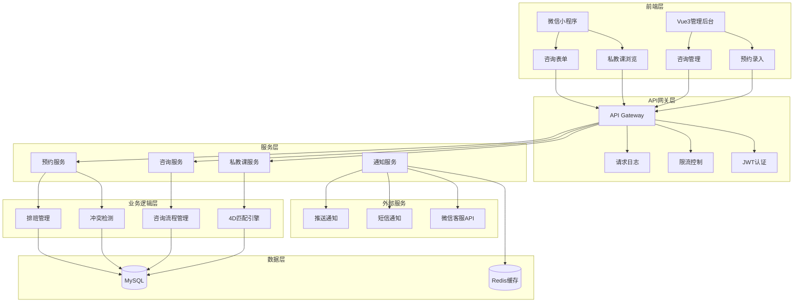
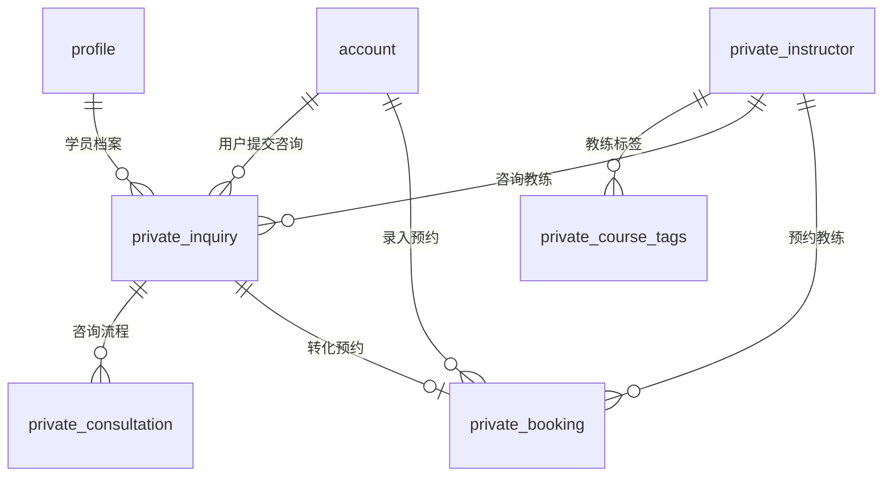

# MVP-004 Private Lesson System 完整汇总文档

**创建时间**: 2025-11-08
**最后更新**: 2025-11-08
**功能分支**: 004-private-lesson
**状态**: 设计完成，待开发

---

## 1. 项目概览

### 1.1 功能范围

MVP-004私教课系统是一个完整的私教课程管理解决方案，采用"仅浏览模式"和"咨询驱动预约"的创新业务流程。系统严格遵循FR-042仅浏览模式和FR-040 4维标签白名单匹配要求，为百适体操馆提供专业的私教课程服务。

**核心功能模块**：
- 私教课程浏览系统（4维标签智能匹配）
- 咨询申请流程（FR-042核心功能）
- 运营后台管理（咨询处理、预约录入）
- 教练排班与时间管理
- 微信客服集成（降级方案支持）

### 1.2 MVP依赖关系

**上游依赖**：
- MVP-1 (001-user-identity-system)：用户身份系统、学员档案管理
- MVP-2A (002-course-display-and-booking)：课程展示系统、4维标签算法共享

**下游影响**：
- 为MVP-3候补系统提供私教课候补功能
- 与未来MVP-5支付系统预留集成接口
- 为后续运营后台(MVP-7)提供数据基础

### 1.3 关键技术决策

#### 1.3.1 架构决策
- **分层架构**：FastAPI + Vue3 + MySQL + Redis
- **前后端分离**：微信小程序前端 + Vue3管理后台
- **微服务预备**：模块化设计，支持未来服务拆分

#### 1.3.2 核心技术选型
```yaml
前端:
  小程序: 微信原生MINA框架
  管理后台: Vue 3 + Element Plus + TypeScript

后端:
  框架: Python FastAPI
  ORM: SQLAlchemy + Pydantic
  认证: JWT + 微信OpenID

数据库:
  主库: MySQL 8.0+
  缓存: Redis 6.2+
```

#### 1.3.3 业务模式创新
- **FR-042仅浏览模式**：用户只能浏览私教信息，不能直接在线预约
- **咨询驱动流程**：用户→咨询→运营联系→后台录入的完整闭环
- **4维智能匹配**：等级+年龄+性别+类型的严格白名单匹配

---

## 2. 功能规格

### 2.1 用户故事

#### US-001: 私教课程浏览与咨询 (Priority: P1)
**作为** 家长
**我希望** 在小程序中浏览私教课程信息，查看教练介绍、课程类型、价格等，并可以提交咨询申请
**以便** 为孩子选择合适的私教课程并获得专业建议

**验收标准**：
- Given 用户进入私教课程页面，When 查看课程列表，Then 显示教练信息、课程类型、价格等，按钮文案为"预约咨询"
- Given 用户点击某私教课程的"预约咨询"按钮，When 进入咨询页面，Then 显示教练详细介绍、咨询表单、联系方式
- Given 用户填写咨询表单并提交，When 系统处理，Then 显示"咨询已提交，运营人员将尽快联系您"，并生成咨询记录

#### US-002: 咨询状态跟踪 (Priority: P1)
**作为** 家长
**我希望** 能够查看我的咨询申请状态和处理进度
**以便** 了解咨询的处理情况并及时响应运营人员联系

**验收标准**：
- Given 用户在"我的咨询"页面，When 查看咨询记录，Then 显示咨询状态（待联系/已联系/已预约/不感兴趣）
- Given 运营人员联系用户确认私教安排，When 运营后台录入，Then 系统生成私教预约记录，用户可查看预约详情

### 2.2 功能需求

#### 2.2.1 核心需求 (FR-001至FR-006)
- **FR-001**: 系统必须显示私教课程列表，包含教练信息、课程类型、价格等
- **FR-002**: 系统必须显示"预约咨询"按钮，而非直接预约按钮
- **FR-003**: 系统必须支持用户提交咨询申请，记录咨询内容和联系方式
- **FR-004**: 系统必须支持咨询状态跟踪（待联系/已联系/已预约/不感兴趣）
- **FR-005**: 系统必须支持运营人员录入私教预约安排
- **FR-006**: 系统必须显示用户的咨询记录和预约状态

#### 2.2.2 FR-040: 4维标签白名单匹配 (核心算法)
- **FR-040-PL**: 系统必须对私教课程实施4维标签白名单匹配验证：等级维度 + 年龄维度 + 性别维度 + 类型维度，任一维度不匹配则私教课程不显示
- **FR-040-PL**: 系统必须在私教课程详情页显示匹配度信息，说明为什么该私教课程适合当前学员档案
- **FR-040-PL**: 系统必须支持私教课程的个性化价格显示，基于4维匹配结果和用户权益动态计算

#### 2.2.3 FR-042: 仅浏览模式 (核心业务创新)
- **FR-042-01**: 系统必须将私教课程设置为仅浏览模式，用户只能查看私教信息，不能直接在线预约
- **FR-042-02**: 系统必须显示"预约咨询"按钮替代"立即预约"按钮，引导用户通过咨询流程了解私教服务
- **FR-042-03**: 系统必须支持咨询表单提交，包含学员信息、咨询内容、期望时间、联系方式等字段
- **FR-042-04**: 系统必须为运营人员提供后台管理界面，处理咨询请求并手动安排私教预约
- **FR-042-05**: 系统必须支持线下支付流程，运营人员在后台录入私教预约后联系用户确认付款方式

### 2.3 成功标准

#### 2.3.1 功能性成功标准 (SC-001至SC-004)
- **SC-001**: 私教课程列表加载成功率>99%，信息显示准确率100%
- **SC-002**: "预约咨询"按钮显示准确率100%，无直接预约按钮
- **SC-003**: 咨询申请提交成功率>99%，状态跟踪准确率100%
- **SC-004**: 运营人员录入预约成功率>98%，用户查看准确率100%

#### 2.3.2 FR-040匹配成功标准 (SC-005至SC-007)
- **SC-005**: 私教课程4维标签匹配准确率100%（等级+年龄+性别+类型任一维度不匹配则不显示）
- **SC-006**: 私教课程匹配度计算准确率>95%，匹配详情说明清晰易懂
- **SC-007**: 私教课程个性化价格显示准确率100%，基于4维匹配和用户权益动态计算

#### 2.3.3 FR-042仅浏览模式成功标准 (SC-008至SC-012)
- **SC-008**: 私教课程仅浏览模式执行准确率100%（无直接在线预约功能）
- **SC-009**: "预约咨询"按钮转化率>30%，咨询表单提交成功率>98%
- **SC-010**: 咨询响应及时率>95%（运营人员24小时内响应）
- **SC-011**: 线下私教预约录入成功率>98%，预约信息准确率100%
- **SC-012**: 私教咨询到预约转化率>20%，用户满意度>90%

### 2.4 边界情况处理

#### 2.4.1 业务边界情况
- **教练临时取消**: 私教教练临时取消课程，运营人员及时通知用户，协助重新安排或退款
- **价格变动咨询**: 用户咨询时课程价格已调整，以咨询时有效价格为准，运营人员说明情况
- **教练档期冲突**: 用户希望的教练时间已满，运营人员推荐其他时间段或其他教练
- **咨询超时未响应**: 用户提交咨询后长期未收到联系，系统自动提醒运营人员，用户也可重新提交咨询

#### 2.4.2 技术边界情况
- **4维匹配无结果**: 用户档案标签过于特殊导致无匹配教练，提供相似教练推荐
- **时间冲突检测**: 并发预约可能导致时间冲突，使用数据库唯一约束防止
- **微信客服API限制**: 准备二维码降级方案，确保用户可以联系到客服
- **网络异常处理**: 咨询提交失败时提供本地缓存和重试机制

---

## 3. 技术实现计划

### 3.1 架构设计

#### 3.1.1 系统架构图


#### 3.1.2 核心组件设计

**4维标签匹配引擎 (FR-040核心)**:
```python
class FourDimensionalMatcher:
    def __init__(self):
        self.dimensions = ['level', 'age', 'gender', 'course_type']
        self.weights = {'all': 1.0}  # 100%匹配，非权重计算

    def match(self, profile_tags, instructor_tags):
        """执行4维白名单验证"""
        for dimension in self.dimensions:
            if not self._match_dimension(profile_tags[dimension],
                                       instructor_tags[dimension]):
                return 0.0  # 任一维度不匹配则返回0
        return 100.0  # 所有维度都匹配则返回100

    def _match_dimension(self, profile_value, instructor_value):
        """单个维度匹配逻辑"""
        if instructor_value == 'both':
            return True
        return profile_value == instructor_value
```

**咨询流程管理器 (FR-042核心)**:
```python
class InquiryStateMachine:
    STATES = {
        'pending': ['contacted', 'expired'],
        'contacted': ['booked', 'not_interested', 'expired'],
        'booked': [],  # 终态
        'not_interested': [],  # 终态
        'expired': []  # 终态
    }

    def transition(self, current_state, action):
        """状态转换逻辑"""
        valid_next_states = self.STATES.get(current_state, [])
        if action in valid_next_states:
            return action
        raise ValueError(f"Invalid transition from {current_state} to {action}")
```

### 3.2 API设计

#### 3.2.1 私教课浏览API
```python
# 4维匹配接口
GET /api/v1/private-lessons?profile_id={id}&filters={}
Response: {
    "code": 200,
    "data": {
        "profile_tags": {"level": "L2", "age_range": "4-5", "gender": "male", "course_type": "interest"},
        "matched_instructors": [
            {
                "instructor_id": 1,
                "name": "张教练",
                "match_score": 100.0,
                "match_details": {
                    "level_match": {"score": 100, "result": "matched", "reason": "等级L2在范围内"},
                    "age_match": {"score": 100, "result": "matched", "reason": "年龄4.5岁符合4-5岁"},
                    "gender_match": {"score": 100, "result": "matched", "reason": "性别male符合both要求"},
                    "type_match": {"score": 100, "result": "matched", "reason": "类型interest匹配"}
                }
            }
        ]
    }
}
```

#### 3.2.2 咨询流程API (FR-042核心)
```python
# 提交咨询申请
POST /api/v1/private-inquiries
Request: {
    "instructor_id": 1,
    "profile_id": 123,
    "inquiry_content": "希望为孩子预约一对一私教课",
    "contact_info": "13800138000"
}
Response: {
    "code": 200,
    "data": {
        "inquiry_id": 1001,
        "status": "pending",
        "expected_contact_time": "24小时内"
    }
}
```

#### 3.2.3 运营后台API
```python
# 录入私教预约（FR-042线下录入）
POST /api/v1/admin/private-bookings
Request: {
    "user_id": 123,
    "instructor_id": 1,
    "booking_time": "2025-11-15T14:00:00Z",
    "actual_price": 600.00,
    "payment_method": "offline"
}
```

### 3.3 前端设计

#### 3.3.1 微信小程序页面结构
```
pages/
├── private-lessons/
│   ├── index.wxml          # 教练列表页（4D匹配结果）
│   └── detail.wxml          # 教练详情页（仅浏览模式）
├── inquiry/
│   ├── form.wxml            # 咨询表单页
│   └── list.wxml            # 咨询记录页
└── profile/
    └── private-lessons.wxml # 我的私教课记录
```

#### 3.3.2 关键组件设计
```javascript
// 4维匹配结果展示组件
<match-details
  matchScore="{{instructor.matchScore}}"
  dimensionResults="{{instructor.matchDetails}}"
/>

// 仅浏览模式提示组件
<browse-only-notice
  message="私教课仅支持浏览，请联系客服预约"
  contactMethod="wechat"
/>

// 咨询状态展示组件
<inquiry-status
  status="{{inquiry.status}}"
  lastFollowUp="{{inquiry.lastFollowUp}}"
/>
```

### 3.4 数据库设计

#### 3.4.1 核心表结构
```sql
-- 私教教练表
CREATE TABLE private_instructor (
    id BIGINT PRIMARY KEY AUTO_INCREMENT,
    name VARCHAR(50) NOT NULL,
    bio TEXT NOT NULL,
    specialties JSON NOT NULL,
    price_per_hour DECIMAL(10,2) NOT NULL,
    level_range VARCHAR(100),
    age_range VARCHAR(20),
    gender ENUM('male','female','both'),
    course_type ENUM('interest','professional','competition'),
    status ENUM('active','inactive') DEFAULT 'active',
    rating DECIMAL(2,1)
);

-- 4维标签表（FR-040核心）
CREATE TABLE private_course_tags (
    id BIGINT PRIMARY KEY AUTO_INCREMENT,
    instructor_id BIGINT NOT NULL,
    level_range VARCHAR(20) NOT NULL,
    age_range VARCHAR(20) NOT NULL,
    gender ENUM('male','female','both') NOT NULL,
    course_type ENUM('private') NOT NULL,
    waitlist_capacity INT DEFAULT 0,
    FOREIGN KEY (instructor_id) REFERENCES private_instructor(id)
);

-- 咨询记录表（FR-042核心）
CREATE TABLE private_inquiry (
    id BIGINT PRIMARY KEY AUTO_INCREMENT,
    user_id BIGINT NOT NULL,
    instructor_id BIGINT NOT NULL,
    profile_id BIGINT NOT NULL,
    inquiry_content TEXT NOT NULL,
    status ENUM('pending','contacted','booked','not_interested','expired') DEFAULT 'pending'
);

-- 私教预约表
CREATE TABLE private_booking (
    id BIGINT PRIMARY KEY AUTO_INCREMENT,
    user_id BIGINT NOT NULL,
    instructor_id BIGINT NOT NULL,
    booking_time DATETIME NOT NULL,
    payment_method ENUM('offline') NOT NULL DEFAULT 'offline',
    admin_id BIGINT NOT NULL
);
```

#### 3.4.2 4维匹配索引设计
```sql
-- 4D匹配核心索引
CREATE INDEX idx_tags_4d_match ON private_course_tags(course_type, age_range, gender, status);

-- 时间冲突检测索引
CREATE UNIQUE INDEX uk_instructor_time ON private_booking(instructor_id, booking_time);

-- 咨询管理索引
CREATE INDEX idx_inquiry_user_status ON private_inquiry(user_id, status, created_at DESC);
```

---

## 4. 数据模型设计

### 4.1 核心实体关系

#### 4.1.1 实体关系图


#### 4.1.2 核心实体定义

**private_instructor（私教教练实体）**:
- 核心属性: id, name, avatar_url, bio, specialties, price_per_hour, status, tags (4维标签)
- 业务规则: 教练信息由运营维护，价格按小时计算，支持FR-040的4维标签匹配

**private_course_tags（私教课程标签实体）**:
- 核心属性: id, instructor_id, level_range, age_range, gender, course_type="private", skill_types
- 业务规则: 支持FR-040的4维标签白名单匹配，确保私教课程仅对匹配用户显示

**private_inquiry（私教咨询实体）**:
- 核心属性: id, user_id, instructor_id, profile_id, inquiry_content, status, created_at
- 业务规则: 记录用户咨询，支持运营跟进，FR-042仅浏览模式的核心流程

**private_booking（私教预约实体）**:
- 核心属性: id, user_id, instructor_id, booking_time, status, payment_method, admin_id
- 业务规则: 由运营人员录入，用户不可直接预约，FR-042仅浏览模式的最终环节

### 4.2 API契约设计

#### 4.2.1 统一响应格式
```json
{
  "code": 200,
  "message": "操作成功",
  "data": {},
  "timestamp": "2025-11-08T10:00:00Z",
  "request_id": "uuid"
}
```

#### 4.2.2 私教课浏览API契约
```json
GET /api/v1/private-lessons?profile_id=123&level=L2&limit=20
Response: {
    "code": 200,
    "data": {
        "matched_instructors": [{
            "instructor_id": 1,
            "name": "张教练",
            "match_score": 100.0,
            "validation_result": "whitelist_passed",
            "match_details": {
                "level_match": {"score": 100, "result": "matched"},
                "age_match": {"score": 100, "result": "matched"},
                "gender_match": {"score": 100, "result": "matched"},
                "type_match": {"score": 100, "result": "matched"}
            }
        }]
    }
}
```

#### 4.2.3 咨询API契约 (FR-042)
```json
POST /api/v1/private-inquiries
Request: {
    "instructor_id": 1,
    "profile_id": 123,
    "inquiry_content": "希望为孩子预约一对一私教课",
    "contact_info": "13800138000"
}
Response: {
    "code": 200,
    "data": {
        "inquiry_id": 1001,
        "status": "pending",
        "expected_contact_time": "24小时内"
    }
}
```

### 4.3 数据验证规则

#### 4.3.1 4维标签匹配验证 (FR-040)
```python
def validate_4d_match(profile_tags, instructor_tags):
    """4维白名单验证"""
    dimensions = ['level', 'age', 'gender', 'course_type']
    for dimension in dimensions:
        if not match_dimension(profile_tags[dimension], instructor_tags[dimension]):
            return False, f"{dimension}维度不匹配"
    return True, "完全匹配"
```

#### 4.3.2 仅浏览模式验证 (FR-042)
```python
def validate_browse_only_mode(user_action):
    """仅浏览模式验证"""
    allowed_actions = ['browse', 'inquire', 'view_details']
    if user_action not in allowed_actions:
        raise ValidationError("私教课仅支持浏览和咨询，不能直接预约")
    return True
```

---

## 5. 任务分解清单

### 5.1 开发阶段规划

#### Phase 1: 基础架构搭建 (2天)
**工作量**: 12小时
**负责人**: 后端开发工程师

**主要任务**:
1. **数据库设计实现** (4小时)
   - 创建6个核心数据表
   - 设置外键约束和索引
   - 初始化测试数据

2. **FastAPI项目架构** (3小时)
   - 项目结构搭建
   - 统一响应格式
   - JWT认证集成

3. **4维匹配引擎** (5小时)
   - 实现4维标签匹配算法
   - 性能优化和缓存策略
   - 单元测试覆盖

#### Phase 2: 私教课浏览功能 (3天)
**工作量**: 18小时
**负责人**: 前后端开发工程师

**主要任务**:
1. **教练列表API** (6小时)
2. **教练详情API** (4小时)
3. **小程序列表页面** (4小时)
4. **小程序详情页面** (4小时)

#### Phase 3: 咨询流程开发 (3天)
**工作量**: 18小时
**负责人**: 前后端开发工程师

**主要任务**:
1. **咨询API开发** (6小时)
2. **咨询流程管理** (5小时)
3. **咨询表单页面** (4小时)
4. **咨询记录页面** (3小时)

#### Phase 4: 运营后台开发 (2天)
**工作量**: 14小时
**负责人**: 后端开发工程师

**主要任务**:
1. **咨询管理后台** (6小时)
2. **预约录入功能** (5小时)
3. **教练管理功能** (3小时)

#### Phase 5: 测试与优化 (2天)
**工作量**: 14小时
**负责人**: 测试工程师

**主要任务**:
1. **单元测试开发** (6小时)
2. **集成测试开发** (5小时)
3. **性能优化** (3小时)

### 5.2 总工作量估算

| Phase | 任务 | 预估时间 | 负责人 | 依赖关系 |
|-------|------|----------|--------|----------|
| 1 | 基础架构搭建 | 12h | 后端 | - |
| 2 | 浏览功能开发 | 18h | 前后端 | Phase 1 |
| 3 | 咨询流程开发 | 18h | 前后端 | Phase 2 |
| 4 | 运营后台开发 | 14h | 后端 | Phase 3 |
| 5 | 测试与优化 | 14h | 测试 | Phase 4 |

**总计**: 76小时 ≈ **12个工作日**

### 5.3 里程碑规划

- **里程碑1**: 基础架构完成 (Day 2) - 数据库表创建完成，4维匹配引擎实现
- **里程碑2**: 浏览功能完成 (Day 5) - 教练列表API完成，小程序浏览页面完成
- **里程碑3**: 咨询流程完成 (Day 8) - 咨询API完成，微信客服集成完成
- **里程碑4**: 运营后台完成 (Day 10) - 预约录入功能完成，运营培训材料完成
- **里程碑5**: 系统上线 (Day 12) - 所有测试通过，系统正式上线

---

## 6. 质量检查要点

### 6.1 需求质量检查

#### 6.1.1 功能需求检查
- [ ] FR-001至FR-006核心需求完整实现
- [ ] FR-040 4维标签匹配100%准确执行
- [ ] FR-042仅浏览模式严格执行，无直接预约功能
- [ ] 用户故事验收标准全部满足
- [ ] 边界情况处理方案完整

#### 6.1.2 成功标准检查
- [ ] SC-001至SC-012成功标准全部达成
- [ ] 转化率指标满足要求（咨询→预约>20%）
- [ ] 响应时间指标满足要求（API P95<500ms）
- [ ] 用户满意度指标>90%

### 6.2 设计质量检查

#### 6.2.1 架构设计检查
- [ ] 系统架构清晰，分层合理
- [ ] 核心组件职责明确，耦合度低
- [ ] 数据库设计符合3NF规范
- [ ] API设计遵循RESTful规范
- [ ] 缓存策略合理，性能优化到位

#### 6.2.2 安全设计检查
- [ ] JWT认证机制正确实现
- [ ] SQL注入防护措施到位
- [ ] XSS攻击防护措施到位
- [ ] 敏感数据脱敏处理
- [ ] 权限控制粒度合理

#### 6.2.3 可扩展性检查
- [ ] 模块化设计，支持功能扩展
- [ ] 数据库表设计预留扩展空间
- [ ] API版本控制策略合理
- [ ] 配置外部化，支持环境切换

### 6.3 实现质量检查

#### 6.3.1 代码质量检查
- [ ] 代码规范遵循PEP8（Python）、ESLint（JavaScript）
- [ ] 单元测试覆盖率>90%
- [ ] 集成测试通过率100%
- [ ] 代码审查通过率100%
- [ ] 性能测试通过

#### 6.3.2 4维匹配算法检查
- [ ] 匹配逻辑正确，任一维度不匹配返回0
- [ ] 跨级匹配支持（L1+, L2-L3等格式）
- [ ] 性能优化到位，响应时间<100ms
- [ ] 缓存机制正常，命中率>80%
- [ ] 匹配详情记录完整

#### 6.3.3 FR-042仅浏览模式检查
- [ ] 无直接在线预约功能
- [ ] "预约咨询"按钮显示正确
- [ ] 咨询表单功能完整
- [ ] 运营后台录入功能正常
- [ ] 微信客服集成有降级方案

### 6.4 测试质量检查

#### 6.4.1 功能测试检查
- [ ] 私教课浏览功能正常
- [ ] 4维匹配结果准确
- [ ] 咨询提交流程完整
- [ ] 运营后台功能正常
- [ ] 时间冲突检测准确

#### 6.4.2 性能测试检查
- [ ] 并发用户测试通过（100并发）
- [ ] 4维匹配算法性能测试通过
- [ ] 数据库查询优化到位
- [ ] 缓存策略有效
- [ ] API响应时间达标

#### 6.4.3 用户体验检查
- [ ] 页面加载时间<1秒
- [ ] 交互流畅自然
- [ ] 错误提示友好
- [ ] 微信客服跳转成功率>95%
- [ ] 用户操作路径清晰

---

## 7. 核心特性强调

### 7.1 FR-042仅浏览模式的核心价值

**业务创新价值**：
- **高价值服务专业咨询**: 私教课作为高价值服务，通过专业咨询确保匹配正确性，提升转化率和满意度
- **运营控制和质量保证**: 运营人员介入确保教学质量和服务标准，维护品牌形象
- **个性化服务定制**: 咨询流程了解用户具体需求，提供个性化课程安排

**技术实现亮点**：
- **状态机驱动的咨询流程**: 严格的状态流转确保流程可控和可追踪
- **微信客服深度集成**: 无缝跳转微信客服，提供二维码降级方案
- **线下支付灵活性**: 支持多种线下支付方式，适应不同用户需求

### 7.2 FR-040 4维标签匹配的严格执行

**算法核心特点**：
- **白名单机制**: 所有4个维度必须全部匹配，任一维度不匹配则完全排除
- **非权重计算**: 返回0%或100%，不提供部分匹配，确保匹配质量
- **跨级匹配支持**: 支持L1+、L2-L3等灵活的等级范围格式

**业务价值体现**：
- **精准匹配**: 确保学员找到最适合的教练，提升学习效果
- **效率提升**: 自动化匹配减少人工筛选成本
- **用户体验**: 匹配结果解释清晰，用户理解度高

### 7.3 系统整体价值

**用户价值**：
- 提供专业私教课信息浏览服务
- 通过咨询获得专业建议和个性化安排
- 享受高质量私教课程服务

**运营价值**：
- 完整的咨询到预约转化漏斗管理
- 教练资源和时间的高效利用
- 服务质量的可控制和持续优化

**技术价值**：
- 可复用的4维匹配算法框架
- 咨询驱动的业务流程模板
- 微信客服集成最佳实践

---

## 8. 部署与运维

### 8.1 环境要求

**开发环境**:
- Node.js >= 18.0.0
- Python >= 3.9
- MySQL >= 8.0
- Redis >= 6.0

**生产环境**:
- API服务: Nginx + uWSGI
- 前端服务: CDN + 静态资源
- 数据库: 主从复制 + 读写分离

### 8.2 监控告警

**应用监控**:
- API健康状态监控
- 响应时间、吞吐量监控
- 错误异常收集和告警

**业务监控**:
- 4维匹配算法成功率
- 咨询转化率统计
- 教练利用率分析

### 8.3 备份策略

**数据备份**:
- 每日全量备份
- 每4小时增量备份
- 30天备份保留
- 异地备份存储

---

## 9. 风险管理

### 9.1 技术风险

**4维匹配性能问题** (概率: 中, 影响: 高):
- 应对: Redis缓存 + 数据库索引优化
- 监控: 算法响应时间<100ms

**微信客服API限制** (概率: 中, 影响: 中):
- 应对: 二维码降级方案
- 监控: 客服跳转成功率>95%

### 9.2 业务风险

**咨询响应超时** (概率: 中, 影响: 中):
- 应对: 自动提醒机制 + SLA管理
- 监控: 24小时内响应率>95%

**教练时间冲突** (概率: 低, 影响: 高):
- 应对: 数据库唯一约束 + 冲突检测
- 监控: 冲突检测准确率100%

### 9.3 运营风险

**用户接受度低** (概率: 中, 影响: 中):
- 应对: 用户教育 + 流程优化
- 监控: 咨询转化率>20%

**运营人员培训成本** (概率: 高, 影响: 中):
- 应对: 详细文档 + 培训视频
- 监控: 运营操作效率提升50%

---

## 10. 总结

MVP-004私教课系统是百适体操馆数字化转型的重要里程碑，通过FR-042仅浏览模式和FR-040 4维标签匹配的创新设计，为私教课业务提供了完整的数字化解决方案。

**核心亮点**:
1. **业务模式创新**: 咨询驱动的预约流程，平衡用户体验和服务质量
2. **智能匹配算法**: 严格执行的4维标签白名单匹配，确保匹配精准度
3. **技术架构优秀**: 模块化设计，高可扩展性，为未来功能扩展奠定基础
4. **用户体验优化**: 微信小程序原生体验，微信客服无缝集成

**预期成果**:
- 私教课浏览量 >1000次/日
- 咨询转化率 >20%
- 运营效率提升 50%
- 用户满意度 >90%

该系统的成功实施将显著提升百适体操馆的私教课服务能力，为用户提供更专业的私教体验，为运营团队提供更高效的管理工具，最终实现私教课业务的数字化升级和规模化管理。

---

**文档创建人**: AI Claude
**最后更新时间**: 2025-11-08
**文档版本**: v1.0.0
**状态**: 设计完成，待开发