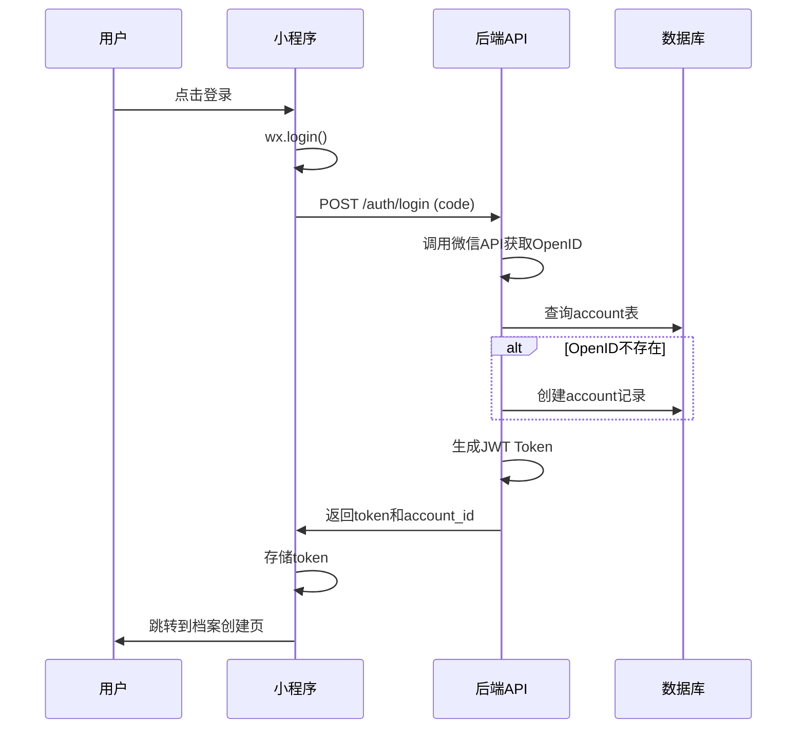
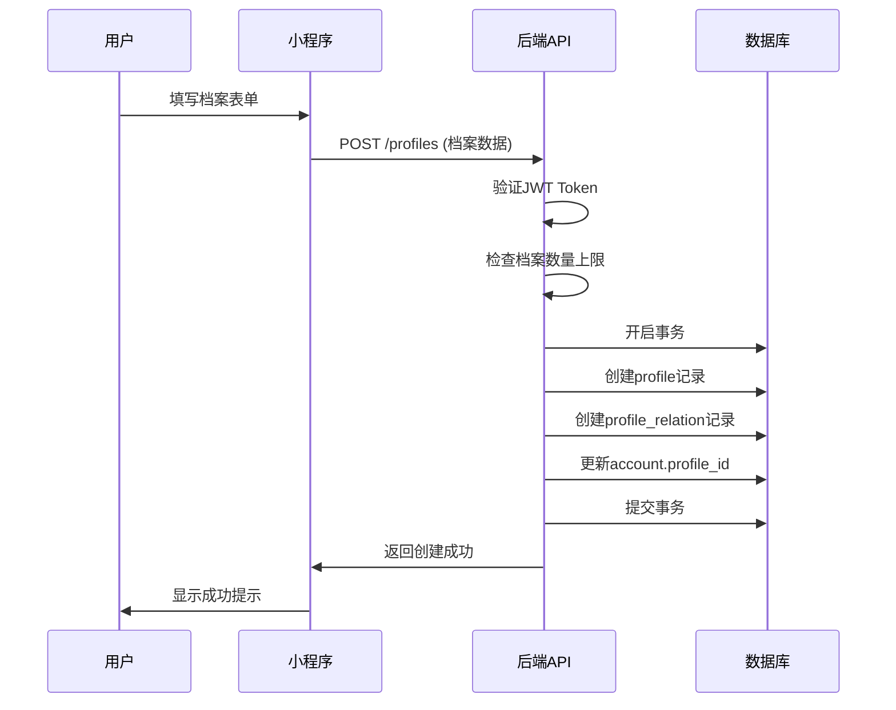
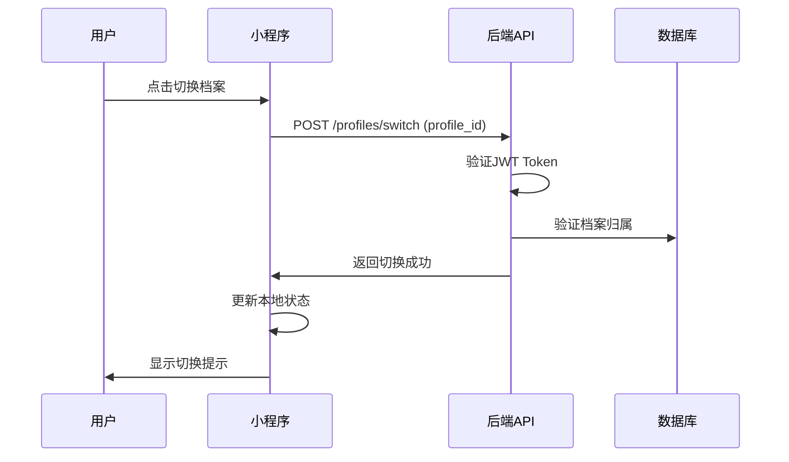

# 数据模型： User Identity System

**Feature**: 001-user-identity-system
**创建时间**: 2025-10-26
**Version**: 1.1.0
**Update**: 2025-11-17 - 优化虚拟年龄设计，改为virtual_age_offset偏移量模式，简化家长设置流程

## Database Schema

### Overview

用户身份系统的数据模型采用三表设计，实现微信账号与用户档案的分离，支持一个微信账号管理多个学员档案的复杂业务场景。

### Entity Relationship Diagram

```
┌─────────────────┐         ┌─────────────────┐
│     account     │         │     profile     │
├─────────────────┤         ├─────────────────┤
│ id (PK)         │◄────────┤ profile_id (FK) │
│ openid (UNIQUE) │         │ id (PK)         │
│ profile_id (FK) │         │ name            │
│ created_at      │         │ nickname        │
│ updated_at      │         │ birthday        │
└─────────────────┘         │ gender          │
                            │ avatar_url      │
                            │ phone           │
                            │ id_number       │
                            │ sports_background│
                            │ level           │
                            │ development     │
                            │ privilege       │
                            │ status          │
                            │ created_at      │
                            │ updated_at      │
                            └─────────────────┘
                                     │
                                     │
                                     ▼
                           ┌─────────────────┐
                           │profile_relation │
                           ├─────────────────┤
                           │ id (PK)         │
                           │ account_id (FK) │
                           │ profile_id (FK) │
                           │ relation_type   │
                           │ can_book        │
                           │ created_at      │
                           └─────────────────┘
```

## Table Definitions

### account（账号表）

**描述**：存储微信账号信息，每个微信用户对应一条记录

**用途**：微信登录认证，与档案建立关联关系

| 字段名 | 数据类型 | 约束 | 默认值 | 描述 | 索引 |
|--------|----------|------|--------|------|------|
| id | INT | PK, AUTO_INCREMENT | - | 账号ID | PRIMARY |
| openid | VARCHAR(64) | UNIQUE, NOT NULL | - | 微信OpenID | INDEX |
| profile_id | INT | NOT NULL | - | 关联的主档案ID | INDEX |
| created_at | TIMESTAMP | NOT NULL | CURRENT_TIMESTAMP | 创建时间 | INDEX |
| updated_at | TIMESTAMP | NOT NULL | CURRENT_TIMESTAMP ON UPDATE | 更新时间 | INDEX |

**外键约束**：
- `profile_id` → `profile.id` (ON DELETE CASCADE)

**业务规则**：
- `openid` 是微信用户的唯一标识，直接存储（信任微信安全机制）
- `profile_id` 为必填字段，确保每个账号都有主档案
- 一个 `openid` 只能对应一个账号记录
- 如果删除主档案，由于存在 CASCADE 约束，account 记录也会被删除
- 新用户注册时必须先创建档案，再建立账号关联

### profile（档案表）

**描述**：存储用户档案信息，支持家长和学员的统一管理

**用途**：用户基本信息管理，预约系统的基础数据

| 字段名 | 数据类型 | 约束 | 默认值 | 描述 | 索引 |
|--------|----------|------|--------|------|------|
| id | INT | PK, AUTO_INCREMENT | - | 档案ID | PRIMARY |
| name | VARCHAR(50) | NOT NULL | - | 真实姓名 | INDEX |
| nickname | VARCHAR(50) | NULL | NULL | 常用名/昵称 | - |
| id_number | VARCHAR(50) | NULL | NULL | 身份证号或护照号 | - |
| birthday | DATE | NOT NULL | - | 生日 | INDEX |
| gender | TINYINT | NOT NULL | - | 性别：1=男,2=女 | INDEX |
| avatar_url | VARCHAR(255) | NULL | NULL | 头像URL | - |
| phone | VARCHAR(20) | NULL | NULL | 手机号 | INDEX |
| sports_background | TEXT | NULL | NULL | 运动情况 | - |
| level | ENUM | NOT NULL | 'L1' | 课程等级：L1-L6 | INDEX |
| development | ENUM | NULL | NULL | 发展标签：兴趣班/专业班/竞赛班/长训班 | INDEX |
| privilege | ENUM | NULL | 'new_user' | 权益标签：老用户/新用户/亲友权益 | INDEX |
| registration_date | DATE | NULL | NULL | 首次报课日期(用于判断老用户/新用户) | INDEX |
| customer_type | ENUM | NULL | NULL | 客户类型：old_user/new_user/friend(自动计算) | INDEX |
| status | TINYINT | NOT NULL | 1 | 状态：1=正常,0=已删除 | INDEX |
| created_at | TIMESTAMP | NOT NULL | CURRENT_TIMESTAMP | 创建时间 | INDEX |
| updated_at | TIMESTAMP | NOT NULL | CURRENT_TIMESTAMP ON UPDATE | 更新时间 | INDEX |

**业务规则**：
- `name` 为必填字段，用于真实身份识别
- `birthday` 用于精确计算年龄（支持小数点后1位）
- `gender` 使用数字枚举：1=男性，2=女性
- `phone` 虽然可选，但报名体验课时强制要求
- `level` 表示学员的课程等级，由运营在后台手动设置，影响课程推荐和价格计算
- `development` 表示学员的发展标签，用于课程匹配和推荐
- `privilege` 表示学员的权益标签，影响课程价格和优惠政策
- `virtual_age_offset` 虚拟年龄偏移量，由家长直接设定，正数增加年龄，负数减少年龄
- `display_age` 显示年龄（计算字段）：实际年龄 + 虚拟年龄偏移量，用于课程匹配
- `registration_date` 记录学员首次报课日期，用于判断老用户/新用户（基准日期：2024-11-11）
- `customer_type` 客户类型，基于privilege和registration_date自动计算：old_user(11月11日前报课)/new_user(11月11日后报课)/friend(亲友权益)
- `status` 支持软删除：0=已删除，1=正常
- 删除档案时使用软删除，保留历史记录

### profile_relation（档案关联表）

**描述**：建立账号与档案的多对多关联关系

**用途**：权限控制，确定哪个账号可以管理哪些档案

| 字段名 | 数据类型 | 约束 | 默认值 | 描述 | 索引 |
|--------|----------|------|--------|------|------|
| id | INT | PK, AUTO_INCREMENT | - | 关联ID | PRIMARY |
| account_id | INT | NOT NULL | - | 账号ID（谁登录） | INDEX |
| profile_id | INT | NOT NULL | - | 档案ID（能管理谁） | INDEX |
| relation_type | ENUM | NOT NULL | 'self' | 关系类型 | - |
| can_book | TINYINT | NOT NULL | 1 | 是否可预约 | INDEX |
| created_at | TIMESTAMP | NOT NULL | CURRENT_TIMESTAMP | 创建时间 | INDEX |

**外键约束**：
- `account_id` → `account.id` (ON DELETE CASCADE)
- `profile_id` → `profile.id` (ON DELETE CASCADE)

**唯一约束**：
- `uk_account_profile` (`account_id`, `profile_id`)

**枚举值**：
- `relation_type`: 'self', 'child', 'parent', 'spouse'

**业务规则**：
- 一个账号可以管理多个档案（家长管理多个孩子）
- 一个档案可以被多个账号管理（妈妈和爸爸都可以管理孩子）
- `relation_type` 明确账号与档案的关系类型
- `can_book` 控制档案是否可用于预约（如暂时禁用）
- 删除账号或档案时，关联关系自动删除

### virtual_age_offset_log（虚拟年龄偏移量变更记录表）

**描述**：存储虚拟年龄偏移量的历史变更记录，用于运营分析和审计追踪

**用途**：记录每次虚拟年龄偏移量的设置变更，支持历史追溯和异常分析

| 字段名 | 数据类型 | 约束 | 默认值 | 描述 | 索引 |
|--------|----------|------|--------|------|------|
| id | INT | PK, AUTO_INCREMENT | - | 记录ID | PRIMARY |
| profile_id | INT | NOT NULL | - | 档案ID | INDEX |
| old_offset | INT | NULL | NULL | 原偏移量 | - |
| new_offset | INT | NULL | NULL | 新偏移量 | - |
| change_reason | TEXT | NULL | NULL | 变更原因 | - |
| created_at | TIMESTAMP | NOT NULL | CURRENT_TIMESTAMP | 变更时间 | INDEX |

**外键约束**：
- `profile_id` → `profile.id` (ON DELETE CASCADE)

**业务规则**：
- 每次虚拟年龄偏移量设置/更新都会生成记录
- 偏移量范围：-5到+5岁
- 变更原因可选，但建议填写以便后续分析
- 按变更时间倒序显示历史记录

## API Contracts

### Authentication API

#### POST /api/v1/auth/login
**方法**: POST
**路径**: /api/v1/auth/login
**描述**: 微信静默登录，获取JWT Token

**Request**:
```json
{
  "code": "string"
}
```

**Response**:
```json
{
  "code": 200,
  "message": "登录成功",
  "data": {
    "token": "eyJhbGciOiJIUzI1NiIsInR5cCI6IkpXVCJ9...",
    "account_id": 1,
    "profile_id": null,
    "expires_at": "2025-11-25T00:00:00Z"
  }
}
```

#### POST /api/v1/auth/phone
**方法**: POST
**路径**: /api/v1/auth/phone
**描述**: 获取微信手机号

**Request**:
```json
{
  "code": "string"
}
```

**Response**:
```json
{
  "code": 200,
  "message": "获取成功",
  "data": {
    "phone": "13800138000"
  }
}
```

### Profile Management API

#### POST /api/v1/profiles
**方法**: POST
**路径**: /api/v1/profiles
**描述**: 创建新档案

**Request**:
```json
{
  "name": "string",
  "nickname": "string",
  "id_number": "string",
  "birthday": "2020-01-01",
  "gender": 1,
  "relation_type": "self|child|spouse",
  "avatar_url": "string",
  "phone": "string",
  "sports_background": "string",
  "development": "interest|professional|competition|long_term",
  "privilege": "old_user|new_user|friend_discount"
}
```

**Response**:
```json
{
  "code": 200,
  "message": "创建成功",
  "data": {
    "profile_id": 1,
    "age": 5.8,
    "created_at": "2025-10-26T23:00:00Z"
  }
}
```

#### GET /api/v1/profiles
**方法**: GET
**路径**: /api/v1/profiles
**描述**: 获取档案列表

**Response**:
```json
{
  "code": 200,
  "message": "查询成功",
  "data": {
    "profiles": [
      {
        "profile_id": 1,
        "name": "string",
        "nickname": "string",
        "birthday": "2020-01-01",
        "age": 5.8,
        "gender": 1,
        "avatar_url": "string",
        "relation_type": "child",
        "is_current": true
      }
    ],
    "total": 2,
    "limit": 5
  }
}
```

#### GET /api/v1/profiles/{id}
**方法**: GET
**路径**: /api/v1/profiles/{id}
**描述**: 获取档案详情

**Response**:
```json
{
  "code": 200,
  "message": "查询成功",
  "data": {
    "profile_id": 1,
    "name": "string",
    "nickname": "string",
    "id_number": "string",
    "birthday": "2020-01-01",
    "age": 5.8,
    "gender": 1,
    "avatar_url": "string",
    "phone": "string",
    "sports_background": "string",
    "status": 1,
    "created_at": "2025-10-26T23:00:00Z",
    "updated_at": "2025-10-26T23:00:00Z"
  }
}
```

#### PUT /api/v1/profiles/{id}
**方法**: PUT
**路径**: /api/v1/profiles/{id}
**描述**: 更新档案信息

**Request**:
```json
{
  "name": "string",
  "nickname": "string",
  "phone": "string",
  "sports_background": "string",
  "avatar_url": "string"
}
```

**Response**:
```json
{
  "code": 200,
  "message": "更新成功",
  "data": {
    "profile_id": 1,
    "updated_at": "2025-10-26T23:30:00Z"
  }
}
```

#### DELETE /api/v1/profiles/{id}
**方法**: DELETE
**路径**: /api/v1/profiles/{id}
**描述**: 删除档案（软删除）

**Response**:
```json
{
  "code": 200,
  "message": "删除成功（历史记录已保留）",
  "data": {
    "profile_id": 1,
    "deleted_at": "2025-10-26T23:45:00Z"
  }
}
```

#### POST /api/v1/profiles/switch
**方法**: POST
**路径**: /api/v1/profiles/switch
**描述**: 切换当前档案

**Request**:
```json
{
  "profile_id": 2
}
```

**Response**:
```json
{
  "code": 200,
  "message": "已切换至：小明",
  "data": {
    "profile_id": 2,
    "name": "小明",
    "age": 5.8
  }
}
```

#### GET /api/v1/profiles/current
**方法**: GET
**路径**: /api/v1/profiles/current
**描述**: 获取当前档案

**Response**:
```json
{
  "code": 200,
  "message": "查询成功",
  "data": {
    "profile_id": 1,
    "name": "小明",
    "age": 5.8,
    "avatar_url": "string"
  }
}
```

#### GET /api/v1/profiles/validate-limit
**方法**: GET
**路径**: /api/v1/profiles/validate-limit
**描述**: 检查档案数量上限

**Response**:
```json
{
  "code": 200,
  "message": "未达上限",
  "data": {
    "current_count": 3,
    "limit": 5,
    "can_create": true
  }
}
```

#### PUT /api/v1/profiles/{id}/virtual-age-offset
**方法**: PUT
**路径**: /api/v1/profiles/{id}/virtual-age-offset
**描述**: 设置或更新档案的虚拟年龄偏移量

**Request**:
```json
{
  "virtual_age_offset": 1,
  "change_reason": "孩子发育较快，建议按大1岁匹配课程"
}
```

**Response**:
```json
{
  "code": 200,
  "message": "虚拟年龄偏移量设置成功",
  "data": {
    "profile_id": 1,
    "actual_age": 5.8,
    "virtual_age_offset": 1,
    "display_age": 6.8,
    "updated_at": "2025-11-17T10:30:00Z"
  }
}
```

#### DELETE /api/v1/profiles/{id}/virtual-age-offset
**方法**: DELETE
**路径**: /api/v1/profiles/{id}/virtual-age-offset
**描述**: 清空档案的虚拟年龄偏移量设置

**Response**:
```json
{
  "code": 200,
  "message": "虚拟年龄偏移量已清空",
  "data": {
    "profile_id": 1,
    "actual_age": 5.8,
    "virtual_age_offset": 0,
    "display_age": 5.8,
    "updated_at": "2025-11-17T10:35:00Z"
  }
}
```

#### GET /api/v1/profiles/{id}/virtual-age-offset/log
**方法**: GET
**路径**: /api/v1/profiles/{id}/virtual-age-offset/log
**描述**: 获取虚拟年龄偏移量变更记录

**Request Parameters**:
- `page`: 页码（默认1）
- `limit`: 每页数量（默认20）

**Response**:
```json
{
  "code": 200,
  "message": "查询成功",
  "data": {
    "logs": [
      {
        "id": 1,
        "old_offset": 0,
        "new_offset": 1,
        "change_reason": "孩子发育较快，建议按大1岁匹配课程",
        "created_at": "2025-11-17T10:30:00Z"
      }
    ],
    "total": 1,
    "page": 1,
    "limit": 20
  }
}
```

## Data Validation

### Input Validation

#### Profile Creation Validation
- **name**: 必填，1-50字符，不能包含特殊字符
- **nickname**: 可选，最多50字符
- **id_number**: 可选，支持身份证和护照格式，宽松验证
- **birthday**: 必填，有效日期，不能是未来日期
- **gender**: 必填，只能是1（男）或2（女）
- **relation_type**: 必填，只能是'self'、'child'或'spouse'
- **phone**: 可选，手机号格式验证
- **sports_background**: 可选，最多500字符

#### Virtual Age Offset Validation
- **virtual_age_offset**: 可选，INT格式，范围-5到+5岁
- **change_reason**: 设置虚拟年龄偏移量时建议填写变更原因
- **display_age**: 显示年龄 = 实际年龄 + 虚拟年龄偏移量

#### Authentication Validation
- **code**: 必填，微信授权code格式
- **token**: 必填，JWT token格式验证

### Business Validation

#### Profile Creation Rules
- 档案数量上限：每个账号最多5个档案
- 年龄范围：0-120岁
- 身份证格式：支持15位和18位身份证
- 护照格式：字母和数字组合，6-20字符
- relation_type映射：'self'=自己报课，'child'=给孩子报课，'spouse'=给家人朋友报课

#### Permission Validation
- 账号只能管理自己关联的档案
- 档案删除需要验证无未完成预约
- 档案切换只能在关联档案范围内

#### Data Consistency Rules
- 软删除档案不影响历史预约记录
- 年龄实时计算，不存储年龄字段
- OpenID全局唯一，防止重复注册
- 虚拟年龄偏移量变更必须记录到virtual_age_offset_log表
- 虚拟年龄偏移量设置不影响实际年龄的计算和存储
- 显示年龄仅用于课程匹配，不在数据库中物理存储

## Migration Strategy

### Version 1.0.0

#### 创建数据库
```sql
-- 创建数据库
CREATE DATABASE IF NOT EXISTS ccmartmeet
CHARACTER SET utf8mb4
COLLATE utf8mb4_unicode_ci;

USE ccmartmeet;
```

#### 创建 profile 表
```sql
CREATE TABLE `profile` (
  `id` INT PRIMARY KEY AUTO_INCREMENT COMMENT '档案ID',
  `name` VARCHAR(50) NOT NULL COMMENT '真实姓名',
  `nickname` VARCHAR(50) DEFAULT NULL COMMENT '常用名/昵称',
  `id_number` VARCHAR(50) DEFAULT NULL COMMENT '身份证号或护照号（宽松验证）',
  `birthday` DATE NOT NULL COMMENT '生日（用于计算年龄）',
  `gender` TINYINT NOT NULL COMMENT '性别：1=男,2=女',
  `avatar_url` VARCHAR(255) DEFAULT NULL COMMENT '头像URL（微信头像或默认头像）',
  `phone` VARCHAR(20) DEFAULT NULL COMMENT '手机号（可选，报名体验课时必填）',
  `sports_background` TEXT DEFAULT NULL COMMENT '运动情况（自由文本输入）',
  `level` ENUM('L1', 'L2', 'L3', 'L4', 'L5', 'L6') DEFAULT 'L1' COMMENT '课程等级（由运营在后台手动设置）',
  `development` ENUM('interest', 'professional', 'competition', 'long_term') DEFAULT NULL COMMENT '发展标签：兴趣班/专业班/竞赛班/长训班',
  `privilege` ENUM('old_user', 'new_user', 'friend_discount') DEFAULT 'new_user' COMMENT '权益标签：老用户/新用户/亲友权益',
  `virtual_age_offset` INT DEFAULT 0 COMMENT '虚拟年龄偏移量（正数增加，负数减少，由家长设定）',
  `status` TINYINT DEFAULT 1 COMMENT '状态：1=正常,0=已删除（软删除）',
  `created_at` TIMESTAMP DEFAULT CURRENT_TIMESTAMP,
  `updated_at` TIMESTAMP DEFAULT CURRENT_TIMESTAMP ON UPDATE CURRENT_TIMESTAMP,

  INDEX `idx_name` (`name`),
  INDEX `idx_phone` (`phone`),
  INDEX `idx_level` (`level`),
  INDEX `idx_development` (`development`),
  INDEX `idx_privilege` (`privilege`),
  INDEX `idx_status` (`status`),
  INDEX `idx_birthday` (`birthday`)
) ENGINE=InnoDB DEFAULT CHARSET=utf8mb4 COMMENT='档案表（家长和学员统一）';
```

#### 创建 account 表
```sql
CREATE TABLE `account` (
  `id` INT PRIMARY KEY AUTO_INCREMENT COMMENT '账号ID',
  `openid` VARCHAR(64) UNIQUE NOT NULL COMMENT '微信OpenID',
  `profile_id` INT NOT NULL COMMENT '关联的主档案ID（该微信属于谁）',
  `has_purchased_trial` BOOLEAN DEFAULT FALSE COMMENT '是否已购买过体验课',
  `created_at` TIMESTAMP DEFAULT CURRENT_TIMESTAMP COMMENT '创建时间',
  `updated_at` TIMESTAMP DEFAULT CURRENT_TIMESTAMP ON UPDATE CURRENT_TIMESTAMP COMMENT '更新时间',

  INDEX `idx_openid` (`openid`),
  INDEX `idx_profile_id` (`profile_id`),
  FOREIGN KEY (`profile_id`) REFERENCES `profile`(`id`) ON DELETE CASCADE
) ENGINE=InnoDB DEFAULT CHARSET=utf8mb4 COMMENT='账号表（微信登录账号）';
```

#### 创建 profile_relation 表
```sql
CREATE TABLE `profile_relation` (
  `id` INT PRIMARY KEY AUTO_INCREMENT,
  `account_id` INT NOT NULL COMMENT '账号ID（谁登录）',
  `profile_id` INT NOT NULL COMMENT '档案ID（能管理谁）',
  `relation_type` ENUM('self', 'child', 'parent', 'spouse') DEFAULT 'self' COMMENT '关系类型',
  `can_book` TINYINT DEFAULT 1 COMMENT '是否可预约（1=可以,0=不可以）',
  `created_at` TIMESTAMP DEFAULT CURRENT_TIMESTAMP,

  FOREIGN KEY (`account_id`) REFERENCES `account`(`id`) ON DELETE CASCADE,
  FOREIGN KEY (`profile_id`) REFERENCES `profile`(`id`) ON DELETE CASCADE,
  UNIQUE KEY `uk_account_profile` (`account_id`, `profile_id`),
  INDEX `idx_account` (`account_id`),
  INDEX `idx_profile` (`profile_id`)
) ENGINE=InnoDB DEFAULT CHARSET=utf8mb4 COMMENT='档案关联表（谁能管理谁）';
```

#### 创建 virtual_age_offset_log 表
```sql
CREATE TABLE `virtual_age_offset_log` (
  `id` INT PRIMARY KEY AUTO_INCREMENT COMMENT '记录ID',
  `profile_id` INT NOT NULL COMMENT '档案ID',
  `old_offset` INT NULL COMMENT '原偏移量',
  `new_offset` INT NULL COMMENT '新偏移量',
  `change_reason` TEXT NULL COMMENT '变更原因',
  `created_at` TIMESTAMP DEFAULT CURRENT_TIMESTAMP COMMENT '变更时间',

  FOREIGN KEY (`profile_id`) REFERENCES `profile`(`id`) ON DELETE CASCADE,
  INDEX `idx_profile` (`profile_id`),
  INDEX `idx_created_at` (`created_at`)
) ENGINE=InnoDB DEFAULT CHARSET=utf8mb4 COMMENT='虚拟年龄偏移量变更记录表';
```

#### 初始化数据
```sql
-- 可以插入一些测试数据
INSERT INTO `profile` (`name`, `birthday`, `gender`, `status`) VALUES
('测试用户', '1990-01-01', 2, 1);
```

### Rollback Plan

#### 删除表（按依赖顺序倒序）
```sql
-- 删除外键约束
ALTER TABLE `profile_relation` DROP FOREIGN KEY `profile_relation_ibfk_1`;
ALTER TABLE `profile_relation` DROP FOREIGN KEY `profile_relation_ibfk_2`;
ALTER TABLE `account` DROP FOREIGN KEY `account_ibfk_1`;

-- 删除表
DROP TABLE IF EXISTS `virtual_age_offset_log`;
DROP TABLE IF EXISTS `profile_relation`;
DROP TABLE IF EXISTS `account`;
DROP TABLE IF EXISTS `profile`;
```

#### 备份策略
- 每次迁移前自动备份数据库
- 保留最近7天的备份文件
- 关键操作前手动备份

## Performance Optimization

### Database Indexes

#### 主要查询索引
- `account.openid` - 登录查询
- `profile.name` - 姓名搜索
- `profile.phone` - 手机号查询
- `profile.status` - 状态筛选
- `profile_relation.account_id` - 账号档案关联查询

#### 复合索引
- `profile_relation(account_id, profile_id)` - 唯一约束索引
- `profile(status, created_at)` - 状态和时间组合查询

### Query Optimization

#### 常用查询优化
```sql
-- 获取账号所有档案（使用索引）
SELECT p.*, pr.relation_type, pr.can_book
FROM profile p
JOIN profile_relation pr ON p.id = pr.profile_id
WHERE pr.account_id = ? AND p.status = 1
ORDER BY pr.created_at DESC;

-- 档案搜索（使用姓名索引）
SELECT * FROM profile
WHERE name LIKE ? AND status = 1
LIMIT 20;
```

#### 分页查询
```sql
-- 档案列表分页
SELECT p.*, pr.relation_type
FROM profile p
JOIN profile_relation pr ON p.id = pr.profile_id
WHERE pr.account_id = ? AND p.status = 1
ORDER BY pr.created_at DESC
LIMIT 10 OFFSET 0;
```

### Caching Strategy

#### Redis 缓存
- 用户档案列表：缓存30分钟
- 当前档案信息：缓存1小时
- 档案数量上限：缓存1天

#### 缓存键设计
```
user:{account_id}:profiles        # 用户档案列表
user:{account_id}:current_profile # 当前档案
user:{account_id}:profile_count   # 档案数量
```

## Data Flow

### 用户注册流程



### 档案创建流程



### 档案切换流程



## 安全考虑

### Data Protection

#### 敏感数据处理
- OpenID 直接存储（信任微信安全机制）
- 手机号 加密存储（可选）
- 身份证号 加密存储（可选）

#### 权限控制
- 每个API调用验证档案归属
- 防止越权访问他人档案
- 删除操作需要额外权限验证

### Input Sanitization

#### SQL注入防护
- 使用参数化查询
- ORM框架自动防护
- 输入长度限制

#### XSS防护
- 前端输入转义
- 后端输出过滤
- CSP策略配置

### Audit Logging

#### 操作日志
```sql
CREATE TABLE `audit_log` (
  `id` INT PRIMARY KEY AUTO_INCREMENT,
  `account_id` INT NOT NULL,
  `action` VARCHAR(50) NOT NULL,
  `resource_type` VARCHAR(50) NOT NULL,
  `resource_id` INT,
  `old_data` JSON,
  `new_data` JSON,
  `ip_address` VARCHAR(45),
  `user_agent` TEXT,
  `created_at` TIMESTAMP DEFAULT CURRENT_TIMESTAMP,

  INDEX `idx_account_action` (`account_id`, `action`),
  INDEX `idx_created_at` (`created_at`)
) ENGINE=InnoDB DEFAULT CHARSET=utf8mb4 COMMENT='操作审计日志';
```

#### 记录的操作类型
- 档案创建 (profile.create)
- 档案更新 (profile.update)
- 档案删除 (profile.delete)
- 档案切换 (profile.switch)
- 登录操作 (auth.login)