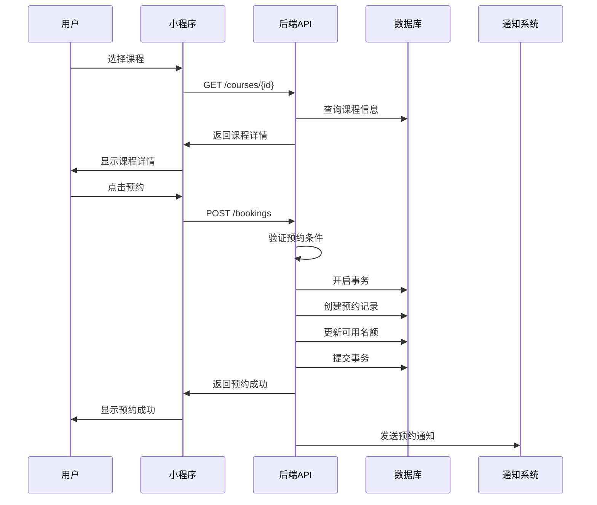
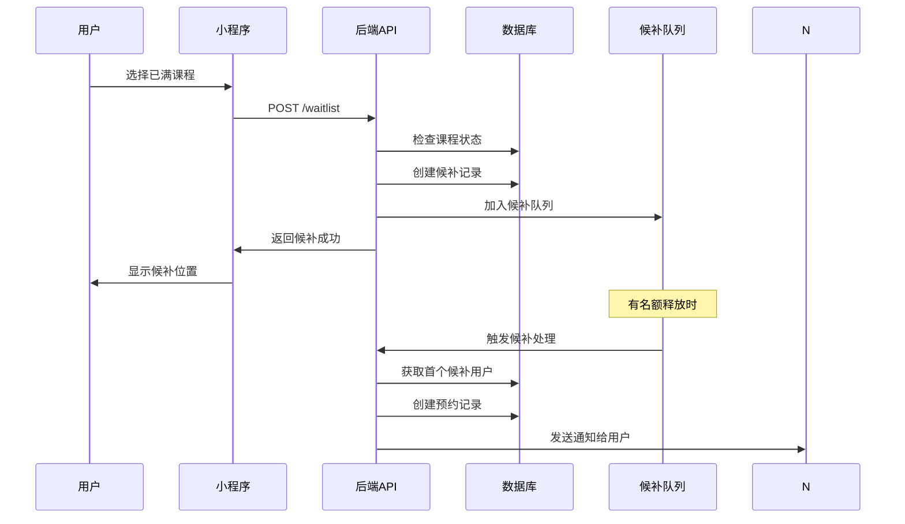

# 数据模型： Course Display and Booking System

**Feature**: 002-course-display-and-booking
**创建时间**: 2025-10-29
**Version**: 1.1.0
**Update**: 2025-10-31 - 整合最终需求：候补通知、补课补偿、私教预约、虚拟年龄、价格规则等扩展表结构

## Database Schema

### Overview

课程预约系统的数据模型支持灵活排课和固定班两种课程模式，包含课程管理、预约系统、候补队列等核心功能，为学员提供便捷的课程预约体验。

### Entity Relationship Diagram

```
┌─────────────────┐         ┌─────────────────┐         ┌─────────────────┐
│     course      │         │  course_tags    │         │   schedule      │
├─────────────────┤         ├─────────────────┤         ├─────────────────┤
│ id (PK)         │◄────────┤ course_id (FK)  │◄────────┤ id (PK)         │
│ name            │ 1:1     │ level_range     │         │ course_id (FK)  │
│ description     │         │ age_range       │         │ start_time      │
│ max_capacity    │         │ gender          │         │ end_time        │
│ price           │         │ course_type     │         │ date            │
│ main_instructor_id│       │ skill_types     │         │ instructor_id   │
│ sub_instructor_id│       │ intensity_level │         │ available_spots │
│ end_date        │         │ main_instructor │         │ created_at      │
│ status          │         │ has_assistant   │         └─────────────────┘
│ created_at      │         │ popularity      │                  │
│ updated_at      │         │ created_at      │                  │
└─────────────────┘         │ updated_at      │                  │
         │                   └─────────────────┘                  │
         │                                                         │
         ▼                                                         ▼
┌─────────────────┐                                     ┌─────────────────┐
│   instructor    │                                     │    booking      │
├─────────────────┤                                     ├─────────────────┤
│ id (PK)         │                                     │ id (PK)         │
│ name            │                                     │ schedule_id (FK)│
│ avatar_url      │                                     │ profile_id (FK) │
│ bio             │                                     │ status          │
│ specialties     │                                     │ match_score     │
│ rating          │                                     │ match_details   │
│ teaching_hours  │                                     │ booked_at       │
│ status          │                                     │ cancelled_at    │
└─────────────────┘                                     │ note            │
         │                                               └─────────────────┘
         │                                                        │
         │                                                        ▼
         │                                              ┌─────────────────┐
         │                                              │ tag_match_log   │
         │                                              ├─────────────────┤
         │                                              │ id (PK)         │
         │                                              │ profile_id (FK) │
         │                                              │ course_id (FK)  │
         │                                              │ is_matched      │
         │                                              │ match_score     │
         │                                              │ match_details   │
         │                                              │ match_rule      │
         │                                              │ algorithm_version│
         │                                              │ created_at      │
         │                                              └─────────────────┘
         ▼
┌─────────────────┐
│    profile      │ (来自MVP-1,扩展字段)
├─────────────────┤
│ id (PK)         │
│ name            │
│ birthday        │
│ gender          │
│ level           │
│ development     │ ← 新增字段
│ privilege       │ ← 新增字段
│ status          │
│ created_at      │
│ updated_at      │
└─────────────────┘
         │
         ▼
┌─────────────────┐
│  pricing_rule   │ (价格规则表)
├─────────────────┤
│ id (PK)         │
│ rule_name       │
│ customer_type   │
│ audience        │
│ course_type     │
│ level_range     │
│ price_per_hour  │
│ discount_rate   │
│ effective_date  │
│ is_active       │
│ created_at      │
│ updated_at      │
└─────────────────┘
```

## Table Definitions

### course（课程表）

**描述**：存储课程的基础信息，与标签信息分离存储

**用途**：课程管理、预约系统的基础数据

| 字段名 | 数据类型 | 约束 | 默认值 | 描述 | 索引 |
|--------|----------|------|--------|------|------|
| id | INT | PK, AUTO_INCREMENT | - | 课程ID | PRIMARY |
| name | VARCHAR(100) | NOT NULL | - | 课程名称 | INDEX |
| description | TEXT | NULL | NULL | 课程描述 | - |
| max_capacity | INT | NOT NULL | 10 | 最大容量 | - |
| price | DECIMAL(10,2) | NOT NULL | 0.00 | 课程价格 | - |
| main_instructor_id | INT | NULL | NULL | 主教练ID | INDEX |
| sub_instructor_id | INT | NULL | NULL | 代课教练ID | INDEX |
| end_date | DATE | NULL | NULL | 课程结束日期（固定班用） | INDEX |
| status | TINYINT | NOT NULL | 1 | 状态：1=正常,0=已删除 | INDEX |
| created_at | TIMESTAMP | NOT NULL | CURRENT_TIMESTAMP | 创建时间 | INDEX |
| updated_at | TIMESTAMP | NOT NULL | CURRENT_TIMESTAMP ON UPDATE | 更新时间 | INDEX |

**外键约束**：
- `main_instructor_id` → `instructor.id` (ON DELETE RESTRICT)
- `sub_instructor_id` → `instructor.id` (ON DELETE SET NULL)

**业务规则**：
- 课程基础信息与标签信息分离存储，便于标签系统的灵活配置
- `max_capacity` 为课程的最大学员数量
- `end_date` 仅对固定班有效，表示课程结束时间
- 删除课程时使用软删除，保留历史预约记录

### course_tags（课程标签表）

**描述**：存储课程的多维度标签信息，支持智能匹配算法

**用途**：标签匹配系统、课程推荐、运营分析

| 字段名 | 数据类型 | 约束 | 默认值 | 描述 | 索引 |
|--------|----------|------|--------|------|------|
| id | INT | PK, AUTO_INCREMENT | - | 标签ID | PRIMARY |
| course_id | INT | NOT NULL | - | 课程ID | UNIQUE |
| level_range | VARCHAR(100) | NULL | NULL | 等级范围(JSON数组,如["L1+", "L2"]) | INDEX |
| age_range | ENUM('3-4','4-5','5-6','6+','all') | DEFAULT 'all' | 年龄范围 | INDEX |
| gender | ENUM('male','female','both') | DEFAULT 'both' | 性别要求 | INDEX |
| course_type | ENUM('interest','professional','competition','long_term','trial','private','camp') | NOT NULL | - | 课程类型 | INDEX |
| skill_types | JSON | NULL | NULL | 技能类型(JSON数组) | - |
| intensity_level | ENUM('light','medium','high') | DEFAULT 'medium' | 课程强度 | INDEX |
| main_instructor | VARCHAR(50) | NULL | NULL | 主教老师 | - |
| has_assistant | BOOLEAN | DEFAULT FALSE | 是否有助教 | - |
| popularity | ENUM('hot','normal','cold') | DEFAULT 'normal' | 热门程度 | INDEX |
| audience | ENUM('child','adult','both') | DEFAULT 'both' | 目标人群 | INDEX |
| pricing_category | ENUM('group','long_term','private_1v1','private_1v2','trial') | DEFAULT 'group' | 定价类别 | INDEX |
| base_price | DECIMAL(10,2) | NULL | NULL | 基础价格(用于显示) | INDEX |
| pricing_strategy | ENUM('fixed','dynamic') | DEFAULT 'dynamic' | 定价策略 | INDEX |
| created_at | TIMESTAMP | NOT NULL | CURRENT_TIMESTAMP | 创建时间 | INDEX |
| updated_at | TIMESTAMP | NOT NULL | CURRENT_TIMESTAMP ON UPDATE | 更新时间 | INDEX |

**外键约束**：
- `course_id` → `course.id` (ON DELETE CASCADE)

**唯一约束**：
- `uk_course_id` (`course_id`)

**业务规则**：
- `level_range` 支持跨级匹配，JSON格式存储多个等级，如["L1+", "L2"]
- `age_range` 目标年龄段，支持灵活匹配
- `gender` 性别限制，both表示不限，新增第4维标签匹配
- `course_type` 课程类型，影响匹配策略
- `skill_types` 技能类型JSON数组，支持多技能标签
- `intensity_level` 课程强度，影响推荐算法
- `main_instructor` 主教老师，支持教练匹配
- `has_assistant` 是否有助教，影响课程质量评估
- `popularity` 热门程度，影响推荐排序
- `audience` 目标人群，区分儿童/成人/通用课程，用于价格计算
- `pricing_category` 定价类别，区分团课/长训班/私教1v1/私教1v2/体验课，用于定价规则匹配
- `base_price` 基础价格，用于课程列表显示"XX元起"，实际价格由pricing_rule动态计算
- `pricing_strategy` 定价策略，fixed=固定价格(体验课200元)，dynamic=动态计算(基于用户权益)
- **FR-040**: 4维标签白名单匹配：等级维度 + 年龄维度 + 性别维度 + 类型维度，任一维度不匹配则课程不显示

### schedule（课程安排表）

**描述**：存储具体的课程时间安排，支持灵活排课的单次安排和固定班的重复安排

**用途**：预约系统的时间管理，名额控制

| 字段名 | 数据类型 | 约束 | 默认值 | 描述 | 索引 |
|--------|----------|------|--------|------|------|
| id | INT | PK, AUTO_INCREMENT | - | 安排ID | PRIMARY |
| course_id | INT | NOT NULL | - | 课程ID | INDEX |
| start_time | TIME | NOT NULL | - | 开始时间 | INDEX |
| end_time | TIME | NOT NULL | - | 结束时间 | - |
| date | DATE | NOT NULL | - | 上课日期 | INDEX |
| instructor_id | INT | NOT NULL | - | 授课教练ID | INDEX |
| available_spots | INT | NOT NULL | 0 | 可用名额 | - |
| created_at | TIMESTAMP | NOT NULL | CURRENT_TIMESTAMP | 创建时间 | INDEX |

**外键约束**：
- `course_id` → `course.id` (ON DELETE CASCADE)
- `instructor_id` → `instructor.id` (ON DELETE RESTRICT)

**业务规则**：
- `available_spots` = `course.max_capacity` - 当前预约数量
- 灵活排课：每次创建单独的schedule记录
- 固定班：批量创建重复的schedule记录
- 同一时间同一教练不能安排两门课程

### booking（预约记录表）

**描述**：存储用户的预约记录和标签匹配信息，支持多种预约状态

**用途**：预约管理、出勤统计、退款处理、标签匹配分析

| 字段名 | 数据类型 | 约束 | 默认值 | 描述 | 索引 |
|--------|----------|------|--------|------|------|
| id | INT | PK, AUTO_INCREMENT | - | 预约ID | PRIMARY |
| schedule_id | INT | NOT NULL | - | 课程安排ID | INDEX |
| profile_id | INT | NOT NULL | - | 档案ID | INDEX |
| status | ENUM('booked','completed','cancelled','leave','absent') | NOT NULL | 'booked' | 预约状态 | INDEX |
| match_score | DECIMAL(5,2) | NULL | NULL | 匹配分数(0-100) | INDEX |
| match_details | JSON | NULL | NULL | 匹配详情 | - |
| booked_at | TIMESTAMP | NOT NULL | CURRENT_TIMESTAMP | 预约时间 | INDEX |
| cancelled_at | TIMESTAMP | NULL | NULL | 取消时间 | INDEX |
| can_refund_until | TIMESTAMP | NULL | NULL | 退费截止时间 | INDEX |
| note | TEXT | NULL | NULL | 备注 | - |

**外键约束**：
- `schedule_id` → `schedule.id` (ON DELETE CASCADE)
- `profile_id` → `profile.id` (ON DELETE CASCADE)

**唯一约束**：
- `uk_schedule_profile` (`schedule_id`, `profile_id`)

**枚举值**：
- `status`: 'booked'（已预约）, 'completed'（已完成）, 'cancelled'（已取消）, 'leave'（请假）, 'absent'（旷课）

**业务规则**：
- 同一档案不能重复预约同一课程安排
- 取消预约时更新status为'cancelled'并记录cancelled_at
- 请假时更新status为'leave'，生成补课记录
- `match_score` 记录预约时的匹配分数，用于后续分析
- `match_details` JSON存储详细的匹配过程，包含各维度得分
- 旷课时更新status为'absent'
- `can_refund_until` 记录退费截止时间（开课前6小时），超过此时间无法退费

### tag_match_log（标签匹配日志表）

**描述**：记录标签匹配的详细过程，用于调试和优化匹配算法

**用途**：算法分析、匹配优化、问题排查

| 字段名 | 数据类型 | 约束 | 默认值 | 描述 | 索引 |
|--------|----------|------|--------|------|------|
| id | BIGINT | PK, AUTO_INCREMENT | - | 匹配日志ID | PRIMARY |
| profile_id | INT | NOT NULL | - | 档案ID | INDEX |
| course_id | INT | NOT NULL | - | 课程ID | INDEX |
| is_matched | BOOLEAN | NOT NULL | - | 是否匹配 | INDEX |
| match_score | DECIMAL(5,2) | NULL | NULL | 匹配分数(0-100) | INDEX |
| match_details | JSON | NULL | NULL | 匹配详情 | - |
| match_rule | VARCHAR(50) | NULL | NULL | 匹配规则类型 | INDEX |
| algorithm_version | VARCHAR(20) | DEFAULT 'v1.0' | 算法版本 | INDEX |
| created_at | TIMESTAMP | NOT NULL | CURRENT_TIMESTAMP | 创建时间 | INDEX |

**外键约束**：
- `profile_id` → `profile.id` (ON DELETE CASCADE)
- `course_id` → `course.id` (ON DELETE CASCADE)

**业务规则**：
- 每次标签匹配计算都记录日志
- `is_matched` 最终匹配结果
- `match_score` 匹配分数，用于排序和推荐
- `match_details` 详细的匹配过程，包含各维度得分
- `match_rule` 应用的匹配规则类型（under_L3/above_L3/trial_class）
- `algorithm_version` 算法版本，支持算法迭代
- 数据量较大，建议定期归档历史数据

### waitlist（候补队列表）

**描述**：管理课程候补队列，支持按时间顺序的候补处理和动态容量管理

**用途**：名额释放时的自动候补通知，FR-043动态容量管理

| 字段名 | 数据类型 | 约束 | 默认值 | 描述 | 索引 |
|--------|----------|------|--------|------|------|
| id | INT | PK, AUTO_INCREMENT | - | 候补ID | PRIMARY |
| schedule_id | INT | NOT NULL | - | 课程安排ID | INDEX |
| student_id | INT | NOT NULL | - | 学员ID | INDEX |
| position | INT | NOT NULL | - | 候补位置 | INDEX |
| status | ENUM('waiting','notified','expired','cancelled') | NOT NULL | 'waiting' | 候补状态 | INDEX |
| waitlist_capacity_limit | INT | NOT NULL DEFAULT 8 | 候补队列容量限制 | INDEX |
| current_queue_size | INT | NOT NULL DEFAULT 0 | 当前队列大小 | - |
| capacity_usage_rate | DECIMAL(5,2) | NOT NULL DEFAULT 0.00 | 容量使用率 | - |
| created_at | TIMESTAMP | NOT NULL | CURRENT_TIMESTAMP | 创建时间 | INDEX |

**外键约束**：
- `schedule_id` → `schedule.id` (ON DELETE CASCADE)
- `student_id` → `profile.id` (ON DELETE CASCADE)

**唯一约束**：
- `uk_schedule_student` (`schedule_id`, `student_id`)

**枚举值**：
- `status`: 'waiting'（等待中）, 'notified'（已通知）, 'expired'（已过期）, 'cancelled'（已取消）

**业务规则**：
- `position` 按创建时间自动分配，越小越优先
- 收到通知后10分钟内未确认自动过期
- 学员可以主动取消候补

### pricing_rule（价格规则表）

**描述**：存储多维度价格规则，支持基于客户类型、人群、课程类型、等级的差异化定价

**用途**：价格计算系统、运营后台价格管理、个性化价格显示

| 字段名 | 数据类型 | 约束 | 默认值 | 描述 | 索引 |
|--------|----------|------|--------|------|------|
| id | INT | PK, AUTO_INCREMENT | - | 价格规则ID | PRIMARY |
| rule_name | VARCHAR(100) | NOT NULL | - | 规则名称 | INDEX |
| customer_type | ENUM('old_user','new_user','friend') | NOT NULL | - | 客户类型 | INDEX |
| audience | ENUM('child','adult') | NOT NULL | - | 人群类型 | INDEX |
| course_type | ENUM('group','long_term','private_1v1','private_1v2','trial') | NOT NULL | - | 课程类型 | INDEX |
| level_range | VARCHAR(50) | NULL | NULL | 等级范围(如"L1-L4") | INDEX |
| price_per_hour | DECIMAL(10,2) | NOT NULL | - | 每小时价格 | - |
| discount_rate | DECIMAL(3,2) | DEFAULT 1.00 | 1.00 | 折扣率 | - |
| effective_date | DATE | NULL | NULL | 生效日期 | INDEX |
| is_active | BOOLEAN | DEFAULT TRUE | TRUE | 是否启用 | INDEX |
| created_at | TIMESTAMP | NOT NULL | CURRENT_TIMESTAMP | 创建时间 | INDEX |
| updated_at | TIMESTAMP | NOT NULL | CURRENT_TIMESTAMP ON UPDATE | 更新时间 | INDEX |

**唯一约束**：
- `uk_rule_unique` (`customer_type`, `audience`, `course_type`, `level_range`)

**业务规则**：
- `customer_type`: old_user(老用户)/new_user(新用户)/friend(亲友权益)
- `audience`: child(儿童)/adult(成人)，基于年龄自动判断
- `course_type`: group(团课)/long_term(长训班)/private_1v1(私教1v1)/private_1v2(私教1v2)/trial(体验课)
- `level_range`: 等级范围，支持"L1-L4"格式或"NULL"(不限等级)
- `discount_rate`: 折扣率，1.00表示无折扣，0.60表示6折
- `effective_date`: 生效日期，用于区分老用户和新用户基准日(2024-11-11)
- 亲友权益仅适用于团课，discount_rate自动设为0.60
- 成人课程新老同价，无差异定价

### instructor（教练表）

**描述**：存储教练的基本信息

**用途**：课程管理、预约显示

| 字段名 | 数据类型 | 约束 | 默认值 | 描述 | 索引 |
|--------|----------|------|--------|------|------|
| id | INT | PK, AUTO_INCREMENT | - | 教练ID | PRIMARY |
| name | VARCHAR(50) | NOT NULL | - | 教练姓名 | INDEX |
| avatar_url | VARCHAR(255) | NULL | NULL | 头像URL | - |
| bio | TEXT | NULL | NULL | 教练简介 | - |
| rating | DECIMAL(2,1) | DEFAULT NULL | NULL | 教练评分 | INDEX |
| status | TINYINT | NOT NULL | 1 | 状态：1=正常,0=已删除 | INDEX |
| created_at | TIMESTAMP | NOT NULL | CURRENT_TIMESTAMP | 创建时间 | INDEX |
| updated_at | TIMESTAMP | NOT NULL | CURRENT_TIMESTAMP ON UPDATE | 更新时间 | INDEX |

**业务规则**：
- `rating` 范围为0.0-5.0，保留一位小数
- 删除教练时使用软删除，保留历史授课记录
- 教练头像URL可为空，使用默认头像

### course_cancellation（课程取消表）

**描述**：记录课程取消的历史信息

**用途**：取消记录追踪、统计分析

| 字段名 | 数据类型 | 约束 | 默认值 | 描述 | 索引 |
|--------|----------|------|--------|------|------|
| id | INT | PK, AUTO_INCREMENT | - | 取消ID | PRIMARY |
| schedule_id | INT | NOT NULL | - | 课程安排ID | INDEX |
| reason | TEXT | NOT NULL | - | 取消原因 | - |
| cancel_type | ENUM('instructor','system','other') | NOT NULL | 'other' | 取消类型 | INDEX |
| created_at | TIMESTAMP | NOT NULL | CURRENT_TIMESTAMP | 取消时间 | INDEX |

**外键约束**：
- `schedule_id` → `schedule.id` (ON DELETE CASCADE)

**枚举值**：
- `cancel_type`: 'instructor'（教练取消）, 'system'（系统取消）, 'other'（其他）

**业务规则**：
- 课程取消时必须记录取消原因
- 自动处理所有相关预约的退款/补课
- 通知所有候补用户课程已取消

## API Contracts

### Course Management API

#### GET /api/v1/courses
**方法**: GET
**路径**: /api/v1/courses
**描述**: 获取课程列表

**Query Parameters**:
```
?level=L1&course_type=flexible&page=1&limit=10
```

**Response**:
```json
{
  "code": 200,
  "message": "查询成功",
  "data": {
    "courses": [
      {
        "course_id": 1,
        "name": "基础体操训练",
        "description": "适合初学者的基础体操课程",
        "level": "L1",
        "price": 200.00,
        "course_type": "flexible",
        "main_instructor": {
          "id": 1,
          "name": "张教练",
          "avatar_url": "https://example.com/avatar.jpg",
          "rating": 4.8
        },
        "status": 1,
        "created_at": "2025-10-29T00:00:00Z"
      }
    ],
    "total": 15,
    "page": 1,
    "limit": 10
  }
}
```

#### GET /api/v1/courses/{id}
**方法**: GET
**路径**: /api/v1/courses/{id}
**描述**: 获取课程详情

**Response**:
```json
{
  "code": 200,
  "message": "查询成功",
  "data": {
    "course_id": 1,
    "name": "基础体操训练",
    "description": "适合初学者的基础体操课程",
    "level": "L1",
    "max_capacity": 10,
    "price": 200.00,
    "course_type": "flexible",
    "main_instructor": {
      "id": 1,
      "name": "张教练",
      "avatar_url": "https://example.com/avatar.jpg",
      "rating": 4.8,
      "bio": "10年体操教学经验"
    },
    "schedules": [
      {
        "schedule_id": 1,
        "date": "2025-11-01",
        "start_time": "14:00:00",
        "end_time": "15:30:00",
        "available_spots": 3,
        "instructor": {
          "id": 1,
          "name": "张教练"
        }
      }
    ],
    "status": 1,
    "created_at": "2025-10-29T00:00:00Z"
  }
}
```

### Booking Management API

#### POST /api/v1/bookings
**方法**: POST
**路径**: /api/v1/bookings
**描述**: 创建预约

**Request**:
```json
{
  "schedule_id": 1,
  "student_id": 1,
  "note": "第一次上课，请多关照"
}
```

**Response**:
```json
{
  "code": 200,
  "message": "预约成功",
  "data": {
    "booking_id": 1,
    "schedule": {
      "schedule_id": 1,
      "date": "2025-11-01",
      "start_time": "14:00:00",
      "end_time": "15:30:00"
    },
    "course": {
      "course_id": 1,
      "name": "基础体操训练",
      "level": "L1"
    },
    "student": {
      "student_id": 1,
      "name": "小明"
    },
    "status": "booked",
    "booked_at": "2025-10-29T10:00:00Z"
  }
}
```

#### DELETE /api/v1/bookings/{id}
**方法**: DELETE
**路径**: /api/v1/bookings/{id}
**描述**: 取消预约

**Response**:
```json
{
  "code": 200,
  "message": "预约已取消",
  "data": {
    "booking_id": 1,
    "cancelled_at": "2025-10-29T11:00:00Z",
    "refund_info": {
      "type": "wechat_refund",
      "amount": 200.00,
      "status": "pending"
    }
  }
}
```

#### GET /api/v1/bookings
**方法**: GET
**路径**: /api/v1/bookings
**描述**: 获取预约列表

**Query Parameters**:
```
?student_id=1&status=booked&page=1&limit=10
```

**Response**:
```json
{
  "code": 200,
  "message": "查询成功",
  "data": {
    "bookings": [
      {
        "booking_id": 1,
        "schedule": {
          "schedule_id": 1,
          "date": "2025-11-01",
          "start_time": "14:00:00",
          "end_time": "15:30:00"
        },
        "course": {
          "course_id": 1,
          "name": "基础体操训练",
          "level": "L1",
          "course_type": "flexible"
        },
        "student": {
          "student_id": 1,
          "name": "小明"
        },
        "status": "booked",
        "booked_at": "2025-10-29T10:00:00Z"
      }
    ],
    "total": 5,
    "page": 1,
    "limit": 10
  }
}
```

### Waitlist Management API

#### POST /api/v1/waitlist
**方法**: POST
**路径**: /api/v1/waitlist
**描述**: 加入候补队列

**Request**:
```json
{
  "schedule_id": 1,
  "student_id": 1
}
```

**Response**:
```json
{
  "code": 200,
  "message": "已加入候补队列",
  "data": {
    "waitlist_id": 1,
    "position": 3,
    "schedule": {
      "schedule_id": 1,
      "date": "2025-11-01",
      "start_time": "14:00:00"
    },
    "estimated_time": "约2-3天内有空位"
  }
}
```

#### GET /api/v1/waitlist
**方法**: GET
**路径**: /api/v1/waitlist
**描述**: 获取候补队列

**Query Parameters**:
```
?schedule_id=1&status=waiting
```

**Response**:
```json
{
  "code": 200,
  "message": "查询成功",
  "data": {
    "waitlist": [
      {
        "waitlist_id": 1,
        "student": {
          "student_id": 1,
          "name": "小明"
        },
        "position": 1,
        "status": "waiting",
        "created_at": "2025-10-29T09:00:00Z"
      }
    ],
    "total": 3
  }
}
```

## Data Validation

### Input Validation

#### Course Creation Validation
- **name**: 必填，1-100字符，不能包含特殊字符
- **description**: 可选，最多1000字符
- **level**: 必填，只能是L1-L6中的一个
- **max_capacity**: 必填，1-50之间的整数
- **price**: 必填，0-9999.99之间的数值
- **course_type**: 必填，只能是flexible或fixed
- **main_instructor_id**: 必填，有效的教练ID

#### Booking Creation Validation
- **schedule_id**: 必填，有效的课程安排ID
- **student_id**: 必填，有效的学员ID
- **note**: 可选，最多200字符

#### Waitlist Creation Validation
- **schedule_id**: 必填，有效的课程安排ID
- **student_id**: 必填，有效的学员ID

### Business Validation

#### Course Management Rules
- 课程名称在相同等级下不能重复
- 教练在同一时间不能安排两门课程
- 固定班课程必须有明确的结束日期
- 课程容量不能超过50人

#### Booking Management Rules
- 学员不能重复预约同一课程安排
- 预约时检查课程时间是否冲突
- 取消预约需要满足时间限制（开课前6小时）
- 请假规则：不设置月度次数限制，连续请假4次触发运营通知

#### Waitlist Management Rules
- 学员不能重复加入同一课程的候补队列
- 候补位置按报名时间自动分配
- 候补通知后10分钟内未确认自动过期
- 候补队列最多支持50人

### Data Consistency Rules
- 课程取消时自动取消所有相关预约
- 预约取消时立即释放课程名额
- 候补成功时自动创建预约记录
- 软删除课程不影响历史预约记录

## Migration Strategy

### Version 1.0.0

#### 创建数据库
```sql
-- 创建数据库（如果不存在）
CREATE DATABASE IF NOT EXISTS ccmartmeet
CHARACTER SET utf8mb4
COLLATE utf8mb4_unicode_ci;

USE ccmartmeet;
```

#### 创建 instructor 表
```sql
CREATE TABLE `instructor` (
  `id` INT PRIMARY KEY AUTO_INCREMENT COMMENT '教练ID',
  `name` VARCHAR(50) NOT NULL COMMENT '教练姓名',
  `avatar_url` VARCHAR(255) DEFAULT NULL COMMENT '头像URL',
  `bio` TEXT DEFAULT NULL COMMENT '教练简介',
  `rating` DECIMAL(2,1) DEFAULT NULL COMMENT '教练评分(0.0-5.0)',
  `status` TINYINT DEFAULT 1 COMMENT '状态：1=正常,0=已删除',
  `created_at` TIMESTAMP DEFAULT CURRENT_TIMESTAMP,
  `updated_at` TIMESTAMP DEFAULT CURRENT_TIMESTAMP ON UPDATE CURRENT_TIMESTAMP,

  INDEX `idx_name` (`name`),
  INDEX `idx_rating` (`rating`),
  INDEX `idx_status` (`status`)
) ENGINE=InnoDB DEFAULT CHARSET=utf8mb4 COMMENT='教练表';
```

#### 创建 course 表
```sql
CREATE TABLE `course` (
  `id` INT PRIMARY KEY AUTO_INCREMENT COMMENT '课程ID',
  `name` VARCHAR(100) NOT NULL COMMENT '课程名称',
  `description` TEXT DEFAULT NULL COMMENT '课程描述',
  `level` ENUM('L1', 'L2', 'L3', 'L4', 'L5', 'L6') NOT NULL DEFAULT 'L1' COMMENT '课程等级',
  `max_capacity` INT NOT NULL DEFAULT 10 COMMENT '最大容量',
  `price` DECIMAL(10,2) NOT NULL DEFAULT 0.00 COMMENT '课程价格',
  `course_type` ENUM('flexible', 'fixed') NOT NULL DEFAULT 'flexible' COMMENT '课程类型',
  `main_instructor_id` INT NOT NULL COMMENT '主教练ID',
  `substitute_instructor_id` INT DEFAULT NULL COMMENT '代课教练ID',
  `end_date` DATE DEFAULT NULL COMMENT '课程结束日期（固定班用）',
  `status` TINYINT DEFAULT 1 COMMENT '状态：1=正常,0=已删除',
  `created_at` TIMESTAMP DEFAULT CURRENT_TIMESTAMP,
  `updated_at` TIMESTAMP DEFAULT CURRENT_TIMESTAMP ON UPDATE CURRENT_TIMESTAMP,

  INDEX `idx_name` (`name`),
  INDEX `idx_level` (`level`),
  INDEX `idx_course_type` (`course_type`),
  INDEX `idx_main_instructor` (`main_instructor_id`),
  INDEX `idx_substitute_instructor` (`substitute_instructor_id`),
  INDEX `idx_end_date` (`end_date`),
  INDEX `idx_status` (`status`),
  FOREIGN KEY (`main_instructor_id`) REFERENCES `instructor`(`id`) ON DELETE RESTRICT,
  FOREIGN KEY (`substitute_instructor_id`) REFERENCES `instructor`(`id`) ON DELETE SET NULL
) ENGINE=InnoDB DEFAULT CHARSET=utf8mb4 COMMENT='课程表';
```

#### 创建 schedule 表
```sql
CREATE TABLE `schedule` (
  `id` INT PRIMARY KEY AUTO_INCREMENT COMMENT '安排ID',
  `course_id` INT NOT NULL COMMENT '课程ID',
  `start_time` TIME NOT NULL COMMENT '开始时间',
  `end_time` TIME NOT NULL COMMENT '结束时间',
  `date` DATE NOT NULL COMMENT '上课日期',
  `instructor_id` INT NOT NULL COMMENT '授课教练ID',
  `available_spots` INT NOT NULL DEFAULT 0 COMMENT '可用名额',
  `created_at` TIMESTAMP DEFAULT CURRENT_TIMESTAMP,

  INDEX `idx_course` (`course_id`),
  INDEX `idx_instructor` (`instructor_id`),
  INDEX `idx_date` (`date`),
  INDEX `idx_date_time` (`date`, `start_time`),
  FOREIGN KEY (`course_id`) REFERENCES `course`(`id`) ON DELETE CASCADE,
  FOREIGN KEY (`instructor_id`) REFERENCES `instructor`(`id`) ON DELETE RESTRICT
) ENGINE=InnoDB DEFAULT CHARSET=utf8mb4 COMMENT='课程安排表';
```

#### 创建 booking 表
```sql
CREATE TABLE `booking` (
  `id` INT PRIMARY KEY AUTO_INCREMENT COMMENT '预约ID',
  `schedule_id` INT NOT NULL COMMENT '课程安排ID',
  `student_id` INT NOT NULL COMMENT '学员ID',
  `status` ENUM('booked', 'completed', 'cancelled', 'leave', 'absent') NOT NULL DEFAULT 'booked' COMMENT '预约状态',
  `booked_at` TIMESTAMP DEFAULT CURRENT_TIMESTAMP COMMENT '预约时间',
  `cancelled_at` TIMESTAMP DEFAULT NULL COMMENT '取消时间',
  `note` TEXT DEFAULT NULL COMMENT '备注',

  UNIQUE KEY `uk_schedule_student` (`schedule_id`, `student_id`),
  INDEX `idx_schedule` (`schedule_id`),
  INDEX `idx_student` (`student_id`),
  INDEX `idx_status` (`status`),
  INDEX `idx_booked_at` (`booked_at`),
  FOREIGN KEY (`schedule_id`) REFERENCES `schedule`(`id`) ON DELETE CASCADE,
  FOREIGN KEY (`student_id`) REFERENCES `profile`(`id`) ON DELETE CASCADE
) ENGINE=InnoDB DEFAULT CHARSET=utf8mb4 COMMENT='预约记录表';
```

#### 创建 waitlist 表
```sql
CREATE TABLE `waitlist` (
  `id` INT PRIMARY KEY AUTO_INCREMENT COMMENT '候补ID',
  `schedule_id` INT NOT NULL COMMENT '课程安排ID',
  `student_id` INT NOT NULL COMMENT '学员ID',
  `position` INT NOT NULL COMMENT '候补位置',
  `status` ENUM('waiting', 'notified', 'expired', 'cancelled') NOT NULL DEFAULT 'waiting' COMMENT '候补状态',
  `created_at` TIMESTAMP DEFAULT CURRENT_TIMESTAMP,

  UNIQUE KEY `uk_schedule_student` (`schedule_id`, `student_id`),
  INDEX `idx_schedule` (`schedule_id`),
  INDEX `idx_student` (`student_id`),
  INDEX `idx_position` (`position`),
  INDEX `idx_status` (`status`),
  FOREIGN KEY (`schedule_id`) REFERENCES `schedule`(`id`) ON DELETE CASCADE,
  FOREIGN KEY (`student_id`) REFERENCES `profile`(`id`) ON DELETE CASCADE
) ENGINE=InnoDB DEFAULT CHARSET=utf8mb4 COMMENT='候补队列表';
```

#### 创建 course_cancellation 表
```sql
CREATE TABLE `course_cancellation` (
  `id` INT PRIMARY KEY AUTO_INCREMENT COMMENT '取消ID',
  `schedule_id` INT NOT NULL COMMENT '课程安排ID',
  `reason` TEXT NOT NULL COMMENT '取消原因',
  `cancel_type` ENUM('instructor', 'system', 'other') NOT NULL DEFAULT 'other' COMMENT '取消类型',
  `created_at` TIMESTAMP DEFAULT CURRENT_TIMESTAMP,

  INDEX `idx_schedule` (`schedule_id`),
  INDEX `idx_cancel_type` (`cancel_type`),
  INDEX `idx_created_at` (`created_at`),
  FOREIGN KEY (`schedule_id`) REFERENCES `schedule`(`id`) ON DELETE CASCADE
) ENGINE=InnoDB DEFAULT CHARSET=utf8mb4 COMMENT='课程取消表';
```

#### 初始化数据
```sql
-- 插入测试教练数据
INSERT INTO `instructor` (`name`, `rating`, `bio`) VALUES
('张教练', 4.8, '10年体操教学经验，擅长儿童基础训练'),
('李教练', 4.6, '8年体操教学经验，专业竞技体操背景'),
('王教练', 4.9, '12年体操教学经验，儿童心理学专家');

-- 插入测试课程数据
INSERT INTO `course` (`name`, `description`, `level`, `max_capacity`, `price`, `course_type`, `main_instructor_id`) VALUES
('基础体操训练', '适合初学者的基础体操课程，培养基本的体操动作和身体协调能力', 'L1', 10, 200.00, 'flexible', 1),
('进阶体操技巧', '在基础之上学习更复杂的体操技巧，提升身体控制能力', 'L2', 8, 250.00, 'flexible', 2),
('竞技体操预备', '为竞技体操比赛做准备的专业训练课程', 'L3', 6, 300.00, 'fixed', 3);
```

### Rollback Plan

#### 删除表（按依赖顺序倒序）
```sql
-- 删除外键约束
ALTER TABLE `waitlist` DROP FOREIGN KEY `waitlist_ibfk_1`;
ALTER TABLE `waitlist` DROP FOREIGN KEY `waitlist_ibfk_2`;
ALTER TABLE `booking` DROP FOREIGN KEY `booking_ibfk_1`;
ALTER TABLE `booking` DROP FOREIGN KEY `booking_ibfk_2`;
ALTER TABLE `schedule` DROP FOREIGN KEY `schedule_ibfk_1`;
ALTER TABLE `schedule` DROP FOREIGN KEY `schedule_ibfk_2`;
ALTER TABLE `course` DROP FOREIGN KEY `course_ibfk_1`;
ALTER TABLE `course` DROP FOREIGN KEY `course_ibfk_2`;
ALTER TABLE `course_cancellation` DROP FOREIGN KEY `course_cancellation_ibfk_1`;

-- 删除表
DROP TABLE IF EXISTS `course_cancellation`;
DROP TABLE IF EXISTS `waitlist`;
DROP TABLE IF EXISTS `booking`;
DROP TABLE IF EXISTS `schedule`;
DROP TABLE IF EXISTS `course`;
DROP TABLE IF EXISTS `instructor`;
```

#### 备份策略
- 每次迁移前自动备份数据库
- 保留最近30天的备份文件
- 关键操作前手动备份

## Performance Optimization

### Database Indexes

#### 主要查询索引
- `course.name` - 课程名称搜索
- `course.level` - 等级筛选
- `course.course_type` - 课程类型筛选
- `schedule.date` - 日期查询
- `schedule.instructor_id` - 教练查询
- `booking.student_id` - 学员预约查询
- `booking.status` - 状态筛选
- `waitlist.schedule_id` - 候补队列查询

#### 复合索引
- `schedule(date, start_time)` - 时间组合查询
- `booking(student_id, status)` - 学员状态组合查询
- `waitlist(schedule_id, position)` - 候补位置排序
- `course(level, course_type)` - 课程类型等级组合

### Query Optimization

#### 常用查询优化
```sql
-- 获取课程列表（使用复合索引）
SELECT c.*, i.name as instructor_name, i.rating
FROM course c
JOIN instructor i ON c.main_instructor_id = i.id
WHERE c.level = ? AND c.course_type = ? AND c.status = 1
ORDER BY c.created_at DESC
LIMIT 20;

-- 获取课程安排（使用时间索引）
SELECT s.*, c.name as course_name, c.level
FROM schedule s
JOIN course c ON s.course_id = c.id
WHERE s.date >= CURDATE() AND s.available_spots > 0
ORDER BY s.date, s.start_time;

-- 获取学员预约记录（使用学员索引）
SELECT b.*, s.date, s.start_time, c.name as course_name
FROM booking b
JOIN schedule s ON b.schedule_id = s.id
JOIN course c ON s.course_id = c.id
WHERE b.student_id = ? AND b.status IN ('booked', 'completed')
ORDER BY s.date, s.start_time;
```

#### 分页查询
```sql
-- 课程列表分页
SELECT c.*, i.name as instructor_name
FROM course c
JOIN instructor i ON c.main_instructor_id = i.id
WHERE c.status = 1
ORDER BY c.created_at DESC
LIMIT 10 OFFSET 0;

-- 预约记录分页
SELECT b.*, s.date, s.start_time, c.name as course_name
FROM booking b
JOIN schedule s ON b.schedule_id = s.id
JOIN course c ON s.course_id = c.id
WHERE b.student_id = ?
ORDER BY b.booked_at DESC
LIMIT 10 OFFSET 0;
```

### Caching Strategy

#### Redis 缓存
- 课程列表：缓存30分钟
- 课程详情：缓存1小时
- 教练信息：缓存2小时
- 课程安排：缓存15分钟（动态变化频繁）

#### 缓存键设计
```
courses:level:{level}:type:{type}  # 课程列表
course:{id}                        # 课程详情
instructor:{id}                    # 教练信息
schedule:date:{date}               # 按日期的课程安排
booking:student:{student_id}       # 学员预约记录
```

## Data Flow

### 课程预约流程



### 候补队列流程



## 安全考虑

### Data Protection

#### 敏感数据处理
- 教练联系信息加密存储（可选）
- 学员信息访问权限控制
- 课程价格信息防篡改

#### 权限控制
- 用户只能预约自己档案的课程
- 教练只能查看自己的课程安排
- 管理员权限分级管理

### Input Sanitization

#### SQL注入防护
- 使用参数化查询
- ORM框架自动防护
- 输入长度限制

#### XSS防护
- 前端输入转义
- 后端输出过滤
- CSP策略配置

### Audit Logging

#### 操作日志
```sql
CREATE TABLE `course_audit_log` (
  `id` INT PRIMARY KEY AUTO_INCREMENT,
  `account_id` INT NOT NULL,
  `action` VARCHAR(50) NOT NULL,
  `resource_type` VARCHAR(50) NOT NULL,
  `resource_id` INT,
  `old_data` JSON,
  `new_data` JSON,
  `ip_address` VARCHAR(45),
  `user_agent` TEXT,
  `created_at` TIMESTAMP DEFAULT CURRENT_TIMESTAMP,

  INDEX `idx_account_action` (`account_id`, `action`),
  INDEX `idx_resource` (`resource_type`, `resource_id`),
  INDEX `idx_created_at` (`created_at`)
) ENGINE=InnoDB DEFAULT CHARSET=utf8mb4 COMMENT='课程系统操作日志';
```

#### 记录的操作类型
- 课程创建 (course.create)
- 课程更新 (course.update)
- 课程删除 (course.delete)
- 预约创建 (booking.create)
- 预约取消 (booking.cancel)
- 候补加入 (waitlist.join)
- 候补取消 (waitlist.cancel)

---

## 扩展表结构（最终需求整合）

### 候补通知管理表

```sql
CREATE TABLE `waitlist_notification` (
  `id` INT PRIMARY KEY AUTO_INCREMENT COMMENT '通知ID',
  `waitlist_id` INT NOT NULL COMMENT '候补记录ID',
  `notification_type` ENUM('spot_available', 'deadline_reminder', 'expired') NOT NULL DEFAULT 'spot_available' COMMENT '通知类型',
  `sent_time` TIMESTAMP DEFAULT CURRENT_TIMESTAMP COMMENT '发送时间',
  `response_deadline` TIMESTAMP NULL COMMENT '响应截止时间',
  `response_time` TIMESTAMP NULL COMMENT '用户响应时间',
  `status` ENUM('pending', 'responded', 'expired', 'cancelled') NOT NULL DEFAULT 'pending' COMMENT '通知状态',
  `notification_round` INT NOT NULL DEFAULT 1 COMMENT '通知轮次',
  `created_at` TIMESTAMP DEFAULT CURRENT_TIMESTAMP,

  INDEX `idx_waitlist` (`waitlist_id`),
  INDEX `idx_status` (`status`),
  INDEX `idx_deadline` (`response_deadline`),
  FOREIGN KEY (`waitlist_id`) REFERENCES `waitlist`(`id`) ON DELETE CASCADE
) ENGINE=InnoDB DEFAULT CHARSET=utf8mb4 COMMENT='候补通知表';
```

### 候补流程时间记录表

```sql
CREATE TABLE `waitlist_flow` (
  `id` INT PRIMARY KEY AUTO_INCREMENT COMMENT '流程ID',
  `waitlist_notification_id` INT NOT NULL COMMENT '候补通知ID',
  `flow_start_time` TIMESTAMP DEFAULT CURRENT_TIMESTAMP COMMENT '流程开始时间',
  `flow_completion_time` TIMESTAMP NULL COMMENT '流程完成时间',
  `expiration_reason` ENUM('auto_timeout', 'user_cancel', 'system_error') NULL COMMENT '过期原因',
  `created_at` TIMESTAMP DEFAULT CURRENT_TIMESTAMP,

  INDEX `idx_notification` (`waitlist_notification_id`),
  INDEX `idx_start_time` (`flow_start_time`),
  FOREIGN KEY (`waitlist_notification_id`) REFERENCES `waitlist_notification`(`id`) ON DELETE CASCADE
) ENGINE=InnoDB DEFAULT CHARSET=utf8mb4 COMMENT='候补流程时间表';
```

### 补课预约记录表

```sql
CREATE TABLE `makeup_booking` (
  `id` INT PRIMARY KEY AUTO_INCREMENT COMMENT '补课预约ID',
  `user_id` INT NOT NULL COMMENT '用户ID',
  `original_booking_id` INT NOT NULL COMMENT '原预约ID',
  `makeup_class_id` INT NOT NULL COMMENT '补课课程ID',
  `status` ENUM('pending', 'completed', 'cancelled') NOT NULL DEFAULT 'pending' COMMENT '补课状态',
  `booking_time` TIMESTAMP DEFAULT CURRENT_TIMESTAMP COMMENT '预约时间',
  `original_duration` INT NOT NULL COMMENT '原课程时长(分钟)',
  `makeup_duration` INT NOT NULL COMMENT '补课课程时长(分钟)',
  `duration_difference` INT NOT NULL COMMENT '时长差异(分钟)',
  `completion_type` ENUM('full', 'partial', 'extra') NOT NULL COMMENT '完成类型',
  `created_at` TIMESTAMP DEFAULT CURRENT_TIMESTAMP,
  `updated_at` TIMESTAMP DEFAULT CURRENT_TIMESTAMP ON UPDATE CURRENT_TIMESTAMP,

  INDEX `idx_user` (`user_id`),
  INDEX `idx_original_booking` (`original_booking_id`),
  INDEX `idx_makeup_class` (`makeup_class_id`),
  INDEX `idx_status` (`status`),
  FOREIGN KEY (`user_id`) REFERENCES `account`(`id`) ON DELETE CASCADE,
  FOREIGN KEY (`original_booking_id`) REFERENCES `booking`(`id`) ON DELETE CASCADE
) ENGINE=InnoDB DEFAULT CHARSET=utf8mb4 COMMENT='补课预约记录表';
```

### 课时补偿记录表

```sql
CREATE TABLE `class_credit_compensation` (
  `id` INT PRIMARY KEY AUTO_INCREMENT COMMENT '补偿ID',
  `user_id` INT NOT NULL COMMENT '用户ID',
  `profile_id` INT NOT NULL COMMENT '学员档案ID',
  `original_booking_id` INT NOT NULL COMMENT '原预约ID',
  `compensation_minutes` INT NOT NULL COMMENT '补偿时长(分钟)',
  `status` ENUM('pending', 'used', 'expired') NOT NULL DEFAULT 'pending' COMMENT '补偿状态',
  `created_time` TIMESTAMP DEFAULT CURRENT_TIMESTAMP COMMENT '生成时间',
  `expiry_time` TIMESTAMP NULL COMMENT '过期时间',
  `used_time` TIMESTAMP NULL COMMENT '使用时间',
  `created_at` TIMESTAMP DEFAULT CURRENT_TIMESTAMP,

  INDEX `idx_user` (`user_id`),
  INDEX `idx_profile` (`profile_id`),
  INDEX `idx_original_booking` (`original_booking_id`),
  INDEX `idx_status` (`status`),
  INDEX `idx_expiry_time` (`expiry_time`),
  FOREIGN KEY (`user_id`) REFERENCES `account`(`id`) ON DELETE CASCADE,
  FOREIGN KEY (`profile_id`) REFERENCES `profile`(`id`) ON DELETE CASCADE,
  FOREIGN KEY (`original_booking_id`) REFERENCES `booking`(`id`) ON DELETE CASCADE
) ENGINE=InnoDB DEFAULT CHARSET=utf8mb4 COMMENT='课时补偿记录表';
```

### 补偿使用记录表

```sql
CREATE TABLE `compensation_usage` (
  `id` INT PRIMARY KEY AUTO_INCREMENT COMMENT '使用记录ID',
  `compensation_id` INT NOT NULL COMMENT '补偿记录ID',
  `booking_id` INT NOT NULL COMMENT '预约ID',
  `used_minutes` INT NOT NULL COMMENT '使用时长(分钟)',
  `remaining_minutes` INT NOT NULL COMMENT '剩余时长(分钟)',
  `usage_time` TIMESTAMP DEFAULT CURRENT_TIMESTAMP COMMENT '使用时间',
  `created_at` TIMESTAMP DEFAULT CURRENT_TIMESTAMP,

  INDEX `idx_compensation` (`compensation_id`),
  INDEX `idx_booking` (`booking_id`),
  INDEX `idx_usage_time` (`usage_time`),
  FOREIGN KEY (`compensation_id`) REFERENCES `class_credit_compensation`(`id`) ON DELETE CASCADE,
  FOREIGN KEY (`booking_id`) REFERENCES `booking`(`id`) ON DELETE CASCADE
) ENGINE=InnoDB DEFAULT CHARSET=utf8mb4 COMMENT='补偿使用记录表';
```

### 私教预约记录表

```sql
CREATE TABLE `private_booking` (
  `id` INT PRIMARY KEY AUTO_INCREMENT COMMENT '私教预约ID',
  `user_id` INT NOT NULL COMMENT '用户ID',
  `profile_id` INT NOT NULL COMMENT '学员档案ID',
  `instructor_id` INT NOT NULL COMMENT '教练ID',
  `booking_time` DATETIME NOT NULL COMMENT '预约时间',
  `duration` INT NOT NULL COMMENT '课程时长(分钟)',
  `price` DECIMAL(10,2) NOT NULL COMMENT '课程价格',
  `status` ENUM('pending', 'confirmed', 'completed', 'cancelled') NOT NULL DEFAULT 'pending' COMMENT '预约状态',
  `notes` TEXT NULL COMMENT '备注信息',
  `admin_id` INT NOT NULL COMMENT '录入运营人员ID',
  `confirmation_method` ENUM('phone', 'wechat', 'offline') NULL COMMENT '确认方式',
  `price_confirmation` TEXT NULL COMMENT '价格确认记录',
  `created_at` TIMESTAMP DEFAULT CURRENT_TIMESTAMP,
  `updated_at` TIMESTAMP DEFAULT CURRENT_TIMESTAMP ON UPDATE CURRENT_TIMESTAMP,

  INDEX `idx_user` (`user_id`),
  INDEX `idx_profile` (`profile_id`),
  INDEX `idx_instructor` (`instructor_id`),
  INDEX `idx_booking_time` (`booking_time`),
  INDEX `idx_status` (`status`),
  INDEX `idx_admin` (`admin_id`),
  FOREIGN KEY (`user_id`) REFERENCES `account`(`id`) ON DELETE CASCADE,
  FOREIGN KEY (`profile_id`) REFERENCES `profile`(`id`) ON DELETE CASCADE,
  FOREIGN KEY (`instructor_id`) REFERENCES `instructor`(`id`) ON DELETE CASCADE
) ENGINE=InnoDB DEFAULT CHARSET=utf8mb4 COMMENT='私教预约记录表';
```

### 私教咨询记录表

```sql
CREATE TABLE `private_class_inquiry` (
  `id` INT PRIMARY KEY AUTO_INCREMENT COMMENT '咨询ID',
  `user_id` INT NOT NULL COMMENT '用户ID',
  `instructor_id` INT NOT NULL COMMENT '教练ID',
  `inquiry_time` TIMESTAMP DEFAULT CURRENT_TIMESTAMP COMMENT '咨询时间',
  `inquiry_content` TEXT NOT NULL COMMENT '咨询内容',
  `follow_up_status` ENUM('pending', 'contacted', 'booked', 'not_interested') NOT NULL DEFAULT 'pending' COMMENT '跟进状态',
  `admin_id` INT NULL COMMENT '处理运营人员ID',
  `notes` TEXT NULL COMMENT '备注',
  `created_at` TIMESTAMP DEFAULT CURRENT_TIMESTAMP,
  `updated_at` TIMESTAMP DEFAULT CURRENT_TIMESTAMP ON UPDATE CURRENT_TIMESTAMP,

  INDEX `idx_user` (`user_id`),
  INDEX `idx_instructor` (`instructor_id`),
  INDEX `idx_status` (`follow_up_status`),
  INDEX `idx_inquiry_time` (`inquiry_time`),
  INDEX `idx_admin` (`admin_id`),
  FOREIGN KEY (`user_id`) REFERENCES `account`(`id`) ON DELETE CASCADE,
  FOREIGN KEY (`instructor_id`) REFERENCES `instructor`(`id`) ON DELETE CASCADE
) ENGINE=InnoDB DEFAULT CHARSET=utf8mb4 COMMENT='私教课咨询记录表';
```

### 虚拟年龄变更记录表

```sql
CREATE TABLE `virtual_age_log` (
  `id` INT PRIMARY KEY AUTO_INCREMENT COMMENT '变更ID',
  `profile_id` INT NOT NULL COMMENT '学员档案ID',
  `old_virtual_age` INT NULL COMMENT '原虚拟年龄',
  `new_virtual_age` INT NULL COMMENT '新虚拟年龄',
  `change_reason` VARCHAR(255) NOT NULL COMMENT '变更原因',
  `admin_id` INT NULL COMMENT '操作运营人员ID',
  `created_at` TIMESTAMP DEFAULT CURRENT_TIMESTAMP,

  INDEX `idx_profile` (`profile_id`),
  INDEX `idx_admin` (`admin_id`),
  INDEX `idx_created_at` (`created_at`),
  FOREIGN KEY (`profile_id`) REFERENCES `profile`(`id`) ON DELETE CASCADE
) ENGINE=InnoDB DEFAULT CHARSET=utf8mb4 COMMENT='虚拟年龄变更记录表';
```

### 价格规则表

```sql
CREATE TABLE `pricing_rule` (
  `id` INT PRIMARY KEY AUTO_INCREMENT COMMENT '规则ID',
  `rule_name` VARCHAR(100) NOT NULL COMMENT '规则名称',
  `customer_type` ENUM('old_user', 'new_user', 'friend_discount') NOT NULL COMMENT '客户类型',
  `audience` ENUM('child', 'adult') NOT NULL COMMENT '人群类型',
  `course_type` ENUM('group', 'private', 'trial') NOT NULL COMMENT '课程类型',
  `level_range` VARCHAR(50) NOT NULL COMMENT '等级范围',
  `hourly_price` DECIMAL(10,2) NOT NULL COMMENT '每小时价格',
  `discount_rate` DECIMAL(3,2) NOT NULL DEFAULT 1.00 COMMENT '折扣率',
  `effective_date` TIMESTAMP DEFAULT CURRENT_TIMESTAMP COMMENT '生效时间',
  `is_active` BOOLEAN NOT NULL DEFAULT TRUE COMMENT '是否启用',
  `priority` INT NOT NULL DEFAULT 0 COMMENT '优先级',
  `created_at` TIMESTAMP DEFAULT CURRENT_TIMESTAMP,
  `updated_at` TIMESTAMP DEFAULT CURRENT_TIMESTAMP ON UPDATE CURRENT_TIMESTAMP,

  UNIQUE KEY `uk_rule_name` (`rule_name`),
  INDEX `idx_customer_type` (`customer_type`),
  INDEX `idx_audience` (`audience`),
  INDEX `idx_course_type` (`course_type`),
  INDEX `idx_level_range` (`level_range`),
  INDEX `idx_active_priority` (`is_active`, `priority`)
) ENGINE=InnoDB DEFAULT CHARSET=utf8mb4 COMMENT='价格规则表';
```

---

## FR-043 扩展表结构：候补容量管理系统

### 课程候补容量设置表

```sql
CREATE TABLE `course_waitlist_capacity` (
  `id` INT PRIMARY KEY AUTO_INCREMENT COMMENT '容量设置ID',
  `course_id` INT NOT NULL COMMENT '课程ID',
  `waitlist_capacity_limit` INT NOT NULL DEFAULT 8 COMMENT '候补队列容量上限',
  `current_waitlist_count` INT NOT NULL DEFAULT 0 COMMENT '当前候补人数',
  `capacity_usage_rate` DECIMAL(5,2) NOT NULL DEFAULT 0.00 COMMENT '容量使用率',
  `course_type_category` ENUM('regular', 'hot', 'vip', 'trial') NOT NULL DEFAULT 'regular' COMMENT '课程类型分类',
  `is_active` BOOLEAN NOT NULL DEFAULT TRUE COMMENT '是否启用',
  `created_at` TIMESTAMP DEFAULT CURRENT_TIMESTAMP,
  `updated_at` TIMESTAMP DEFAULT CURRENT_TIMESTAMP ON UPDATE CURRENT_TIMESTAMP,

  UNIQUE KEY `uk_course_capacity` (`course_id`),
  INDEX `idx_course_type` (`course_type_category`),
  INDEX `idx_usage_rate` (`capacity_usage_rate`),
  FOREIGN KEY (`course_id`) REFERENCES `course`(`id`) ON DELETE CASCADE
) ENGINE=InnoDB DEFAULT CHARSET=utf8mb4 COMMENT='课程候补容量设置表';
```

### 候补容量变更历史表

```sql
CREATE TABLE `waitlist_capacity_change_log` (
  `id` INT PRIMARY KEY AUTO_INCREMENT COMMENT '变更记录ID',
  `course_id` INT NOT NULL COMMENT '课程ID',
  `old_capacity_limit` INT NULL COMMENT '原容量上限',
  `new_capacity_limit` INT NOT NULL COMMENT '新容量上限',
  `change_reason` VARCHAR(255) NOT NULL COMMENT '变更原因',
  `admin_id` INT NULL COMMENT '操作运营人员ID',
  `change_time` TIMESTAMP DEFAULT CURRENT_TIMESTAMP COMMENT '变更时间',
  `notes` TEXT NULL COMMENT '备注信息',

  INDEX `idx_course` (`course_id`),
  INDEX `idx_admin` (`admin_id`),
  INDEX `idx_change_time` (`change_time`),
  FOREIGN KEY (`course_id`) REFERENCES `course`(`id`) ON DELETE CASCADE
) ENGINE=InnoDB DEFAULT CHARSET=utf8mb4 COMMENT='候补容量变更历史表';
```

### 课程类型默认候补容量表

```sql
CREATE TABLE `course_type_waitlist_defaults` (
  `id` INT PRIMARY KEY AUTO_INCREMENT COMMENT '默认设置ID',
  `course_type_category` ENUM('regular', 'hot', 'vip', 'trial') NOT NULL COMMENT '课程类型分类',
  `default_capacity_limit` INT NOT NULL COMMENT '默认容量上限',
  `min_capacity_limit` INT NOT NULL COMMENT '最小容量限制',
  `max_capacity_limit` INT NOT NULL COMMENT '最大容量限制',
  `description` VARCHAR(255) NULL COMMENT '分类描述',
  `is_active` BOOLEAN NOT NULL DEFAULT TRUE COMMENT '是否启用',
  `created_at` TIMESTAMP DEFAULT CURRENT_TIMESTAMP,
  `updated_at` TIMESTAMP DEFAULT CURRENT_TIMESTAMP ON UPDATE CURRENT_TIMESTAMP,

  UNIQUE KEY `uk_course_type` (`course_type_category`)
) ENGINE=InnoDB DEFAULT CHARSET=utf8mb4 COMMENT='课程类型默认候补容量表';
```

### 候补队列满员监控表

```sql
CREATE TABLE `waitlist_full_monitor` (
  `id` INT PRIMARY KEY AUTO_INCREMENT COMMENT '监控记录ID',
  `course_id` INT NOT NULL COMMENT '课程ID',
  `schedule_id` INT NULL COMMENT '课程安排ID',
  `full_time` TIMESTAMP DEFAULT CURRENT_TIMESTAMP COMMENT '满员时间',
  `full_duration_hours` DECIMAL(5,1) NOT NULL DEFAULT 0.0 COMMENT '满员持续小时数',
  `last_notified_time` TIMESTAMP NULL COMMENT '上次通知时间',
  `notification_count` INT NOT NULL DEFAULT 0 COMMENT '通知次数',
  `optimization_suggestion` ENUM('increase_capacity', 'add_schedule', 'monitor_only') NULL COMMENT '优化建议',
  `status` ENUM('monitoring', 'resolved', 'escalated') NOT NULL DEFAULT 'monitoring' COMMENT '监控状态',

  INDEX `idx_course` (`course_id`),
  INDEX `idx_schedule` (`schedule_id`),
  INDEX `idx_full_time` (`full_time`),
  INDEX `idx_status` (`status`),
  FOREIGN KEY (`course_id`) REFERENCES `course`(`id`) ON DELETE CASCADE,
  FOREIGN KEY (`schedule_id`) REFERENCES `schedule`(`id`) ON DELETE CASCADE
) ENGINE=InnoDB DEFAULT CHARSET=utf8mb4 COMMENT='候补队列满员监控表';
```

### 初始化FR-043相关数据

```sql
-- 初始化课程类型默认候补容量
INSERT INTO `course_type_waitlist_defaults`
(`course_type_category`, `default_capacity_limit`, `min_capacity_limit`, `max_capacity_limit`, `description`)
VALUES
('regular', 8, 5, 12, '普通课程，默认8人候补容量'),
('hot', 10, 8, 15, '热门课程，默认10人候补容量'),
('vip', 5, 3, 8, 'VIP课程，默认5人候补容量，更严格控制'),
('trial', 12, 8, 20, '体验课，默认12人候补容量，更大容量');
```