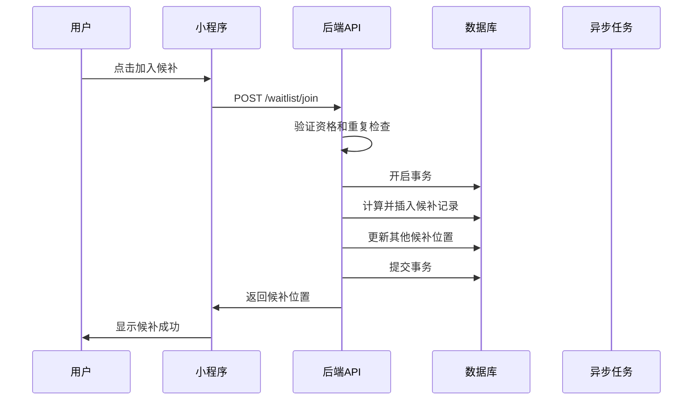
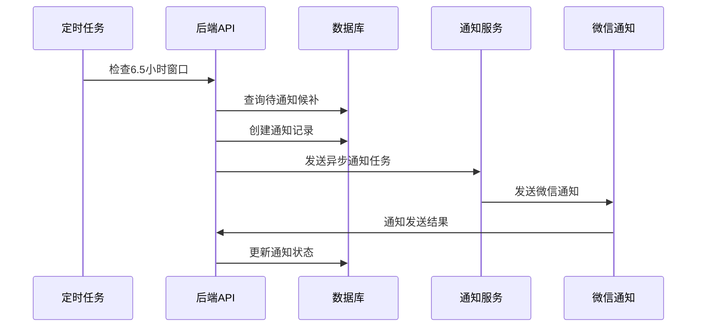
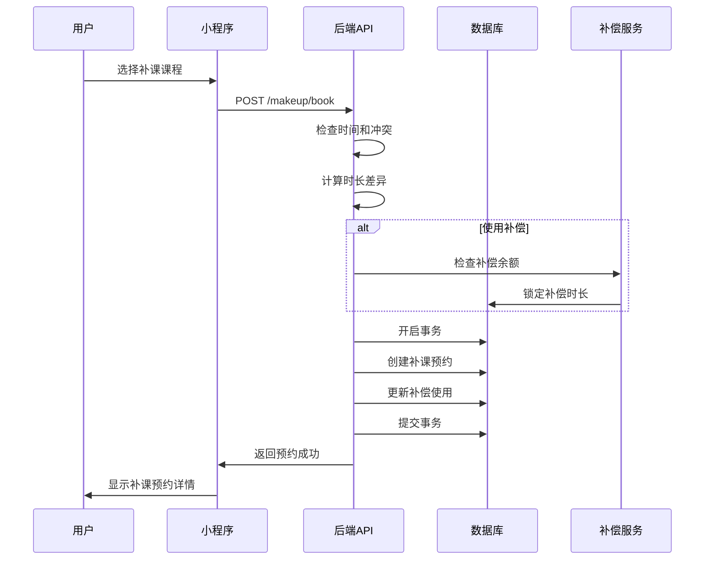

# 数据模型： Waitlist and Makeup Class System

**Feature**: 003-waitlist-and-makeup
**创建时间**: 2025-10-31
**Version**: 1.0.0

## Database Schema

### Overview

候补和补课系统的数据模型采用六表设计，实现候补队列管理、6.5小时截止时限通知、自动顺位机制、补课预约和课时补偿的完整业务流程。

### Entity Relationship Diagram

```
┌─────────────────┐         ┌─────────────────┐
│     waitlist    │         │ waitlist_notif  │
├─────────────────┤         ├─────────────────┤
│ id (PK)         │◄────────┤ waitlist_id (FK)│
│ profile_id (FK) │         │ id (PK)         │
│ course_sched_id │         │ notification_type│
│ position        │         │ round_number    │
│ status          │         │ sent_at         │
│ joined_at       │         │ deadline_at     │
└─────────────────┘         │ response_deadline│
         │                   │ status          │
         │                   └─────────────────┘
         │                            │
         │                            ▼
         │                   ┌─────────────────┐
         │                   │ waitlist_flow   │
         │                   ├─────────────────┤
         │                   │ id (PK)         │
         │                   │ notification_id │
         │                   │ start_time      │
         │                   │ complete_time   │
         │                   │ expire_reason   │
         │                   └─────────────────┘
         ▼
┌─────────────────┐         ┌─────────────────┐
│  makeup_booking │         │ class_credit_   │
│                 │         │ compensation    │
├─────────────────┤         ├─────────────────┤
│ id (PK)         │         │ id (PK)         │
│ original_book_id│         │ profile_id (FK) │
│ profile_id (FK) │         │ total_minutes   │
│ course_sched_id │         │ used_minutes    │
│ scheduled_at    │         │ expire_at       │
│ status          │         │ status          │
│ duration_diff   │         └─────────────────┘
└─────────────────┘                  │
         │                          ▼
         │                  ┌─────────────────┐
         │                  │ compensation_   │
         │                  │ usage           │
         │                  ├─────────────────┤
         │                  │ id (PK)         │
         ▼                  │ compensation_id │
┌─────────────────┐         │ booking_id (FK) │
│ profile         │         │ minutes_used    │
│                 │         │ usage_type      │
├─────────────────┤         └─────────────────┘
│ id (PK)         │
│ name            │
│ level           │
│ status          │
└─────────────────┘
```

## Table Definitions

### waitlist（候补表）

**描述**：存储课程候补队列信息

**用途**：管理候补排队、位置计算、自动顺位

| 字段名 | 数据类型 | 约束 | 默认值 | 描述 | 索引 |
|--------|----------|------|--------|------|------|
| id | INT | PK, AUTO_INCREMENT | - | 候补ID | PRIMARY |
| profile_id | INT | NOT NULL | - | 档案ID | INDEX |
| course_schedule_id | INT | NOT NULL | - | 课程安排ID | INDEX |
| position | INT | NOT NULL | - | 候补位置 | INDEX |
| status | ENUM | NOT NULL | 'active' | 状态：active/confirmed/expired/cancelled | INDEX |
| joined_at | TIMESTAMP | NOT NULL | CURRENT_TIMESTAMP | 加入时间 | INDEX |
| confirmed_at | TIMESTAMP | NULL | NULL | 确认时间 | INDEX |
| expired_at | TIMESTAMP | NULL | NULL | 过期时间 | INDEX |
| queue_position_updated_at | TIMESTAMP | NULL | NULL | 排位更新时间 | INDEX |

**外键约束**：
- `profile_id` → `profile.id` (ON DELETE CASCADE)
- `course_schedule_id` → `course_schedule.id` (ON DELETE CASCADE)

**唯一约束**：
- `uk_profile_course` (`profile_id`, `course_schedule_id`)

**业务规则**：
- 一个档案只能预约一个课程的候补
- 候补位置实时计算，不存储
- 状态流转：active → confirmed/expired/cancelled
- 过期自动处理，释放位置给下一个候补
- `queue_position_updated_at` 记录排位更新时间，用于排位变化跟踪

### waitlist_notification（候补通知表）

**描述**：存储候补通知发送和响应信息

**用途**：6.5小时截止时限通知、响应跟踪

| 字段名 | 数据类型 | 约束 | 默认值 | 描述 | 索引 |
|--------|----------|------|--------|------|------|
| id | INT | PK, AUTO_INCREMENT | - | 通知ID | PRIMARY |
| waitlist_id | INT | NOT NULL | - | 候补ID | INDEX |
| notification_type | ENUM | NOT NULL | 'available' | 通知类型 | INDEX |
| round_number | INT | NOT NULL | 1 | 轮次号 | INDEX |
| sent_at | TIMESTAMP | NOT NULL | CURRENT_TIMESTAMP | 发送时间 | INDEX |
| deadline_at | TIMESTAMP | NOT NULL | - | 截止时间 | INDEX |
| response_deadline | TIMESTAMP | NOT NULL | - | 响应截止时间 | INDEX |
| status | ENUM | NOT NULL | 'pending' | 状态：pending/responded/expired/failed | INDEX |
| responded_at | TIMESTAMP | NULL | NULL | 响应时间 | INDEX |
| response_action | ENUM | NULL | NULL | 响应动作：accept/decline | INDEX |
| notification_data | JSON | NULL | NULL | 通知数据 | - |

**外键约束**：
- `waitlist_id` → `waitlist.id` (ON DELETE CASCADE)

**业务规则**：
- 6.5小时课程开始前发送通知
- 30分钟决策缓冲期
- 超时未响应自动顺位
- 通知内容模板化管理

### waitlist_flow（候补流程表）

**描述**：存储候补流程处理记录

**用途**：流程跟踪、异常分析、运营数据

| 字段名 | 数据类型 | 约束 | 默认值 | 描述 | 索引 |
|--------|----------|------|--------|------|------|
| id | INT | PK, AUTO_INCREMENT | - | 流程ID | PRIMARY |
| notification_id | INT | NOT NULL | - | 通知ID | INDEX |
| start_time | TIMESTAMP | NOT NULL | CURRENT_TIMESTAMP | 开始时间 | INDEX |
| complete_time | TIMESTAMP | NULL | NULL | 完成时间 | INDEX |
| expire_reason | ENUM | NULL | NULL | 过期原因 | INDEX |
| flow_data | JSON | NULL | NULL | 流程数据 | - |
| admin_notes | TEXT | NULL | NULL | 管理员备注 | - |

**外键约束**：
- `notification_id` → `waitlist_notification.id` (ON DELETE CASCADE)

**业务规则**：
- 每个通知都生成流程记录
- 记录完整处理时间线
- 支持异常情况分析
- 运营干预记录

### makeup_booking（补课预约表）

**描述**：存储补课预约信息

**用途**：补课预约管理、时长差异处理

| 字段名 | 数据类型 | 约束 | 默认值 | 描述 | 索引 |
|--------|----------|------|--------|------|------|
| id | INT | PK, AUTO_INCREMENT | - | 补课预约ID | PRIMARY |
| original_booking_id | INT | NULL | NULL | 原预约ID | INDEX |
| profile_id | INT | NOT NULL | - | 档案ID | INDEX |
| course_schedule_id | INT | NOT NULL | - | 课程安排ID | INDEX |
| scheduled_at | TIMESTAMP | NOT NULL | CURRENT_TIMESTAMP | 预约时间 | INDEX |
| class_date | DATE | NOT NULL | - | 上课日期 | INDEX |
| start_time | TIME | NOT NULL | - | 开始时间 | INDEX |
| end_time | TIME | NOT NULL | - | 结束时间 | INDEX |
| duration_minutes | INT | NOT NULL | - | 课程时长 | INDEX |
| duration_difference | INT | NULL | NULL | 时长差异 | INDEX |
| compensation_used | DECIMAL(5,2) | NULL | NULL | 使用补偿时长 | INDEX |
| status | ENUM | NOT NULL | 'scheduled' | 状态 | INDEX |
| cancellation_reason | TEXT | NULL | NULL | 取消原因 | - |
| notes | TEXT | NULL | NULL | 备注 | - |

**外键约束**：
- `original_booking_id` → `booking.id` (ON DELETE SET NULL)
- `profile_id` → `profile.id` (ON DELETE CASCADE)
- `course_schedule_id` → `course_schedule.id` (ON DELETE CASCADE)

**业务规则**：
- 支持关联原预约记录
- 自动计算时长差异
- 支持使用课时补偿
- 补课取消不影响原预约记录

### class_credit_compensation（课时补偿表）

**描述**：存储课时补偿信息

**用途**：补偿余额管理、使用跟踪、过期处理

| 字段名 | 数据类型 | 约束 | 默认值 | 描述 | 索引 |
|--------|----------|------|--------|------|------|
| id | INT | PK, AUTO_INCREMENT | - | 补偿ID | PRIMARY |
| profile_id | INT | NOT NULL | - | 档案ID | INDEX |
| source_type | ENUM | NOT NULL | 'course_cancellation' | 来源类型 | INDEX |
| source_id | INT | NULL | NULL | 来源ID | INDEX |
| total_minutes | DECIMAL(5,2) | NOT NULL | 0 | 总补偿时长 | INDEX |
| used_minutes | DECIMAL(5,2) | NOT NULL | 0 | 已使用时长 | INDEX |
| remaining_minutes | DECIMAL(5,2) | NOT NULL | 0 | 剩余时长 | INDEX |
| expire_at | TIMESTAMP | NOT NULL | - | 过期时间 | INDEX |
| status | ENUM | NOT NULL | 'active' | 状态：active/expired/used_up | INDEX |
| created_at | TIMESTAMP | NOT NULL | CURRENT_TIMESTAMP | 创建时间 | INDEX |
| notes | TEXT | NULL | NULL | 备注 | - |

**外键约束**：
- `profile_id` → `profile.id` (ON DELETE CASCADE)

**业务规则**：
- 补偿时长精确到0.5节课（30分钟）
- 支持多种补偿来源
- 自动过期处理
- 剩余时长实时计算

### compensation_usage（补偿使用记录表）

**描述**：存储补偿使用详细记录

**用途**：使用跟踪、明细查询、统计分析

| 字段名 | 数据类型 | 约束 | 默认值 | 描述 | 索引 |
|--------|----------|------|--------|------|------|
| id | INT | PK, AUTO_INCREMENT | - | 使用记录ID | PRIMARY |
| compensation_id | INT | NOT NULL | - | 补偿ID | INDEX |
| booking_id | INT | NULL | NULL | 预约ID | INDEX |
| makeup_booking_id | INT | NULL | NULL | 补课预约ID | INDEX |
| minutes_used | DECIMAL(5,2) | NOT NULL | 0 | 使用时长 | INDEX |
| usage_type | ENUM | NOT NULL | 'makeup_class' | 使用类型 | INDEX |
| used_at | TIMESTAMP | NOT NULL | CURRENT_TIMESTAMP | 使用时间 | INDEX |
| remaining_before | DECIMAL(5,2) | NOT NULL | 0 | 使用前余额 | INDEX |
| remaining_after | DECIMAL(5,2) | NOT NULL | 0 | 使用后余额 | INDEX |
| notes | TEXT | NULL | NULL | 备注 | - |

**外键约束**：
- `compensation_id` → `class_credit_compensation.id` (ON DELETE CASCADE)
- `booking_id` → `booking.id` (ON DELETE SET NULL)
- `makeup_booking_id` → `makeup_booking.id` (ON DELETE SET NULL)

**业务规则**：
- 每次使用都生成详细记录
- 记录使用前后余额
- 支持多种使用场景
- 使用记录不可删除

## API Contracts

### Waitlist Management APIs

#### POST /api/v1/waitlist/join
**方法**: POST
**路径**: /api/v1/waitlist/join
**描述**: 加入课程候补

**Request**:
```json
{
  "course_schedule_id": 123,
  "profile_id": 456
}
```

**Response**:
```json
{
  "code": 200,
  "message": "加入候补成功",
  "data": {
    "waitlist_id": 789,
    "position": 3,
    "estimated_wait_time": "2-3天",
    "joined_at": "2025-10-31T10:00:00Z"
  }
}
```

#### GET /api/v1/waitlist/my
**方法**: GET
**路径**: /api/v1/waitlist/my
**描述**: 获取我的候补记录

**Response**:
```json
{
  "code": 200,
  "message": "查询成功",
  "data": {
    "waitlists": [
      {
        "waitlist_id": 789,
        "course": {
          "course_name": "初级平衡木",
          "schedule_date": "2025-11-05",
          "start_time": "15:00"
        },
        "position": 3,
        "status": "active",
        "joined_at": "2025-10-31T10:00:00Z",
        "estimated_wait_time": "2-3天"
      }
    ],
    "total": 1
  }
}
```

#### DELETE /api/v1/waitlist/{id}
**方法**: DELETE
**路径**: /api/v1/waitlist/{id}
**描述**: 取消候补

**Response**:
```json
{
  "code": 200,
  "message": "已取消候补",
  "data": {
    "waitlist_id": 789,
    "cancelled_at": "2025-10-31T14:00:00Z"
  }
}
```

### Notification APIs

#### POST /api/v1/waitlist/{id}/respond
**方法**: POST
**路径**: /api/v1/waitlist/{id}/respond
**描述**: 响应候补通知

**Request**:
```json
{
  "action": "accept",
  "notification_id": 101
}
```

**Response**:
```json
{
  "code": 200,
  "message": "响应成功",
  "data": {
    "waitlist_id": 789,
    "booking_id": 202,
    "booking_status": "confirmed",
    "responded_at": "2025-10-31T15:30:00Z"
  }
}
```

### Makeup Class APIs

#### GET /api/v1/makeup/available
**方法**: GET
**路径**: /api/v1/makeup/available
**描述**: 获取可补课课程列表

**Response**:
```json
{
  "code": 200,
  "message": "查询成功",
  "data": {
    "courses": [
      {
        "course_schedule_id": 123,
        "course_name": "初级平衡木",
        "schedule_date": "2025-11-05",
        "start_time": "15:00",
        "duration_minutes": 60,
        "available_spots": 2,
        "can_use_compensation": true,
        "compensation_info": {
          "available_minutes": 90,
          "enough_for_class": true
        }
      }
    ],
    "total": 5
  }
}
```

#### POST /api/v1/makeup/book
**方法**: POST
**路径**: /api/v1/makeup/book
**描述**: 预约补课

**Request**:
```json
{
  "course_schedule_id": 123,
  "profile_id": 456,
  "original_booking_id": 789,
  "use_compensation": true,
  "compensation_minutes": 60
}
```

**Response**:
```json
{
  "code": 200,
  "message": "补课预约成功",
  "data": {
    "makeup_booking_id": 101,
    "booking_number": "MK20251031001",
    "class_date": "2025-11-05",
    "start_time": "15:00",
    "duration_minutes": 60,
    "duration_difference": 0,
    "compensation_used": 60.00,
    "remaining_compensation": 30.00,
    "status": "scheduled"
  }
}
```

### Compensation APIs

#### GET /api/v1/compensation/balance
**方法**: GET
**路径**: /api/v1/compensation/balance
**描述**: 获取课时补偿余额

**Response**:
```json
{
  "code": 200,
  "message": "查询成功",
  "data": {
    "total_compensations": 3,
    "total_minutes": 150.0,
    "used_minutes": 60.0,
    "remaining_minutes": 90.0,
    "expiring_soon": [
      {
        "compensation_id": 5,
        "remaining_minutes": 30.0,
        "expire_at": "2025-11-15T23:59:59Z",
        "days_until_expire": 15
      }
    ]
  }
}
```

## Data Validation

### Input Validation

#### Waitlist Join Validation
- **course_schedule_id**: 必填，有效的课程安排ID
- **profile_id**: 必填，有效的档案ID
- **duplicate_check**: 检查是否已在候补队列中

#### Notification Response Validation
- **action**: 必填，只能是'accept'或'decline'
- **notification_id**: 必填，有效的通知ID
- **response_window**: 检查是否在30分钟响应窗口内

#### Makeup Booking Validation
- **course_schedule_id**: 必填，有效的课程安排ID
- **time_conflict**: 检查时间冲突
- **compensation_validation**: 检查补偿余额是否足够

### Business Validation

#### Waitlist Rules
- 每个档案每个课程只能加入一次候补
- 候补位置实时计算
- 自动过期处理机制
- 6.5小时通知规则

#### Compensation Rules
- 补偿时长最小单位：30分钟
- 补偿有效期：30天
- 过期自动清理
- 使用优先级：即将过期优先

#### Makeup Class Rules
- 补课只能预约同级别或更低级别课程
- 时长差异自动计算补偿
- 补课取消不影响补偿余额

## Migration Strategy

### Version 1.0.0

#### 创建候补相关表
```sql
-- 创建 waitlist 表
CREATE TABLE `waitlist` (
  `id` INT PRIMARY KEY AUTO_INCREMENT,
  `profile_id` INT NOT NULL,
  `course_schedule_id` INT NOT NULL,
  `position` INT NOT NULL,
  `status` ENUM('active', 'confirmed', 'expired', 'cancelled') NOT NULL DEFAULT 'active',
  `joined_at` TIMESTAMP NOT NULL DEFAULT CURRENT_TIMESTAMP,
  `confirmed_at` TIMESTAMP NULL,
  `expired_at` TIMESTAMP NULL,

  FOREIGN KEY (`profile_id`) REFERENCES `profile`(`id`) ON DELETE CASCADE,
  FOREIGN KEY (`course_schedule_id`) REFERENCES `course_schedule`(`id`) ON DELETE CASCADE,
  UNIQUE KEY `uk_profile_course` (`profile_id`, `course_schedule_id`),
  INDEX `idx_profile_course` (`profile_id`, `course_schedule_id`),
  INDEX `idx_status_position` (`status`, `position`),
  INDEX `idx_joined_at` (`joined_at`)
) ENGINE=InnoDB DEFAULT CHARSET=utf8mb4 COMMENT='候补表';

-- 创建 waitlist_notification 表
CREATE TABLE `waitlist_notification` (
  `id` INT PRIMARY KEY AUTO_INCREMENT,
  `waitlist_id` INT NOT NULL,
  `notification_type` ENUM('available', 'reminder', 'expiry') NOT NULL DEFAULT 'available',
  `round_number` INT NOT NULL DEFAULT 1,
  `sent_at` TIMESTAMP NOT NULL DEFAULT CURRENT_TIMESTAMP,
  `deadline_at` TIMESTAMP NOT NULL,
  `response_deadline` TIMESTAMP NOT NULL,
  `status` ENUM('pending', 'responded', 'expired', 'failed') NOT NULL DEFAULT 'pending',
  `responded_at` TIMESTAMP NULL,
  `response_action` ENUM('accept', 'decline') NULL,
  `notification_data` JSON NULL,

  FOREIGN KEY (`waitlist_id`) REFERENCES `waitlist`(`id`) ON DELETE CASCADE,
  INDEX `idx_waitlist_status` (`waitlist_id`, `status`),
  INDEX `idx_deadline_at` (`deadline_at`),
  INDEX `idx_response_deadline` (`response_deadline`)
) ENGINE=InnoDB DEFAULT CHARSET=utf8mb4 COMMENT='候补通知表';

-- 创建 waitlist_flow 表
CREATE TABLE `waitlist_flow` (
  `id` INT PRIMARY KEY AUTO_INCREMENT,
  `notification_id` INT NOT NULL,
  `start_time` TIMESTAMP NOT NULL DEFAULT CURRENT_TIMESTAMP,
  `complete_time` TIMESTAMP NULL,
  `expire_reason` ENUM('timeout', 'declined', 'cancelled', 'error') NULL,
  `flow_data` JSON NULL,
  `admin_notes` TEXT NULL,

  FOREIGN KEY (`notification_id`) REFERENCES `waitlist_notification`(`id`) ON DELETE CASCADE,
  INDEX `idx_notification_start` (`notification_id`, `start_time`),
  INDEX `idx_complete_time` (`complete_time`)
) ENGINE=InnoDB DEFAULT CHARSET=utf8mb4 COMMENT='候补流程表';
```

#### 创建补课相关表
```sql
-- 创建 makeup_booking 表
CREATE TABLE `makeup_booking` (
  `id` INT PRIMARY KEY AUTO_INCREMENT,
  `original_booking_id` INT NULL,
  `profile_id` INT NOT NULL,
  `course_schedule_id` INT NOT NULL,
  `scheduled_at` TIMESTAMP NOT NULL DEFAULT CURRENT_TIMESTAMP,
  `class_date` DATE NOT NULL,
  `start_time` TIME NOT NULL,
  `end_time` TIME NOT NULL,
  `duration_minutes` INT NOT NULL,
  `duration_difference` INT NULL,
  `compensation_used` DECIMAL(5,2) NULL,
  `status` ENUM('scheduled', 'completed', 'cancelled') NOT NULL DEFAULT 'scheduled',
  `cancellation_reason` TEXT NULL,
  `notes` TEXT NULL,

  FOREIGN KEY (`original_booking_id`) REFERENCES `booking`(`id`) ON DELETE SET NULL,
  FOREIGN KEY (`profile_id`) REFERENCES `profile`(`id`) ON DELETE CASCADE,
  FOREIGN KEY (`course_schedule_id`) REFERENCES `course_schedule`(`id`) ON DELETE CASCADE,
  INDEX `idx_profile_date` (`profile_id`, `class_date`),
  INDEX `idx_course_date` (`course_schedule_id`, `class_date`),
  INDEX `idx_status_date` (`status`, `class_date`)
) ENGINE=InnoDB DEFAULT CHARSET=utf8mb4 COMMENT='补课预约表';

-- 创建 class_credit_compensation 表
CREATE TABLE `class_credit_compensation` (
  `id` INT PRIMARY KEY AUTO_INCREMENT,
  `profile_id` INT NOT NULL,
  `source_type` ENUM('course_cancellation', 'system_compensation', 'manual_adjustment') NOT NULL,
  `source_id` INT NULL,
  `total_minutes` DECIMAL(5,2) NOT NULL DEFAULT 0,
  `used_minutes` DECIMAL(5,2) NOT NULL DEFAULT 0,
  `remaining_minutes` DECIMAL(5,2) NOT NULL DEFAULT 0,
  `expire_at` TIMESTAMP NOT NULL,
  `status` ENUM('active', 'expired', 'used_up') NOT NULL DEFAULT 'active',
  `created_at` TIMESTAMP NOT NULL DEFAULT CURRENT_TIMESTAMP,
  `notes` TEXT NULL,

  FOREIGN KEY (`profile_id`) REFERENCES `profile`(`id`) ON DELETE CASCADE,
  INDEX `idx_profile_status` (`profile_id`, `status`),
  INDEX `idx_expire_at` (`expire_at`),
  INDEX `idx_source` (`source_type`, `source_id`)
) ENGINE=InnoDB DEFAULT CHARSET=utf8mb4 COMMENT='课时补偿表';

-- 创建 compensation_usage 表
CREATE TABLE `compensation_usage` (
  `id` INT PRIMARY KEY AUTO_INCREMENT,
  `compensation_id` INT NOT NULL,
  `booking_id` INT NULL,
  `makeup_booking_id` INT NULL,
  `minutes_used` DECIMAL(5,2) NOT NULL,
  `usage_type` ENUM('makeup_class', 'class_extension', 'refund') NOT NULL DEFAULT 'makeup_class',
  `used_at` TIMESTAMP NOT NULL DEFAULT CURRENT_TIMESTAMP,
  `remaining_before` DECIMAL(5,2) NOT NULL,
  `remaining_after` DECIMAL(5,2) NOT NULL,
  `notes` TEXT NULL,

  FOREIGN KEY (`compensation_id`) REFERENCES `class_credit_compensation`(`id`) ON DELETE CASCADE,
  FOREIGN KEY (`booking_id`) REFERENCES `booking`(`id`) ON DELETE SET NULL,
  FOREIGN KEY (`makeup_booking_id`) REFERENCES `makeup_booking`(`id`) ON DELETE SET NULL,
  INDEX `idx_compensation_usage` (`compensation_id`, `used_at`),
  INDEX `idx_profile_usage` (`compensation_id`, `usage_type`)
) ENGINE=InnoDB DEFAULT CHARSET=utf8mb4 COMMENT='补偿使用记录表';
```

### Rollback Plan

#### 删除表（按依赖顺序倒序）
```sql
-- 删除外键约束
ALTER TABLE compensation_usage DROP FOREIGN KEY compensation_usage_ibfk_1;
ALTER TABLE compensation_usage DROP FOREIGN KEY compensation_usage_ibfk_2;
ALTER TABLE compensation_usage DROP FOREIGN KEY compensation_usage_ibfk_3;
ALTER TABLE class_credit_compensation DROP FOREIGN KEY class_credit_compensation_ibfk_1;
ALTER TABLE makeup_booking DROP FOREIGN KEY makeup_booking_ibfk_1;
ALTER TABLE makeup_booking DROP FOREIGN KEY makeup_booking_ibfk_2;
ALTER TABLE makeup_booking DROP FOREIGN KEY makeup_booking_ibfk_3;
ALTER TABLE waitlist_flow DROP FOREIGN KEY waitlist_flow_ibfk_1;
ALTER TABLE waitlist_notification DROP FOREIGN KEY waitlist_notification_ibfk_1;
ALTER TABLE waitlist DROP FOREIGN KEY waitlist_ibfk_1;
ALTER TABLE waitlist DROP FOREIGN KEY waitlist_ibfk_2;

-- 删除表
DROP TABLE IF EXISTS compensation_usage;
DROP TABLE IF EXISTS class_credit_compensation;
DROP TABLE IF EXISTS makeup_booking;
DROP TABLE IF EXISTS waitlist_flow;
DROP TABLE IF EXISTS waitlist_notification;
DROP TABLE IF EXISTS waitlist;
```

## Performance Optimization

### Database Indexes

#### 主要查询索引
- `waitlist.profile_id, course_schedule_id` - 候补查询
- `waitlist.status, position` - 队列管理
- `waitlist_notification.deadline_at` - 通知处理
- `makeup_booking.profile_id, class_date` - 补课查询
- `class_credit_compensation.expire_at` - 过期处理

#### 复合索引
- `waitlist(profile_id, course_schedule_id)` - 唯一约束索引
- `class_credit_compensation(profile_id, status)` - 余额查询
- `compensation_usage(compensation_id, used_at)` - 使用记录

### Query Optimization

#### 常用查询优化
```sql
-- 候补队列查询（使用索引）
SELECT w.*, c.course_name, cs.schedule_date, cs.start_time
FROM waitlist w
JOIN course_schedule cs ON w.course_schedule_id = cs.id
JOIN course c ON cs.course_id = c.id
WHERE w.status = 'active'
ORDER BY w.position ASC;

-- 6.5小时通知查询（使用索引）
SELECT w.*, w_n.*
FROM waitlist_notification w_n
JOIN waitlist w ON w_n.waitlist_id = w.id
WHERE w_n.status = 'pending'
AND w_n.deadline_at <= NOW()
AND w_n.response_deadline > NOW();
```

#### 分页查询
```sql
-- 补课预约列表分页
SELECT mb.*, c.course_name, cs.schedule_date, cs.start_time
FROM makeup_booking mb
JOIN course_schedule cs ON mb.course_schedule_id = cs.id
JOIN course c ON cs.course_id = c.id
WHERE mb.profile_id = ?
ORDER BY mb.class_date DESC, mb.start_time DESC
LIMIT 10 OFFSET 0;
```

### Caching Strategy

#### Redis 缓存
- 候补队列位置：缓存15分钟
- 通知状态：缓存30分钟
- 补偿余额：缓存1小时
- 可补课课程：缓存30分钟

#### 缓存键设计
```
waitlist:queue:{course_schedule_id}     # 候补队列
waitlist:position:{waitlist_id}        # 候补位置
notification:status:{notification_id}  # 通知状态
compensation:balance:{profile_id}      # 补偿余额
makeup:available:{date}                # 可补课课程
```

## Data Flow

### 候补加入流程



### 6.5小时通知流程



### 补课预约流程



## 安全考虑

### Data Protection

#### 敏感数据处理
- 候补位置信息相对保护
- 通知内容模板化，避免敏感信息泄露
- 补偿余额信息加密存储

#### 权限控制
- 用户只能管理自己的候补和补课
- 候补通知需要验证归属
- 补偿使用需要权限验证

### Input Sanitization

#### SQL注入防护
- 使用参数化查询
- ORM框架自动防护
- 输入长度限制

#### 业务逻辑防护
- 候补位置防篡改
- 通知响应时间窗口验证
- 补偿使用防重复扣减

### Audit Logging

#### 操作日志
```sql
CREATE TABLE `waitlist_audit_log` (
  `id` INT PRIMARY KEY AUTO_INCREMENT,
  `profile_id` INT NOT NULL,
  `action` VARCHAR(50) NOT NULL,
  `resource_type` VARCHAR(50) NOT NULL,
  `resource_id` INT,
  `old_data` JSON,
  `new_data` JSON,
  `ip_address` VARCHAR(45),
  `user_agent` TEXT,
  `created_at` TIMESTAMP DEFAULT CURRENT_TIMESTAMP,

  INDEX `idx_profile_action` (`profile_id`, `action`),
  INDEX `idx_created_at` (`created_at`)
) ENGINE=InnoDB DEFAULT CHARSET=utf8mb4 COMMENT='候补操作审计日志';
```

#### 记录的操作类型
- 候补加入 (waitlist.join)
- 候补取消 (waitlist.cancel)
- 通知响应 (notification.respond)
- 补课预约 (makeup.book)
- 补偿使用 (compensation.use)

---

**创建人**: [技术负责人]
**最后更新**: 2025-10-31
**版本**: 1.0.0
**状态**: Draft