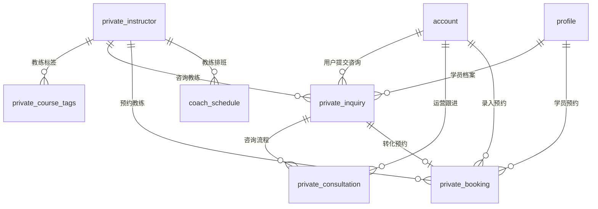

# 数据契约文档: 004-private-lesson

**功能**: Private Lesson System Data Contracts
**创建时间**: 2025-11-08
**版本**: 1.0.0
**数据库版本**: MySQL 8.0+
**字符集**: utf8mb4

---

## 数据契约概述

本文档定义了私教课系统的数据结构契约，包括数据库表结构、字段约束、索引设计、业务规则和数据完整性保证。严格遵循FR-042仅浏览模式和FR-040 4维标签匹配的数据要求。

### 核心数据原则

1. **4维标签一致性**: 确保所有课程和档案使用统一的4维标签体系
2. **咨询流程完整性**: 完整记录从咨询到预约的全流程数据
3. **仅浏览模式**: 数据结构不支持直接在线预约，仅支持咨询驱动
4. **时间冲突防护**: 通过数据库约束防止教练时间冲突预约

### 数据完整性保证

- **外键约束**: 确保数据引用完整性
- **唯一约束**: 防止重复数据和不一致状态
- **检查约束**: 验证业务规则和数据格式
- **触发器**: 自动维护派生数据和审计信息

---

## 核心数据表契约

### 1. private_instructor (私教教练表)

**表描述**: 存储私教教练的基本信息和资质

**表结构**:
```sql
CREATE TABLE private_instructor (
    id BIGINT PRIMARY KEY AUTO_INCREMENT COMMENT '教练ID',
    name VARCHAR(50) NOT NULL COMMENT '教练姓名',
    avatar_url VARCHAR(255) COMMENT '头像URL',
    bio TEXT NOT NULL COMMENT '教练介绍',
    specialties JSON NOT NULL COMMENT '专长领域数组',
    price_per_hour DECIMAL(10,2) NOT NULL COMMENT '每小时价格',
    rating DECIMAL(2,1) DEFAULT 0.0 COMMENT '评分(0.0-5.0)',
    teaching_hours INT DEFAULT 0 COMMENT '授课时长(小时)',
    experience_years INT DEFAULT 0 COMMENT '教学经验年数',
    certifications JSON COMMENT '资质证书数组',
    teaching_style VARCHAR(200) COMMENT '教学风格',
    status ENUM('active', 'inactive') DEFAULT 'active' COMMENT '状态',
    created_at TIMESTAMP DEFAULT CURRENT_TIMESTAMP COMMENT '创建时间',
    updated_at TIMESTAMP DEFAULT CURRENT_TIMESTAMP ON UPDATE CURRENT_TIMESTAMP COMMENT '更新时间',
    created_by BIGINT COMMENT '创建人ID',
    updated_by BIGINT COMMENT '更新人ID',

    -- 业务约束
    CONSTRAINT chk_instructor_rating CHECK (rating >= 0.0 AND rating <= 5.0),
    CONSTRAINT chk_instructor_price CHECK (price_per_hour > 0),
    CONSTRAINT chk_instructor_hours CHECK (teaching_hours >= 0),
    CONSTRAINT chk_instructor_experience CHECK (experience_years >= 0),
    CONSTRAINT chk_instructor_name CHECK (CHAR_LENGTH(name) >= 2)
) ENGINE=InnoDB DEFAULT CHARSET=utf8mb4 COLLATE=utf8mb4_unicode_ci COMMENT='私教教练表';
```

**字段契约**:
```json
{
  "id": {
    "type": "BIGINT",
    "constraints": ["PRIMARY_KEY", "AUTO_INCREMENT", "NOT_NULL"],
    "description": "教练唯一标识符"
  },
  "name": {
    "type": "VARCHAR(50)",
    "constraints": ["NOT_NULL", "UNIQUE"],
    "description": "教练真实姓名，2-50个字符"
  },
  "avatar_url": {
    "type": "VARCHAR(255)",
    "constraints": ["OPTIONAL"],
    "description": "教练头像图片URL，支持jpg/png格式"
  },
  "bio": {
    "type": "TEXT",
    "constraints": ["NOT_NULL"],
    "description": "教练详细介绍，10-1000个字符"
  },
  "specialties": {
    "type": "JSON",
    "constraints": ["NOT_NULL"],
    "description": "专长领域数组，如：['儿童体操', '平衡木']",
    "example": ["儿童体操", "平衡木", "自由体操"]
  },
  "price_per_hour": {
    "type": "DECIMAL(10,2)",
    "constraints": ["NOT_NULL", "MIN>0"],
    "description": "每小时价格，单位：元"
  },
  "rating": {
    "type": "DECIMAL(2,1)",
    "constraints": ["DEFAULT=0.0", "RANGE=0.0-5.0"],
    "description": "教练评分，保留一位小数"
  },
  "teaching_hours": {
    "type": "INT",
    "constraints": ["DEFAULT=0", "MIN=0"],
    "description": "累计授课时长，单位：小时"
  },
  "experience_years": {
    "type": "INT",
    "constraints": ["DEFAULT=0", "MIN=0"],
    "description": "教学经验年数"
  },
  "certifications": {
    "type": "JSON",
    "constraints": ["OPTIONAL"],
    "description": "资质证书数组",
    "example": ["国家一级运动员", "体操教练资格证"]
  },
  "teaching_style": {
    "type": "VARCHAR(200)",
    "constraints": ["OPTIONAL"],
    "description": "教学风格描述"
  },
  "status": {
    "type": "ENUM",
    "values": ["active", "inactive"],
    "default": "active",
    "description": "教练状态，active-可用，inactive-停用"
  }
}
```

**索引设计**:
```sql
-- 基础索引
CREATE UNIQUE INDEX uk_instructor_name ON private_instructor(name);
CREATE INDEX idx_instructor_status ON private_instructor(status);
CREATE INDEX idx_instructor_rating ON private_instructor(rating DESC);
CREATE INDEX idx_instructor_created ON private_instructor(created_at);

-- 业务查询索引
CREATE INDEX idx_instructor_active_rating ON private_instructor(status, rating DESC) WHERE status = 'active';
CREATE INDEX idx_instructor_price ON private_instructor(price_per_hour);
CREATE INDEX idx_instructor_experience ON private_instructor(experience_years DESC);
```

### 2. private_course_tags (私教课程标签表)

**表描述**: 存储私教课程的4维标签信息，实现FR-040白名单匹配

**表结构**:
```sql
CREATE TABLE private_course_tags (
    id BIGINT PRIMARY KEY AUTO_INCREMENT COMMENT '标签ID',
    instructor_id BIGINT NOT NULL COMMENT '教练ID',
    level_range VARCHAR(20) NOT NULL COMMENT '等级范围',
    age_range VARCHAR(20) NOT NULL COMMENT '年龄范围',
    gender ENUM('male', 'female', 'both') NOT NULL COMMENT '性别要求',
    course_type ENUM('private') NOT NULL DEFAULT 'private' COMMENT '课程类型',
    skill_types JSON NOT NULL COMMENT '技能类型数组',
    intensity_level ENUM('basic', 'intermediate', 'advanced') NOT NULL DEFAULT 'basic' COMMENT '强度等级',
    waitlist_capacity INT DEFAULT 0 COMMENT '候补容量(FR-043)',
    max_students_per_session INT DEFAULT 1 COMMENT '单次课最大学生数',
    session_duration INT DEFAULT 60 COMMENT '单次课程时长(分钟)',
    popularity_score INT DEFAULT 0 COMMENT '热门度评分',
    gender_validation ENUM('required', 'preferred', 'any') DEFAULT 'preferred' COMMENT '性别验证规则',
    type_validation ENUM('strict', 'flexible') DEFAULT 'strict' COMMENT '类型验证规则',
    created_at TIMESTAMP DEFAULT CURRENT_TIMESTAMP COMMENT '创建时间',
    updated_at TIMESTAMP DEFAULT CURRENT_TIMESTAMP ON UPDATE CURRENT_TIMESTAMP COMMENT '更新时间',

    -- 外键约束
    FOREIGN KEY (instructor_id) REFERENCES private_instructor(id) ON DELETE CASCADE,

    -- 业务约束
    CONSTRAINT chk_tags_level_range CHECK (
        level_range REGEXP '^L[1-9](-L[1-9])?$' OR
        level_range IN ('L1+', 'L2+', 'L3+', 'L4+', 'L5+')
    ),
    CONSTRAINT chk_tags_age_range CHECK (
        age_range IN ('3-6岁', '4-8岁', '6-12岁', '8-15岁', '12-18岁', '成人', '全年龄段')
    ),
    CONSTRAINT chk_tags_waitlist_capacity CHECK (waitlist_capacity >= 0),
    CONSTRAINT chk_tags_max_students CHECK (max_students_per_session > 0),
    CONSTRAINT chk_tags_duration CHECK (session_duration > 0 AND session_duration <= 240),
    CONSTRAINT chk_tags_popularity CHECK (popularity_score >= 0 AND popularity_score <= 100),

    -- 唯一约束
    UNIQUE KEY uk_instructor_course (instructor_id, course_type)
) ENGINE=InnoDB DEFAULT CHARSET=utf8mb4 COLLATE=utf8mb4_unicode_ci COMMENT='私教课程标签表';
```

**字段契约**:
```json
{
  "instructor_id": {
    "type": "BIGINT",
    "constraints": ["NOT_NULL", "FOREIGN_KEY"],
    "references": "private_instructor(id)",
    "description": "关联的教练ID"
  },
  "level_range": {
    "type": "VARCHAR(20)",
    "constraints": ["NOT_NULL"],
    "description": "教学等级范围",
    "valid_values": [
      "L1-L2", "L1-L3", "L1-L4", "L1-L5",
      "L2-L3", "L2-L4", "L2-L5",
      "L3-L4", "L3-L5",
      "L4-L5",
      "L1+", "L2+", "L3+", "L4+", "L5+"
    ]
  },
  "age_range": {
    "type": "VARCHAR(20)",
    "constraints": ["NOT_NULL"],
    "description": "教学年龄范围",
    "valid_values": ["3-6岁", "4-8岁", "6-12岁", "8-15岁", "12-18岁", "成人", "全年龄段"]
  },
  "gender": {
    "type": "ENUM",
    "values": ["male", "female", "both"],
    "constraints": ["NOT_NULL"],
    "description": "性别要求：male-仅男，female-仅女，both-不限"
  },
  "course_type": {
    "type": "ENUM",
    "values": ["private"],
    "default": "private",
    "constraints": ["NOT_NULL"],
    "description": "课程类型，固定为private"
  },
  "skill_types": {
    "type": "JSON",
    "constraints": ["NOT_NULL"],
    "description": "技能类型数组",
    "valid_values": ["balance_beam", "floor_exercise", "vault", "uneven_bars", "rhythmic", "trampoline"]
  },
  "intensity_level": {
    "type": "ENUM",
    "values": ["basic", "intermediate", "advanced"],
    "default": "basic",
    "description": "课程强度等级"
  },
  "waitlist_capacity": {
    "type": "INT",
    "default": 0,
    "constraints": ["MIN=0"],
    "description": "FR-043候补容量，0表示不支持候补"
  },
  "max_students_per_session": {
    "type": "INT",
    "default": 1,
    "constraints": ["MIN=1"],
    "description": "单次课程最大学生数，私教课通常为1"
  },
  "session_duration": {
    "type": "INT",
    "default": 60,
    "constraints": ["MIN=30", "MAX=240"],
    "description": "标准课程时长，单位：分钟"
  },
  "popularity_score": {
    "type": "INT",
    "default": 0,
    "constraints": ["RANGE=0-100"],
    "description": "热门度评分，用于排序"
  },
  "gender_validation": {
    "type": "ENUM",
    "values": ["required", "preferred", "any"],
    "default": "preferred",
    "description": "性别验证规则强度"
  },
  "type_validation": {
    "type": "ENUM",
    "values": ["strict", "flexible"],
    "default": "strict",
    "description": "类型匹配验证规则"
  }
}
```

**4维匹配索引设计**:
```sql
-- 4维匹配核心索引
CREATE INDEX idx_tags_4d_match ON private_course_tags(course_type, age_range, gender, status, popularity_score DESC);
CREATE INDEX idx_tags_level_match ON private_course_tags(level_range, status);
CREATE INDEX idx_tags_age_match ON private_course_tags(age_range, gender, status);
CREATE INDEX idx_tags_skill_types ON private_course_tags(skill_types(100));

-- 复合索引优化
CREATE INDEX idx_tags_comprehensive ON private_course_tags(
    course_type, level_range, age_range, gender,
    status, popularity_score DESC, waitlist_capacity
);

-- FR-043候补功能索引
CREATE INDEX idx_tags_waitlist ON private_course_tags(waitlist_capacity) WHERE waitlist_capacity > 0;
```

### 3. private_inquiry (私教咨询表)

**表描述**: 存储用户私教课程咨询申请，FR-042仅浏览模式的核心流程

**表结构**:
```sql
CREATE TABLE private_inquiry (
    id BIGINT PRIMARY KEY AUTO_INCREMENT COMMENT '咨询ID',
    inquiry_number VARCHAR(20) NOT NULL COMMENT '咨询编号',
    user_id BIGINT NOT NULL COMMENT '用户ID',
    instructor_id BIGINT NOT NULL COMMENT '教练ID',
    profile_id BIGINT NOT NULL COMMENT '学员档案ID',
    inquiry_content TEXT NOT NULL COMMENT '咨询内容',
    contact_info VARCHAR(100) NOT NULL COMMENT '联系方式',
    preferred_time VARCHAR(100) COMMENT '期望上课时间',
    preferred_duration INT COMMENT '期望课程时长(分钟)',
    budget_range VARCHAR(20) COMMENT '预算范围',
    source ENUM('wechat', 'app', 'website', 'referral') DEFAULT 'app' COMMENT '咨询来源',
    status ENUM('pending', 'contacted', 'booked', 'not_interested', 'expired') DEFAULT 'pending' COMMENT '咨询状态',
    follow_up_count INT DEFAULT 0 COMMENT '跟进次数',
    last_follow_up TIMESTAMP NULL COMMENT '最后跟进时间',
    expires_at TIMESTAMP NULL COMMENT '过期时间',
    admin_notes TEXT COMMENT '管理员备注',
    priority ENUM('low', 'normal', 'high', 'urgent') DEFAULT 'normal' COMMENT '优先级',
    assigned_admin_id BIGINT COMMENT '分配的管理员ID',
    conversion_probability DECIMAL(3,2) DEFAULT 0.50 COMMENT '转化概率预估',
    created_at TIMESTAMP DEFAULT CURRENT_TIMESTAMP COMMENT '创建时间',
    updated_at TIMESTAMP DEFAULT CURRENT_TIMESTAMP ON UPDATE CURRENT_TIMESTAMP COMMENT '更新时间',

    -- 外键约束
    FOREIGN KEY (user_id) REFERENCES account(id) ON DELETE CASCADE,
    FOREIGN KEY (instructor_id) REFERENCES private_instructor(id) ON DELETE SET NULL,
    FOREIGN KEY (profile_id) REFERENCES profile(id) ON DELETE CASCADE,
    FOREIGN KEY (assigned_admin_id) REFERENCES account(id) ON DELETE SET NULL,

    -- 业务约束
    CONSTRAINT chk_inquiry_content CHECK (CHAR_LENGTH(inquiry_content) >= 10),
    CONSTRAINT chk_inquiry_duration CHECK (preferred_duration IN (60, 90, 120) OR preferred_duration IS NULL),
    CONSTRAINT chk_inquiry_budget CHECK (
        budget_range IN ('200-300', '300-400', '400-500', '500+') OR budget_range IS NULL
    ),
    CONSTRAINT chk_inquiry_probability CHECK (conversion_probability >= 0.00 AND conversion_probability <= 1.00),
    CONSTRAINT chk_inquiry_expires CHECK (expires_at > created_at),

    -- 唯一约束
    UNIQUE KEY uk_inquiry_number (inquiry_number),
    UNIQUE KEY uk_user_instructor_profile (user_id, instructor_id, profile_id, status, created_at)
) ENGINE=InnoDB DEFAULT CHARSET=utf8mb4 COLLATE=utf8mb4_unicode_ci COMMENT='私教咨询表';
```

**字段契约**:
```json
{
  "inquiry_number": {
    "type": "VARCHAR(20)",
    "constraints": ["NOT_NULL", "UNIQUE"],
    "description": "咨询编号，格式：INQ+YYYYMMDD+序号",
    "example": "INQ20251108001"
  },
  "user_id": {
    "type": "BIGINT",
    "constraints": ["NOT_NULL", "FOREIGN_KEY"],
    "references": "account(id)",
    "description": "提交咨询的用户ID"
  },
  "instructor_id": {
    "type": "BIGINT",
    "constraints": ["NOT_NULL", "FOREIGN_KEY"],
    "references": "private_instructor(id)",
    "description": "咨询的教练ID"
  },
  "profile_id": {
    "type": "BIGINT",
    "constraints": ["NOT_NULL", "FOREIGN_KEY"],
    "references": "profile(id)",
    "description": "关联的学员档案ID，用于4维匹配"
  },
  "inquiry_content": {
    "type": "TEXT",
    "constraints": ["NOT_NULL", "MIN_LENGTH=10", "MAX_LENGTH=500"],
    "description": "用户咨询的具体内容和需求"
  },
  "contact_info": {
    "type": "VARCHAR(100)",
    "constraints": ["NOT_NULL"],
    "description": "用户提供的联系方式（手机号或微信号）",
    "validation": "手机号格式或微信号格式"
  },
  "preferred_time": {
    "type": "VARCHAR(100)",
    "constraints": ["OPTIONAL"],
    "description": "用户期望的上课时间",
    "example": "周末下午"
  },
  "preferred_duration": {
    "type": "INT",
    "constraints": ["OPTIONAL"],
    "valid_values": [60, 90, 120],
    "description": "期望的课程时长（分钟）"
  },
  "budget_range": {
    "type": "VARCHAR(20)",
    "constraints": ["OPTIONAL"],
    "valid_values": ["200-300", "300-400", "400-500", "500+"],
    "description": "用户预算范围"
  },
  "source": {
    "type": "ENUM",
    "values": ["wechat", "app", "website", "referral"],
    "default": "app",
    "description": "咨询来源渠道"
  },
  "status": {
    "type": "ENUM",
    "values": ["pending", "contacted", "booked", "not_interested", "expired"],
    "default": "pending",
    "description": "咨询状态流转"
  },
  "follow_up_count": {
    "type": "INT",
    "default": 0,
    "constraints": ["MIN=0"],
    "description": "运营人员跟进次数"
  },
  "last_follow_up": {
    "type": "TIMESTAMP",
    "constraints": ["OPTIONAL"],
    "description": "最后一次跟进时间"
  },
  "expires_at": {
    "type": "TIMESTAMP",
    "constraints": ["OPTIONAL"],
    "description": "咨询过期时间，默认创建后7天"
  },
  "admin_notes": {
    "type": "TEXT",
    "constraints": ["OPTIONAL"],
    "description": "管理员内部备注"
  },
  "priority": {
    "type": "ENUM",
    "values": ["low", "normal", "high", "urgent"],
    "default": "normal",
    "description": "咨询处理优先级"
  },
  "assigned_admin_id": {
    "type": "BIGINT",
    "constraints": ["OPTIONAL", "FOREIGN_KEY"],
    "references": "account(id)",
    "description": "分配处理的管理员ID"
  },
  "conversion_probability": {
    "type": "DECIMAL(3,2)",
    "default": 0.50,
    "constraints": ["RANGE=0.00-1.00"],
    "description": "AI预估的转化概率"
  }
}
```

**咨询流程索引设计**:
```sql
-- 查询优化索引
CREATE INDEX idx_inquiry_user_status ON private_inquiry(user_id, status, created_at DESC);
CREATE INDEX idx_inquiry_instructor_status ON private_inquiry(instructor_id, status, created_at DESC);
CREATE INDEX idx_inquiry_admin_status ON private_inquiry(assigned_admin_id, status, priority DESC);
CREATE INDEX idx_inquiry_created ON private_inquiry(created_at DESC);
CREATE INDEX idx_inquiry_expires ON private_inquiry(expires_at, status) WHERE expires_at IS NOT NULL;

-- 业务查询索引
CREATE INDEX idx_inquiry_pending ON private_inquiry(status, priority, created_at) WHERE status = 'pending';
CREATE INDEX idx_inquiry_conversion ON private_inquiry(conversion_probability DESC, status) WHERE status IN ('pending', 'contacted');
CREATE INDEX idx_inquiry_followup ON private_inquiry(last_follow_up, follow_up_count) WHERE last_follow_up IS NOT NULL;
```

### 4. private_consultation (咨询流程记录表)

**表描述**: 记录咨询流程的详细跟进信息

**表结构**:
```sql
CREATE TABLE private_consultation (
    id BIGINT PRIMARY KEY AUTO_INCREMENT COMMENT '咨询记录ID',
    inquiry_id BIGINT NOT NULL COMMENT '咨询ID',
    consultation_method ENUM('phone', 'wechat', 'sms', 'email', 'offline') NOT NULL COMMENT '咨询方式',
    consultation_time TIMESTAMP NOT NULL COMMENT '咨询时间',
    consultation_duration INT COMMENT '咨询时长(分钟)',
    admin_operator_id BIGINT NOT NULL COMMENT '运营操作员ID',
    consultation_result TEXT NOT NULL COMMENT '咨询结果描述',
    customer_response TEXT COMMENT '客户反馈',
    next_steps JSON COMMENT '后续行动列表',
    follow_up_scheduled_at TIMESTAMP NULL COMMENT '下次跟进时间',
    conversion_status ENUM('positive', 'neutral', 'negative', 'pending') DEFAULT 'pending' COMMENT '转化状态',
    customer_satisfaction ENUM('very_satisfied', 'satisfied', 'neutral', 'unsatisfied', 'very_unsatisfied') COMMENT '客户满意度',
    notes TEXT COMMENT '详细备注',
    created_at TIMESTAMP DEFAULT CURRENT_TIMESTAMP COMMENT '创建时间',
    updated_at TIMESTAMP DEFAULT CURRENT_TIMESTAMP ON UPDATE CURRENT_TIMESTAMP COMMENT '更新时间',

    -- 外键约束
    FOREIGN KEY (inquiry_id) REFERENCES private_inquiry(id) ON DELETE CASCADE,
    FOREIGN KEY (admin_operator_id) REFERENCES account(id) ON DELETE CASCADE,

    -- 业务约束
    CONSTRAINT chk_consultation_duration CHECK (consultation_duration > 0 AND consultation_duration <= 180),
    CONSTRAINT chk_consultation_time CHECK (consultation_time <= created_at),
    CONSTRAINT chk_followup_time CHECK (follow_up_scheduled_at > consultation_time)
) ENGINE=InnoDB DEFAULT CHARSET=utf8mb4 COLLATE=utf8mb4_unicode_ci COMMENT='咨询流程记录表';
```

### 5. private_booking (私教预约表)

**表描述**: 存储私教课程预约信息，仅支持运营人员录入

**表结构**:
```sql
CREATE TABLE private_booking (
    id BIGINT PRIMARY KEY AUTO_INCREMENT COMMENT '预约ID',
    booking_number VARCHAR(20) NOT NULL COMMENT '预约编号',
    inquiry_id BIGINT COMMENT '关联咨询ID',
    user_id BIGINT NOT NULL COMMENT '用户ID',
    profile_id BIGINT NOT NULL COMMENT '学员档案ID',
    instructor_id BIGINT NOT NULL COMMENT '教练ID',
    booking_time DATETIME NOT NULL COMMENT '预约时间',
    end_time DATETIME NOT NULL COMMENT '结束时间',
    duration INT NOT NULL COMMENT '课程时长(分钟)',
    actual_price DECIMAL(10,2) NOT NULL COMMENT '实际价格',
    payment_method ENUM('offline') NOT NULL DEFAULT 'offline' COMMENT '支付方式',
    payment_status ENUM('pending', 'paid', 'refunded') DEFAULT 'pending' COMMENT '支付状态',
    status ENUM('confirmed', 'completed', 'cancelled', 'no_show') DEFAULT 'confirmed' COMMENT '预约状态',
    confirmation_notes TEXT COMMENT '确认备注',
    cancellation_reason VARCHAR(200) COMMENT '取消原因',
    cancellation_time TIMESTAMP NULL COMMENT '取消时间',
    admin_id BIGINT NOT NULL COMMENT '录入管理员ID',
    session_notes TEXT COMMENT '课程备注',
    feedback_rating DECIMAL(2,1) COMMENT '课程评分',
    feedback_content TEXT COMMENT '课程反馈',
    created_at TIMESTAMP DEFAULT CURRENT_TIMESTAMP COMMENT '创建时间',
    updated_at TIMESTAMP DEFAULT CURRENT_TIMESTAMP ON UPDATE CURRENT_TIMESTAMP COMMENT '更新时间',

    -- 外键约束
    FOREIGN KEY (inquiry_id) REFERENCES private_inquiry(id) ON DELETE SET NULL,
    FOREIGN KEY (user_id) REFERENCES account(id) ON DELETE CASCADE,
    FOREIGN KEY (profile_id) REFERENCES profile(id) ON DELETE CASCADE,
    FOREIGN KEY (instructor_id) REFERENCES private_instructor(id) ON DELETE CASCADE,
    FOREIGN KEY (admin_id) REFERENCES account(id) ON DELETE CASCADE,

    -- 业务约束
    CONSTRAINT chk_booking_time CHECK (booking_time > created_at),
    CONSTRAINT chk_booking_end_time CHECK (end_time > booking_time),
    CONSTRAINT chk_booking_duration CHECK (duration > 0 AND duration <= 240),
    CONSTRAINT chk_booking_price CHECK (actual_price > 0),
    CONSTRAINT chk_feedback_rating CHECK (feedback_rating >= 0.0 AND feedback_rating <= 5.0),

    -- 时间冲突检测唯一约束
    CONSTRAINT uk_instructor_time UNIQUE (instructor_id, booking_time, end_time),

    -- 唯一约束
    UNIQUE KEY uk_booking_number (booking_number)
) ENGINE=InnoDB DEFAULT CHARSET=utf8mb4 COLLATE=utf8mb4_unicode_ci COMMENT='私教预约表';
```

**预约冲突检测索引**:
```sql
-- 时间冲突检测核心索引
CREATE UNIQUE INDEX uk_instructor_time_conflict ON private_booking(instructor_id, booking_time, end_time);
CREATE INDEX idx_booking_instructor_time ON private_booking(instructor_id, booking_time, status);
CREATE INDEX idx_booking_user_time ON private_booking(user_id, booking_time, status);
CREATE INDEX idx_booking_status_time ON private_booking(status, booking_time);

-- 业务查询索引
CREATE INDEX idx_booking_confirmed ON private_booking(status, booking_time) WHERE status IN ('confirmed', 'completed');
CREATE INDEX idx_booking_upcoming ON private_booking(booking_time, status) WHERE booking_time > NOW() AND status = 'confirmed';
```

### 6. coach_schedule (教练排班表)

**表描述**: 管理教练的排班信息和可用时间

**表结构**:
```sql
CREATE TABLE coach_schedule (
    id BIGINT PRIMARY KEY AUTO_INCREMENT COMMENT '排班ID',
    instructor_id BIGINT NOT NULL COMMENT '教练ID',
    day_of_week TINYINT NOT NULL COMMENT '星期几(1-7)',
    start_time TIME NOT NULL COMMENT '开始时间',
    end_time TIME NOT NULL COMMENT '结束时间',
    is_available BOOLEAN DEFAULT TRUE COMMENT '是否可用',
    schedule_type ENUM('regular', 'temporary', 'blocked') DEFAULT 'regular' COMMENT '排班类型',
    effective_date DATE NOT NULL COMMENT '生效日期',
    expiry_date DATE COMMENT '失效日期',
    notes VARCHAR(200) COMMENT '排班备注',
    created_at TIMESTAMP DEFAULT CURRENT_TIMESTAMP COMMENT '创建时间',
    updated_at TIMESTAMP DEFAULT CURRENT_TIMESTAMP ON UPDATE CURRENT_TIMESTAMP COMMENT '更新时间',
    created_by BIGINT COMMENT '创建人ID',

    -- 外键约束
    FOREIGN KEY (instructor_id) REFERENCES private_instructor(id) ON DELETE CASCADE,
    FOREIGN KEY (created_by) REFERENCES account(id) ON DELETE SET NULL,

    -- 业务约束
    CONSTRAINT chk_schedule_day_of_week CHECK (day_of_week BETWEEN 1 AND 7),
    CONSTRAINT chk_schedule_time CHECK (end_time > start_time),
    CONSTRAINT chk_schedule_effective CHECK (expiry_date IS NULL OR expiry_date > effective_date),
    CONSTRAINT chk_schedule_unique UNIQUE (instructor_id, day_of_week, start_time, end_time, effective_date, expiry_date)
) ENGINE=InnoDB DEFAULT CHARSET=utf8mb4 COLLATE=utf8mb4_unicode_ci COMMENT='教练排班表';
```

**排班查询索引**:
```sql
-- 排班查询优化
CREATE INDEX idx_schedule_instructor_time ON coach_schedule(instructor_id, day_of_week, is_available, effective_date, expiry_date);
CREATE INDEX idx_schedule_effective ON coach_schedule(effective_date, expiry_date, is_available);
CREATE INDEX idx_schedule_temporary ON coach_schedule(instructor_id, schedule_type, effective_date) WHERE schedule_type = 'temporary';
```

---

## 业务规则数据契约

### 1. 4维标签匹配规则

**匹配算法契约**:
```json
{
  "matching_logic": {
    "rule": "ALL_DIMENSIONS_MUST_MATCH",
    "description": "所有4个维度必须全部匹配，任一维度不匹配返回0%",
    "dimensions": [
      {
        "name": "level",
        "description": "等级维度匹配",
        "algorithm": "学员等级必须在教练的level_range范围内",
        "examples": {
          "match": {
            "student_level": "L2",
            "instructor_range": "L1-L3",
            "result": "true"
          },
          "no_match": {
            "student_level": "L4",
            "instructor_range": "L1-L3",
            "result": "false"
          }
        }
      },
      {
        "name": "age",
        "description": "年龄维度匹配",
        "algorithm": "学员年龄必须在教练的age_range范围内",
        "examples": {
          "match": {
            "student_age": "6岁",
            "instructor_range": "4-8岁",
            "result": "true"
          }
        }
      },
      {
        "name": "gender",
        "description": "性别维度匹配",
        "algorithm": "教练性别要求为both时匹配所有，否则要求性别一致",
        "examples": {
          "match_both": {
            "instructor_gender": "both",
            "student_gender": "male",
            "result": "true"
          },
          "match_specific": {
            "instructor_gender": "female",
            "student_gender": "female",
            "result": "true"
          },
          "no_match": {
            "instructor_gender": "female",
            "student_gender": "male",
            "result": "false"
          }
        }
      },
      {
        "name": "course_type",
        "description": "课程类型匹配",
        "algorithm": "私教课程固定匹配private类型",
        "examples": {
          "match": {
            "course_type": "private",
            "required_type": "private",
            "result": "true"
          }
        }
      }
    ],
    "final_score": {
      "all_match": 100.0,
      "any_not_match": 0.0
    }
  }
}
```

### 2. 咨询状态流转契约

**状态机定义**:
```json
{
  "states": {
    "pending": {
      "description": "待联系",
      "duration_limit": "7 days",
      "auto_transition": "expired",
      "allowed_transitions": ["contacted", "expired"],
      "business_rules": [
        "创建后7天内必须联系",
        "超时自动转为expired状态",
        "支持手动状态更新"
      ]
    },
    "contacted": {
      "description": "已联系",
      "duration_limit": "30 days",
      "auto_transition": null,
      "allowed_transitions": ["booked", "not_interested", "expired"],
      "business_rules": [
        "运营人员已联系用户",
        "记录详细的咨询结果",
        "可以转化为预约或标记不感兴趣"
      ]
    },
    "booked": {
      "description": "已预约",
      "is_terminal": true,
      "allowed_transitions": [],
      "business_rules": [
        "成功转化为预约",
        "关联到具体的预约记录",
        "状态不再变更"
      ]
    },
    "not_interested": {
      "description": "不感兴趣",
      "is_terminal": true,
      "allowed_transitions": [],
      "business_rules": [
        "用户明确表示不感兴趣",
        "记录具体原因",
        "用于后续数据分析"
      ]
    },
    "expired": {
      "description": "已过期",
      "is_terminal": true,
      "allowed_transitions": [],
      "business_rules": [
        "超过有效期自动过期",
        "用户取消或无法联系",
        "定期清理过期数据"
      ]
    }
  }
}
```

### 3. 时间冲突检测契约

**冲突检测算法**:
```json
{
  "conflict_detection": {
    "algorithm": "TIME_OVERLAP_CHECK",
    "description": "检查教练预约时间是否重叠",
    "rules": [
      {
        "rule": "STRICT_OVERLAP",
        "description": "严格的时间重叠检测",
        "condition": "new_start_time < existing_end_time AND new_end_time > existing_start_time",
        "action": "REJECT_WITH_CONFLICT_DETAILS"
      },
      {
        "rule": "BOUNDARY_CHECK",
        "description": "边界时间检查",
        "condition": "new_start_time == existing_end_time OR new_end_time == existing_start_time",
        "action": "ALLOW_NO_CONFLICT"
      }
    ],
    "conflict_resolution": {
      "suggested_alternatives": [
        "同一天其他时间段",
        "其他可用日期",
        "其他相似教练"
      ],
      "override_permission": "admin_only"
    }
  }
}
```

### 4. FR-043候补容量契约

**候补规则定义**:
```json
{
  "waitlist_rules": {
    "capacity_check": {
      "description": "检查教练候补容量",
      "condition": "current_waitlist < waitlist_capacity",
      "action": "ALLOW_WAITLIST_JOIN"
    },
    "notification_trigger": {
      "description": "候补通知触发条件",
      "condition": "有预约取消且候补队列非空",
      "action": "NOTIFY_NEXT_IN_QUEUE"
    },
    "expiration_rules": {
      "description": "候补过期规则",
      "condition": "候补超过7天未匹配",
      "action": "AUTO_EXPIRE_WAITLIST"
    }
  }
}
```

---

## 数据完整性约束

### 1. 外键关系图



### 2. 业务约束汇总

**数据完整性约束**:
```sql
-- 教练信息约束
ALTER TABLE private_instructor
ADD CONSTRAINT chk_instructor_complete_info
CHECK (name IS NOT NULL AND bio IS NOT NULL AND specialties IS NOT NULL);

-- 4维标签约束
ALTER TABLE private_course_tags
ADD CONSTRAINT chk_4d_tags_complete
CHECK (instructor_id IS NOT NULL AND level_range IS NOT NULL
        AND age_range IS NOT NULL AND gender IS NOT NULL);

-- 咨询完整性约束
ALTER TABLE private_inquiry
ADD CONSTRAINT chk_inquiry_mandatory_fields
CHECK (user_id IS NOT NULL AND instructor_id IS NOT NULL
        AND profile_id IS NOT NULL AND inquiry_content IS NOT NULL);

-- 预约时间约束
ALTER TABLE private_booking
ADD CONSTRAINT chk_booking_time_logic
CHECK (end_time = DATE_ADD(booking_time, INTERVAL duration MINUTE));
```

**数据一致性触发器**:
```sql
-- 自动更新咨询过期状态
DELIMITER $$
CREATE TRIGGER tr_inquiry_auto_expire
AFTER INSERT ON private_inquiry
FOR EACH ROW
BEGIN
    IF NEW.expires_at IS NULL THEN
        UPDATE private_inquiry
        SET expires_at = DATE_ADD(NEW.created_at, INTERVAL 7 DAY)
        WHERE id = NEW.id;
    END IF;
END$$
DELIMITER ;

-- 自动计算课程结束时间
DELIMITER $$
CREATE TRIGGER tr_booking_calc_end_time
BEFORE INSERT ON private_booking
FOR EACH ROW
BEGIN
    IF NEW.end_time IS NULL THEN
        SET NEW.end_time = DATE_ADD(NEW.booking_time, INTERVAL NEW.duration MINUTE);
    END IF;
END$$
DELIMITER ;

-- 更新教练热门度评分
DELIMITER $$
CREATE TRIGGER tr_inquiry_update_popularity
AFTER INSERT ON private_inquiry
FOR EACH ROW
BEGIN
    UPDATE private_course_tags
    SET popularity_score = LEAST(popularity_score + 1, 100)
    WHERE instructor_id = NEW.instructor_id;
END$$
DELIMITER ;
```

---

## 性能优化数据契约

### 1. 分区策略

**咨询表分区**:
```sql
-- 按月分区咨询表
ALTER TABLE private_inquiry
PARTITION BY RANGE (YEAR(created_at) * 100 + MONTH(created_at)) (
    PARTITION p202511 VALUES LESS THAN (202512),
    PARTITION p202512 VALUES LESS THAN (202601),
    PARTITION p202601 VALUES LESS THAN (202602),
    -- 继续添加分区...
    PARTITION p_future VALUES LESS THAN MAXVALUE
);
```

### 2. 索引使用策略

**查询类型与索引对应**:
```json
{
  "4d_match_query": {
    "used_index": "idx_tags_4d_match",
    "query_pattern": "WHERE course_type = 'private' AND age_range = ? AND gender = ?"
  },
  "instructor_list": {
    "used_index": "idx_instructor_active_rating",
    "query_pattern": "WHERE status = 'active' ORDER BY rating DESC"
  },
  "inquiry_pending": {
    "used_index": "idx_inquiry_pending",
    "query_pattern": "WHERE status = 'pending' ORDER BY priority DESC, created_at"
  },
  "booking_conflict": {
    "used_index": "uk_instructor_time_conflict",
    "query_pattern": "UNIQUE约束检查时间冲突"
  }
}
```

### 3. 缓存数据策略

**热点数据识别**:
```json
{
  "hot_data": {
    "instructor_profiles": "教练基本信息和标签",
    "popular_instructors": "高评分教练列表",
    "user_inquiries": "用户当前咨询状态",
    "available_slots": "教练近期可用时间"
  },
  "cache_keys": {
    "instructor_detail": "instructor:detail:{id}",
    "course_tags": "tags:instructor:{id}",
    "user_inquiries": "inquiries:user:{user_id}",
    "available_times": "schedule:available:{instructor_id}:{date}"
  },
  "cache_ttl": {
    "instructor_info": "1 hour",
    "course_tags": "30 minutes",
    "inquiry_status": "15 minutes",
    "available_slots": "10 minutes"
  }
}
```

---

**创建人**: [AI Claude]
**最后更新**: 2025-11-08
**版本**: v1.0.0
**状态**: Draft