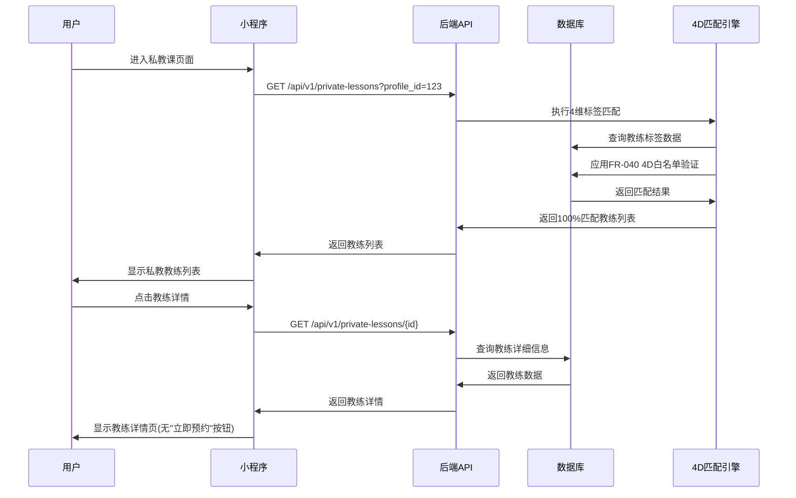
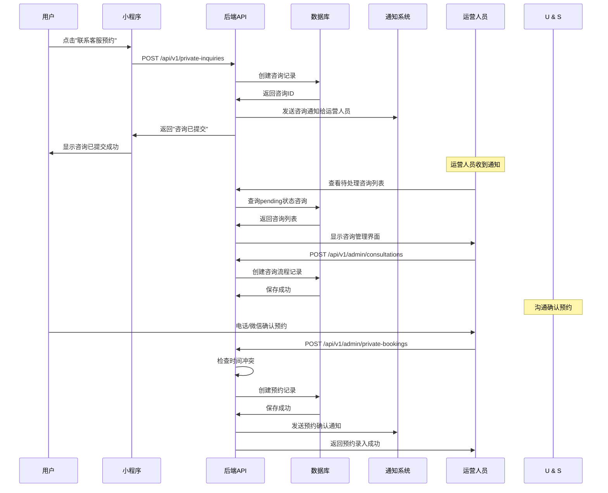
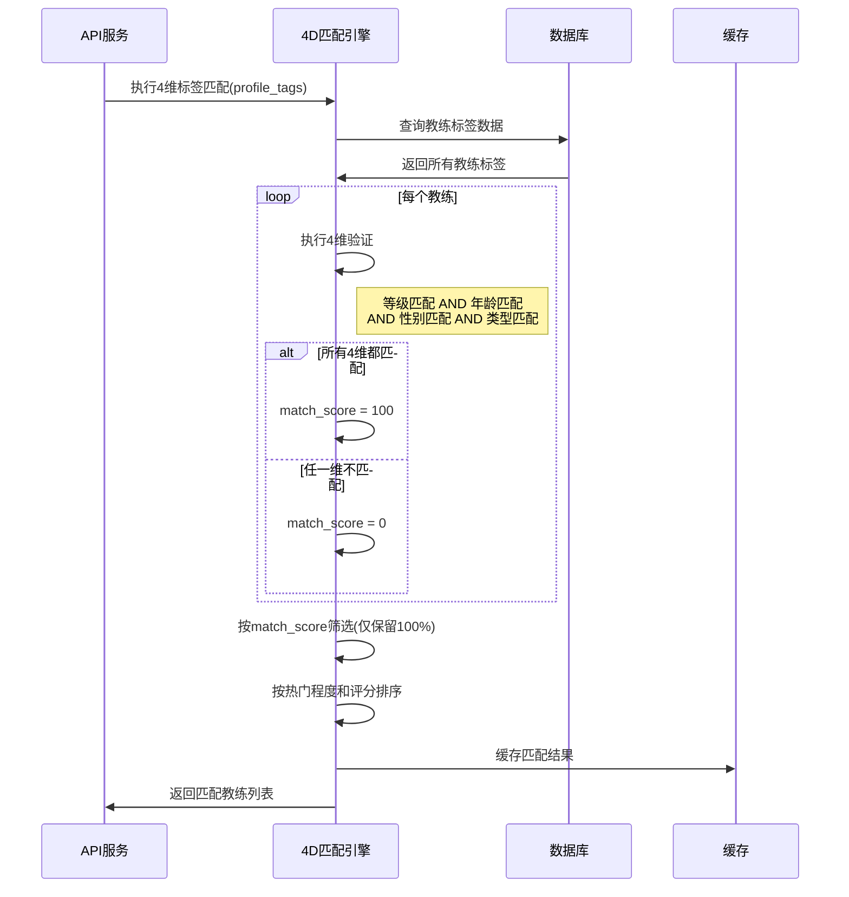

# 数据模型：私教课程系统

**功能**: 004-private-lesson
**创建时间**: 2025-11-08
**版本**: v2.0.0 RuoYi架构重构
**重构日期**: 2025-11-17
**技术栈**: RuoYi-Vue-Pro + MyBatis-Plus + Redis

## Database Schema

### Overview

私教课系统的数据模型采用RuoYi-Vue-Pro架构设计，基于MyBatis-Plus实现五表设计，实现私教课仅浏览模式、咨询驱动预约、4维标签白名单匹配、运营后台录入预约的完整业务流程。系统严格遵循FR-042仅浏览模式和FR-040 4维标签匹配要求，确保用户只能浏览私教课信息并通过咨询流程进行预约。

**RuoYi架构特性**：
- **MyBatis-Plus集成**: 使用LambdaQueryWrapper进行查询优化
- **Redis缓存**: Spring Cache + @Cacheable注解优化性能
- **乐观锁机制**: @Version字段防止并发冲突
- **审计功能**: BaseEntity提供创建时间、更新时间等审计字段
- **数据权限**: 基于RuoYi的权限控制系统

### Entity Relationship Diagram

```
┌─────────────────┐         ┌─────────────────┐
│ private_course  │         │ private_course  │
│   tags          │         │   inquiry        │
├─────────────────┤         ├─────────────────┤
│ id (PK)         │         │ id (PK)         │
│ course_id (FK)  │         │ user_id (FK)    │
│ level_range     │         │ instructor_id   │
│ age_range       │         │ profile_id (FK)│
│ gender          │         │ inquiry_content │
│ course_type     │         │ contact_info    │
│ skill_types     │         │ preferred_time  │
│ waitlist_cap    │         │ status          │
│ gender_val      │         │ created_at      │
│ type_val        │         │ admin_notes     │
└─────────────────┘         └─────────────────┘
         │                            │
         │                            ▼
         │                   ┌─────────────────┐
         │                   │ private_consul-│
         │                   │ tation         │
         │                   ├─────────────────┤
         │                   │ id (PK)         │
         │                   │ inquiry_id (FK) │
         │                   │ consultation_   │
         │                   │ method          │
         │                   │ admin_operator  │
         │                   │ consultation_   │
         │                   │ result          │
         │                   │ follow_up_      │
         │                   │ actions         │
         ▼                   └─────────────────┘
┌─────────────────┐                  │
│ private_instructor│                 │
├─────────────────┤                  │
│ id (PK)         │                  │
│ name            │                  │
│ avatar_url      │                  │
│ bio             │                  │
│ specialties     │                  │
│ price_per_hour  │                  │
│ status          │                  │
│ tags (4维标签)  │                  │
└─────────────────┘                  │
         │                            │
         │                            ▼
         │                   ┌─────────────────┐
         │                   │ private_booking │
         │                   ├─────────────────┤
         │                   │ id (PK)         │
         ▼                   │ user_id (FK)    │
┌─────────────────┐         │ profile_id (FK)│
│ profile         │         │ instructor_id   │
├─────────────────┤         │ booking_time    │
│ id (PK)         │         │ duration        │
│ name            │         │ price           │
│ level           │         │ status          │
│ gender          │         │ payment_method  │
│ status          │         │ admin_id        │
│ created_at      │         │ confirmation_   │
└─────────────────┘         │ notes           │
                            └─────────────────┘
```

## RuoYi-MyBatis-Plus 实体定义

### GymPrivateInstructor（私教教练表）

**描述**：存储私教教练的基础信息和4维标签，基于RuoYi-Vue-Pro架构设计

**用途**：私教课浏览展示、4维标签匹配、咨询分配

#### MyBatis-Plus 实体类
```java
@Data
@TableName("gym_private_instructor")
@Accessors(chain = true)
public class GymPrivateInstructor extends BaseEntity implements Serializable {
    private static final long serialVersionUID = 1L;

    @TableId(value = "instructor_id", type = IdType.AUTO)
    private Long instructorId;

    @TableField("name")
    private String name;

    @TableField("avatar_url")
    private String avatarUrl;

    @TableField("bio")
    private String bio;

    @TableField("specialties")
    private String specialties; // JSON格式存储

    @TableField("price_per_hour")
    private BigDecimal pricePerHour;

    @TableField("level_range")
    private String levelRange; // JSON格式，支持4维匹配

    @TableField("age_range")
    private String ageRange;

    @TableField("gender")
    private String gender;

    @TableField("course_type")
    private String courseType;

    @TableField("skill_types")
    private String skillTypes; // JSON格式

    @TableField("intensity_level")
    private String intensityLevel;

    @TableField("status")
    private String status; // active/inactive

    @TableField("rating")
    private BigDecimal rating;

    @TableField("teaching_hours")
    private Integer teachingHours;

    @Version
    @TableField("version")
    private Integer version;

    @TableField("del_flag")
    private String delFlag; // 软删除标识

    @TableField("create_by")
    private String createBy;

    @TableField("create_time")
    private LocalDateTime createTime;

    @TableField("update_by")
    private String updateBy;

    @TableField("update_time")
    private LocalDateTime updateTime;
}
```

#### 数据库表结构
```sql
CREATE TABLE `gym_private_instructor` (
  `instructor_id` BIGINT(20) NOT NULL AUTO_INCREMENT COMMENT '教练ID',
  `name` VARCHAR(50) NOT NULL COMMENT '教练姓名',
  `avatar_url` VARCHAR(255) DEFAULT NULL COMMENT '头像URL',
  `bio` TEXT DEFAULT NULL COMMENT '教练简介',
  `specialties` VARCHAR(1000) DEFAULT NULL COMMENT '擅长领域(JSON格式)',
  `price_per_hour` DECIMAL(10,2) DEFAULT NULL COMMENT '每小时价格',
  `level_range` VARCHAR(100) DEFAULT NULL COMMENT '等级范围(JSON数组)',
  `age_range` VARCHAR(20) DEFAULT '全年龄段' COMMENT '年龄范围',
  `gender` VARCHAR(10) DEFAULT 'both' COMMENT '性别要求',
  `course_type` VARCHAR(20) DEFAULT 'interest' COMMENT '课程类型',
  `skill_types` VARCHAR(1000) DEFAULT NULL COMMENT '技能类型(JSON数组)',
  `intensity_level` VARCHAR(10) DEFAULT 'medium' COMMENT '课程强度',
  `status` CHAR(1) DEFAULT '0' COMMENT '状态(0正常 1停用)',
  `rating` DECIMAL(2,1) DEFAULT NULL COMMENT '教练评分',
  `teaching_hours` INT(11) DEFAULT 0 COMMENT '授课时长',
  `version` INT(11) DEFAULT 0 COMMENT '乐观锁版本号',
  `del_flag` CHAR(1) DEFAULT '0' COMMENT '删除标志(0代表存在 2代表删除)',
  `create_by` VARCHAR(64) DEFAULT '' COMMENT '创建者',
  `create_time` DATETIME DEFAULT NULL COMMENT '创建时间',
  `update_by` VARCHAR(64) DEFAULT '' COMMENT '更新者',
  `update_time` DATETIME DEFAULT NULL COMMENT '更新时间',
  `remark` VARCHAR(500) DEFAULT NULL COMMENT '备注',
  PRIMARY KEY (`instructor_id`),
  KEY `idx_name` (`name`),
  KEY `idx_status` (`status`),
  KEY `idx_level_range` (`level_range`(100)),
  KEY `idx_age_range` (`age_range`),
  KEY `idx_gender` (`gender`),
  KEY `idx_course_type` (`course_type`),
  KEY `idx_create_time` (`create_time`)
) ENGINE=InnoDB DEFAULT CHARSET=utf8mb4 COMMENT='私教教练表';
```

**唯一约束**：
- `uk_name` (`name`) - 教练姓名唯一

**业务规则**：
- `rating` 范围为0.0-5.0，保留一位小数
- `level_range` 支持跨级匹配，JSON格式存储多个等级，如["L1+", "L2"]
- `skill_types` 技能类型JSON数组，支持多技能标签
- 软删除教练(status='inactive')，保留历史授课记录
- 4维标签字段(level_range/age_range/gender/course_type)用于FR-040匹配

### private_course_tags（私教课程标签表）

**描述**：存储私教课程的多维度标签信息，支持FR-040 4维标签白名单匹配

**用途**：4维标签匹配算法、智能推荐、运营分析

| 字段名 | 数据类型 | 约束 | 默认值 | 描述 | 索引 |
|--------|----------|------|--------|------|------|
| id | INT | PK, AUTO_INCREMENT | - | 标签ID | PRIMARY |
| course_id | INT | NOT NULL | - | 课程ID | UNIQUE |
| level_range | VARCHAR(100) | NULL | NULL | 等级范围(JSON数组,如["L1+", "L2"]) | INDEX |
| age_range | VARCHAR(20) | DEFAULT '全年龄段' | 年龄范围(4-6岁/成人/全年龄段等) | INDEX |
| gender | ENUM('male','female','both') | DEFAULT 'both' | 性别要求 | INDEX |
| course_type | ENUM('interest','professional','competition','private') | NOT NULL | 'private' | 课程类型 | INDEX |
| skill_types | JSON | NULL | NULL | 技能类型(JSON数组) | - |
| intensity_level | ENUM('light','medium','high') | DEFAULT 'medium' | 课程强度 | INDEX |
| main_instructor | VARCHAR(50) | NULL | NULL | 主教老师 | - |
| has_assistant | BOOLEAN | DEFAULT FALSE | 是否有助教 | - |
| popularity | ENUM('hot','normal','cold') | DEFAULT 'normal' | 热门程度 | INDEX |
| audience | ENUM('child','adult','both') | DEFAULT 'both' | 目标人群 | INDEX |
| pricing_category | ENUM('private_1v1','private_1v2','private_group') | DEFAULT 'private_1v1' | 定价类别 | INDEX |
| base_price | DECIMAL(10,2) | NULL | NULL | 基础价格(用于显示) | INDEX |
| pricing_strategy | ENUM('fixed','dynamic') | DEFAULT 'dynamic' | 定价策略 | INDEX |
| waitlist_capacity | INT | NOT NULL DEFAULT 8 | 候补队列容量限制(FR-043) | INDEX |
| gender_validation | ENUM('required','optional') | NOT NULL DEFAULT 'required' | 性别验证级别(4D验证) | INDEX |
| type_validation | ENUM('strict','flexible') | NOT NULL DEFAULT 'strict' | 类型验证级别(4D验证) | INDEX |
| created_at | TIMESTAMP | NOT NULL | CURRENT_TIMESTAMP | 创建时间 | INDEX |
| updated_at | TIMESTAMP | NOT NULL | CURRENT_TIMESTAMP ON UPDATE | 更新时间 | INDEX |

**外键约束**：
- `course_id` → `course.id` (ON DELETE CASCADE)

**唯一约束**：
- `uk_course_id` (`course_id`)

**业务规则**：
- `level_range` 支持跨级匹配，JSON格式存储多个等级
- `gender` 性别限制，both表示不限，新增第4维标签匹配
- `course_type` 课程类型，固定为'private'表示私教课
- `waitlist_capacity` 候补队列容量限制，FR-043动态容量管理
- `gender_validation` 和 `type_validation` 确保4维验证强制执行
- **FR-040**: 4维标签白名单匹配：等级维度 + 年龄维度 + 性别维度 + 类型维度，任一维度不匹配则课程不显示

### private_inquiry（私教咨询记录表）

**描述**：存储用户私教课咨询申请，FR-042仅浏览模式的核心流程

**用途**：咨询流程管理、运营跟进、转化率分析

| 字段名 | 数据类型 | 约束 | 默认值 | 描述 | 索引 |
|--------|----------|------|--------|------|------|
| id | INT | PK, AUTO_INCREMENT | - | 咨询ID | PRIMARY |
| user_id | INT | NOT NULL | - | 用户ID | INDEX |
| instructor_id | INT | NULL | NULL | 意向教练ID | INDEX |
| profile_id | INT | NOT NULL | - | 学员档案ID | INDEX |
| inquiry_content | TEXT | NOT NULL | - | 咨询内容 | - |
| contact_info | VARCHAR(255) | NULL | NULL | 联系方式 | - |
| preferred_time | VARCHAR(255) | NULL | NULL | 期望时间 | - |
| preferred_duration | INT | NULL | NULL | 期望课时(分钟) | - |
| budget_range | VARCHAR(50) | NULL | NULL | 预算范围 | - |
| status | ENUM('pending','contacted','booked','not_interested','expired') | NOT NULL | 'pending' | 咨询状态 | INDEX |
| source | ENUM('course_detail','coach_list','recommendation') | DEFAULT 'course_detail' | 咨询来源 | INDEX |
| created_at | TIMESTAMP | NOT NULL | CURRENT_TIMESTAMP | 创建时间 | INDEX |
| updated_at | TIMESTAMP | NOT NULL | CURRENT_TIMESTAMP ON UPDATE | 更新时间 | INDEX |
| admin_notes | TEXT | NULL | NULL | 运营备注 | - |
| follow_up_count | INT | DEFAULT 0 | 跟进次数 | - |
| last_follow_up | TIMESTAMP | NULL | NULL | 最后跟进时间 | INDEX |
| expires_at | TIMESTAMP | NULL | NULL | 咨询过期时间 | INDEX |

**外键约束**：
- `user_id` → `account.id` (ON DELETE CASCADE)
- `instructor_id` → `private_instructor.id` (ON DELETE SET NULL)
- `profile_id` → `profile.id` (ON DELETE CASCADE)

**唯一约束**：
- `uk_user_instructor_profile` (`user_id`, `instructor_id`, `profile_id`)

**业务规则**：
- `status` 状态流转：pending → contacted → booked/not_interested
- `expires_at` 咨询过期时间，默认7天后自动标记为expired
- `follow_up_count` 记录运营跟进次数，用于运营效率统计
- **FR-042**: 私教课仅浏览模式的核心数据表，记录所有咨询申请

### private_consultation（私教咨询流程表）

**描述**：记录私教咨询的完整流程，FR-042扩展流程管理

**用途**：咨询流程跟踪、质量评估、运营分析

| 字段名 | 数据类型 | 约束 | 默认值 | 描述 | 索引 |
|--------|----------|------|--------|------|------|
| id | INT | PK, AUTO_INCREMENT | - | 流程ID | PRIMARY |
| inquiry_id | INT | NOT NULL | - | 咨询ID | INDEX |
| consultation_method | ENUM('phone','wechat','offline','email') | NOT NULL | 'wechat' | 咨询方式 | INDEX |
| consultation_time | TIMESTAMP | NULL | NULL | 咨询时间 | INDEX |
| admin_operator_id | INT | NULL | NULL | 运营人员ID | INDEX |
| consultation_result | ENUM('success','pending','failed','rescheduled') | DEFAULT 'pending' | 咨询结果 | INDEX |
| follow_up_actions | JSON | NULL | NULL | 后续行动(JSON数组) | - |
| consultation_notes | TEXT | NULL | NULL | 咨询记录 | - |
| customer_satisfaction | ENUM('very_satisfied','satisfied','neutral','dissatisfied','very_dissatisfied') | NULL | NULL | 客户满意度 | INDEX |
| response_time_minutes | INT | NULL | NULL | 响应时间(分钟) | INDEX |
| next_follow_up_time | TIMESTAMP | NULL | NULL | 下次跟进时间 | INDEX |
| conversion_status | ENUM('converted','lost','pending') | DEFAULT 'pending' | 转化状态 | INDEX |
| created_at | TIMESTAMP | NOT NULL | CURRENT_TIMESTAMP | 创建时间 | INDEX |
| updated_at | TIMESTAMP | NOT NULL | CURRENT_TIMESTAMP ON UPDATE | 更新时间 | INDEX |

**外键约束**：
- `inquiry_id` → `private_inquiry.id` (ON DELETE CASCADE)
- `admin_operator_id` → `staff.id` (ON DELETE SET NULL)

**业务规则**：
- `response_time_minutes` 记录从咨询申请到首次联系的时间
- `conversion_status` 跟踪咨询到预约的转化情况
- `follow_up_actions` JSON数组存储后续行动，如["发送课程资料","安排试课"]
- **FR-042**: 支持多种咨询方式和完整的流程跟踪

### private_booking（私教预约记录表）

**描述**：存储私教课预约记录，由运营人员手动录入，FR-042线下录入环节

**用途**：预约管理、教练排班、结算统计、学员查看

| 字段名 | 数据类型 | 约束 | 默认值 | 描述 | 索引 |
|--------|----------|------|--------|------|------|
| id | INT | PK, AUTO_INCREMENT | - | 预约ID | PRIMARY |
| user_id | INT | NOT NULL | - | 用户ID | INDEX |
| profile_id | INT | NOT NULL | - | 学员档案ID | INDEX |
| instructor_id | INT | NOT NULL | - | 教练ID | INDEX |
| course_id | INT | NULL | NULL | 课程ID | INDEX |
| booking_time | DATETIME | NOT NULL | - | 预约时间 | INDEX |
| duration | INT | NOT NULL | 60 | 课程时长(分钟) | - |
| actual_price | DECIMAL(10,2) | NOT NULL | 0.00 | 实际价格 | - |
| status | ENUM('pending','confirmed','completed','cancelled','no_show') | NOT NULL | 'pending' | 预约状态 | INDEX |
| payment_method | ENUM('offline','wechat','alipay','wallet') | NOT NULL | 'offline' | 支付方式 | INDEX |
| payment_status | ENUM('unpaid','paid','refunded') | DEFAULT 'unpaid' | 支付状态 | INDEX |
| admin_id | INT | NOT NULL | - | 录入运营人员ID | INDEX |
| confirmation_notes | TEXT | NULL | NULL | 确认备注 | - |
| cancellation_reason | TEXT | NULL | NULL | 取消原因 | - |
| cancellation_time | TIMESTAMP | NULL | NULL | 取消时间 | INDEX |
| completed_at | TIMESTAMP | NULL | NULL | 完成时间 | INDEX |
| instructor_notes | TEXT | NULL | NULL | 教练评语 | - |
| room_id | INT | NULL | NULL | 教室ID | INDEX |
| booking_source | ENUM('inquiry','direct','recommendation') | DEFAULT 'inquiry' | 预约来源 | INDEX |
| created_at | TIMESTAMP | NOT NULL | CURRENT_TIMESTAMP | 创建时间 | INDEX |
| updated_at | TIMESTAMP | NOT NULL | CURRENT_TIMESTAMP ON UPDATE | 更新时间 | INDEX |

**外键约束**：
- `user_id` → `account.id` (ON DELETE CASCADE)
- `profile_id` → `profile.id` (ON DELETE CASCADE)
- `instructor_id` → `private_instructor.id` (ON DELETE RESTRICT)
- `course_id` → `course.id` (ON DELETE SET NULL)
- `admin_id` → `staff.id` (ON DELETE RESTRICT)
- `room_id` → `room.id` (ON DELETE SET NULL)

**唯一约束**：
- `uk_instructor_time` (`instructor_id`, `booking_time`) - 防止教练时间冲突

**业务规则**：
- 时间冲突检测：同一教练同一时间只能有一个预约
- `status` 状态流转：pending → confirmed → completed/cancelled/no_show
- **FR-042**: 仅支持运营后台录入，用户无法直接在线预约私教课
- 支付方式默认为offline（线下支付），符合FR-042仅浏览模式要求

### coach_schedule（教练排班表）

**描述**：存储私教教练的排班信息，用于时间可用性检查

**用途**：时间冲突检测、排班管理、教练工作负载分析

| 字段名 | 数据类型 | 约束 | 默认值 | 描述 | 索引 |
|--------|----------|------|--------|------|------|
| id | INT | PK, AUTO_INCREMENT | - | 排班ID | PRIMARY |
| instructor_id | INT | NOT NULL | - | 教练ID | INDEX |
| day_of_week | TINYINT | NOT NULL | - | 星期(1-7,1为周一) | INDEX |
| start_time | TIME | NOT NULL | - | 开始时间 | INDEX |
| end_time | TIME | NOT NULL | - | 结束时间 | - |
| is_available | BOOLEAN | DEFAULT TRUE | 是否可用 | INDEX |
| schedule_type | ENUM('regular','temporary','blocked') | DEFAULT 'regular' | 排班类型 | INDEX |
| effective_date | DATE | NULL | NULL | 生效日期 | INDEX |
| expiry_date | DATE | NULL | NULL | 失效日期 | INDEX |
| notes | VARCHAR(255) | NULL | NULL | 排班备注 | - |
| created_at | TIMESTAMP | NOT NULL | CURRENT_TIMESTAMP | 创建时间 | INDEX |
| updated_at | TIMESTAMP | NOT NULL | CURRENT_TIMESTAMP ON UPDATE | 更新时间 | INDEX |

**外键约束**：
- `instructor_id` → `private_instructor.id` (ON DELETE CASCADE)

**唯一约束**：
- `uk_instructor_schedule` (`instructor_id`, `day_of_week`, `start_time`, `effective_date`)

**业务规则**：
- `day_of_week`: 1=周一, 2=周二, ..., 7=周日
- `schedule_type`: regular(固定排班), temporary(临时调整), blocked(屏蔽时间)
- 时间冲突检查时考虑此表的可用时间设置

---

## RuoYi架构API设计

### 私教课程管理API

#### GET /gym/private/instructors/matched
**方法**: GET
**路径**: /gym/private/instructors/matched
**描述**: 获取匹配的私教教练列表（RuoYi架构 + 4维标签匹配）

**Controller实现**:
```java
@RestController
@RequestMapping("/gym/private/instructors")
@Api(tags = "私教教练管理")
@RequiredArgsConstructor
public class GymPrivateInstructorController extends BaseController {

    private final IGymPrivateInstructorService instructorService;

    @GetMapping("/matched")
    @ApiOperation("获取匹配的私教教练列表")
    @PreAuthorize("@ss.hasPermi('gym:private:instructor:list')")
    public TableDataInfo<GymPrivateInstructorVO> getMatchedInstructors(GymPrivateInquiryQuery query) {
        startPage();
        List<GymPrivateInstructorVO> list = instructorService.getMatchedInstructors(query);
        return getDataTable(list);
    }
}
```

**查询参数**:
```json
{
  "profileId": 123,
  "level": "L2",
  "ageRange": "4-5岁",
  "gender": "male",
  "courseType": "interest"
}
```

**响应格式**:
```json
{
  "code": 200,
  "msg": "查询成功",
  "total": 15,
  "rows": [
    {
      "instructorId": 1,
      "name": "张教练",
      "avatarUrl": "https://example.com/avatar.jpg",
      "bio": "10年体操教学经验",
      "specialties": ["翻滚", "平衡木"],
      "pricePerHour": 600.00,
      "levelRange": ["L1+", "L2"],
      "ageRange": "4-5",
      "gender": "both",
      "courseType": "interest",
      "matchScore": 100.0,
      "validationResult": "whitelist_passed",
      "status": "0",
      "createTime": "2025-11-08 10:00:00"
    }
  ]
}
```

**Query Parameters**:
```
?profile_id=123&level=L2&limit=20&include_unmatched=false
```

**Response**:
```json
{
  "code": 200,
  "message": "查询成功",
  "data": {
    "profile_tags": {
      "age_tag": "4-5",
      "level": "L2",
      "gender": "male",
      "course_type": "interest"
    },
    "match_rule": "4d_whitelist_validation",
    "matched_instructors": [
      {
        "instructor_id": 1,
        "name": "张教练",
        "avatar_url": "https://example.com/avatar.jpg",
        "bio": "10年体操教学经验",
        "specialties": ["翻滚", "平衡木"],
        "price_per_hour": 600.00,
        "level_range": ["L1+", "L2"],
        "age_range": "4-5",
        "gender": "both",
        "course_type": "interest",
        "match_score": 100.0,
        "validation_result": "whitelist_passed",
        "match_details": {
          "validation_type": "4d_whitelist",
          "overall_match": true,
          "dimension_results": {
            "level_match": { "score": 100, "result": "matched", "reason": "等级L2在范围内" },
            "age_match": { "score": 100, "result": "matched", "reason": "年龄4.5岁符合4-5岁" },
            "gender_match": { "score": 100, "result": "matched", "reason": "性别male符合both要求" },
            "type_match": { "score": 100, "result": "matched", "reason": "类型interest匹配" }
          },
          "validation_summary": {
            "total_dimensions": 4,
            "passed_dimensions": 4,
            "validation_result": "whitelist_passed"
          }
        }
      }
    ],
    "pagination": {
      "total": 15,
      "page": 1,
      "limit": 20
    }
  }
}
```

#### GET /api/v1/private-lessons/{id}
**方法**: GET
**路径**: /api/v1/private-lessons/{id}
**描述**: 获取私教教练详情

**Response**:
```json
{
  "code": 200,
  "message": "查询成功",
  "data": {
    "instructor_id": 1,
    "name": "张教练",
    "avatar_url": "https://example.com/avatar.jpg",
    "bio": "10年体操教学经验，专业竞技体操背景",
    "specialties": ["翻滚", "平衡木", "自由体操"],
    "price_per_hour": 600.00,
    "level_range": ["L1+", "L2", "L2+"],
    "age_range": "4-6",
    "gender": "both",
    "course_type": "interest",
    "rating": 4.8,
    "teaching_hours": 1200,
    "schedule": [
      {
        "day_of_week": 1,
        "start_time": "14:00:00",
        "end_time": "18:00:00",
        "is_available": true
      },
      {
        "day_of_week": 3,
        "start_time": "14:00:00",
        "end_time": "18:00:00",
        "is_available": true
      }
    ],
    "available_slots": [
      {
        "date": "2025-11-10",
        "start_time": "14:00:00",
        "end_time": "15:00:00"
      }
    ],
    "student_reviews": [
      {
        "student_name": "小明",
        "rating": 5,
        "comment": "教练很有耐心，孩子进步很快",
        "review_date": "2025-10-15"
      }
    ]
  }
}
```

### Private Inquiry API

#### POST /api/v1/private-inquiries
**方法**: POST
**路径**: /api/v1/private-inquiries
**描述**: 提交私教课咨询申请（FR-042核心功能）

**Request**:
```json
{
  "instructor_id": 1,
  "profile_id": 123,
  "inquiry_content": "希望为孩子预约一对一私教课",
  "contact_info": "13800138000",
  "preferred_time": "周末下午",
  "preferred_duration": 60,
  "budget_range": "500-800元/小时"
}
```

**Response**:
```json
{
  "code": 200,
  "message": "咨询申请已提交",
  "data": {
    "inquiry_id": 1001,
    "status": "pending",
    "created_at": "2025-11-08T10:00:00Z",
    "expected_contact_time": "24小时内",
    "contact_methods": ["电话", "微信"]
  }
}
```

#### GET /api/v1/private-inquiries
**方法**: GET
**路径**: /api/v1/private-inquiries
**描述**: 获取用户的私教课咨询记录

**Query Parameters**:
```
?user_id=123&status=pending&page=1&limit=10
```

**Response**:
```json
{
  "code": 200,
  "message": "查询成功",
  "data": {
    "inquiries": [
      {
        "inquiry_id": 1001,
        "instructor": {
          "id": 1,
          "name": "张教练",
          "avatar_url": "https://example.com/avatar.jpg"
        },
        "profile": {
          "id": 123,
          "name": "小明"
        },
        "inquiry_content": "希望为孩子预约一对一私教课",
        "preferred_time": "周末下午",
        "status": "contacted",
        "created_at": "2025-11-08T10:00:00Z",
        "last_follow_up": "2025-11-08T15:30:00Z",
        "follow_up_count": 1,
        "consultations": [
          {
            "consultation_method": "phone",
            "consultation_time": "2025-11-08T15:30:00Z",
            "consultation_result": "pending"
          }
        ]
      }
    ],
    "pagination": {
      "total": 5,
      "page": 1,
      "limit": 10
    }
  }
}
```

### Private Booking Management API (Admin Only)

#### POST /api/v1/admin/private-bookings
**方法**: POST
**路径**: /api/v1/admin/private-bookings
**描述**: 运营人员录入私教课预约（FR-042线下录入）

**Request**:
```json
{
  "user_id": 123,
  "profile_id": 123,
  "instructor_id": 1,
  "course_id": 1001,
  "booking_time": "2025-11-15T14:00:00Z",
  "duration": 60,
  "actual_price": 600.00,
  "payment_method": "offline",
  "room_id": 5,
  "booking_source": "inquiry",
  "confirmation_notes": "家长确认时间，已发送上课提醒"
}
```

**Response**:
```json
{
  "code": 200,
  "message": "预约录入成功",
  "data": {
    "booking_id": 2001,
    "status": "confirmed",
    "booking_time": "2025-11-15T14:00:00Z",
    "conflict_check": {
      "has_conflict": false,
      "conflict_details": null
    },
    "notification_sent": true,
    "created_at": "2025-11-08T16:00:00Z"
  }
}
```

**时间冲突响应**:
```json
{
  "code": 409,
  "message": "时间冲突",
  "data": {
    "has_conflict": true,
    "conflict_details": {
      "conflicting_booking": {
        "booking_id": 1999,
        "student_name": "小红",
        "time": "2025-11-15T14:00:00Z",
        "duration": 60
      },
      "suggested_alternatives": [
        {
          "date": "2025-11-15",
          "time": "15:00:00",
          "available": true
        },
        {
          "date": "2025-11-16",
          "time": "14:00:00",
          "available": true
        }
      ]
    }
  }
}
```

#### GET /api/v1/admin/private-bookings
**方法**: GET
**路径**: /api/v1/admin/private-bookings
**描述**: 运营人员查看私教课预约列表

**Query Parameters**:
```
?instructor_id=1&status=confirmed&date_from=2025-11-01&date_to=2025-11-30&page=1&limit=20
```

**Response**:
```json
{
  "code": 200,
  "message": "查询成功",
  "data": {
    "bookings": [
      {
        "booking_id": 2001,
        "user": {
          "id": 123,
          "name": "张三",
          "phone": "13800138000"
        },
        "profile": {
          "id": 123,
          "name": "小明",
          "age": 5,
          "level": "L2"
        },
        "instructor": {
          "id": 1,
          "name": "张教练"
        },
        "course": {
          "id": 1001,
          "name": "幼儿体操私教课L1-L3"
        },
        "booking_time": "2025-11-15T14:00:00Z",
        "duration": 60,
        "actual_price": 600.00,
        "status": "confirmed",
        "payment_method": "offline",
        "payment_status": "unpaid",
        "room": {
          "id": 5,
          "name": "私教室A"
        },
        "admin": {
          "id": 10,
          "name": "教务李老师"
        },
        "created_at": "2025-11-08T16:00:00Z"
      }
    ],
    "summary": {
      "total_bookings": 45,
      "confirmed_bookings": 38,
      "completed_bookings": 32,
      "cancelled_bookings": 5,
      "total_revenue": 22800.00
    },
    "pagination": {
      "total": 45,
      "page": 1,
      "limit": 20
    }
  }
}
```

---

## Data Validation

### Input Validation

#### Private Instructor Creation Validation
- **name**: 必填，1-50字符，不能包含特殊字符
- **bio**: 可选，最多1000字符
- **specialties**: 可选，JSON数组，每个技能最多20字符
- **price_per_hour**: 可选，0-9999.99之间的数值
- **level_range**: 可选，JSON数组，符合L1-L8格式

#### Private Inquiry Creation Validation
- **user_id**: 必填，有效的用户ID
- **profile_id**: 必填，有效的学员档案ID
- **inquiry_content**: 必填，10-1000字符
- **contact_info**: 必填，手机号或微信号格式
- **preferred_time**: 可选，最多100字符
- **preferred_duration**: 可选，30-180分钟

#### Private Booking Creation Validation
- **user_id**: 必填，有效的用户ID
- **profile_id**: 必填，有效的学员档案ID
- **instructor_id**: 必填，有效的教练ID
- **booking_time**: 必填，有效的未来时间
- **duration**: 必填，30-180分钟
- **actual_price**: 必填，0-9999.99之间的数值

### Business Validation

#### 4维标签匹配规则 (FR-040)
- **等级维度**: 学员等级必须在教练等级范围内
- **年龄维度**: 学员年龄必须在教练年龄要求范围内
- **性别维度**: 学员性别必须符合教练性别要求
- **类型维度**: 课程类型必须匹配学员目标类型
- **匹配结果**: 只有同时满足所有4个维度的教练才会显示，否则完全不显示

#### 私教课仅浏览模式 (FR-042)
- **浏览权限**: 所有用户都可以浏览私教课信息
- **预约限制**: 用户不能直接在线预约私教课程
- **咨询流程**: 用户必须通过咨询申请流程进行预约
- **录入权限**: 只有运营人员可以在后台录入私教课预约

#### 时间冲突检测
- **教练冲突**: 同一教练同一时间只能有一个预约
- **学员冲突**: 同一学员同一时间不能有两个预约（考虑不同教练）
- **缓冲时间**: 两节课之间至少间隔15分钟
- **排班检查**: 预约时间必须在教练可用排班时间内

#### 数据完整性规则 (宪法Principle 2)
- **事务保护**: 预约创建使用数据库事务确保ACID特性
- **外键约束**: 确保引用完整性，防止孤立的关联记录
- **软删除**: 教练等重要数据使用软删除，保留历史记录
- **审计日志**: 记录所有关键操作的变更历史

---

## Performance Optimization

### Database Indexes

#### 主要查询索引
- `private_instructor.name` - 教练姓名搜索
- `private_instructor.level_range` - 等级筛选
- `private_instructor.status` - 在线状态筛选
- `private_course_tags.course_type` - 课程类型筛选
- `private_inquiry.status` - 咨询状态筛选
- `private_booking.instructor_id` - 教练预约查询
- `private_booking.booking_time` - 时间查询
- `coach_schedule.instructor_id` - 教练排班查询

#### 复合索引
- `private_course_tags(course_type, age_range, gender)` - 4D匹配索引
- `private_booking(instructor_id, booking_time)` - 教练时间冲突检测
- `private_inquiry(user_id, status)` - 用户咨询查询
- `coach_schedule(instructor_id, day_of_week, start_time)` - 教练排班查询

### Query Optimization

#### 常用查询优化
```sql
-- 4维标签匹配查询（使用复合索引）
SELECT i.*, t.level_range, t.age_range, t.gender, t.course_type
FROM private_instructor i
JOIN private_course_tags t ON i.id = t.instructor_id
WHERE i.status = 'active'
  AND JSON_CONTAINS(t.level_range, '"L2"')
  AND t.age_range = '4-5'
  AND t.gender IN ('both', 'male')
  AND t.course_type = 'interest';

-- 教练时间冲突检测（使用复合索引）
SELECT COUNT(*) as conflict_count
FROM private_booking
WHERE instructor_id = ?
  AND booking_time = ?
  AND status IN ('pending', 'confirmed');

-- 用户咨询记录查询（使用复合索引）
SELECT i.*, c.name as consultation_method, c.consultation_time
FROM private_inquiry i
LEFT JOIN private_consultation c ON i.id = c.inquiry_id
WHERE i.user_id = ? AND i.status = 'pending'
ORDER BY i.created_at DESC;
```

#### 分页查询
```sql
-- 教练列表分页（4D匹配后）
SELECT i.*, t.match_score
FROM private_instructor i
JOIN (
  SELECT instructor_id,
         (CASE
           WHEN JSON_CONTAINS(level_range, ?) AND
                age_range = ? AND
                gender IN ('both', ?) AND
                course_type = ?
           THEN 100 ELSE 0
         END) as match_score
  FROM private_course_tags
  WHERE instructor_id IN (
    SELECT id FROM private_instructor WHERE status = 'active'
  )
) t ON i.id = t.instructor_id
WHERE t.match_score = 100
ORDER BY i.rating DESC, i.teaching_hours DESC
LIMIT 20 OFFSET 0;
```

### Caching Strategy

#### Redis 缓存
- 教练列表：缓存30分钟
- 教练详情：缓存1小时
- 4维匹配结果：缓存15分钟（动态变化）
- 咨询统计：缓存10分钟

#### 缓存键设计
```
instructors:level:{level}:age:{age}:gender:{gender}:type:{type}  # 4D匹配结果
instructor:{id}                                          # 教练详情
user:{user_id}:inquiries                                 # 用户咨询记录
instructor:{id}:schedule:{date}                          # 教练排班
booking_conflict:{instructor_id}:{timestamp}            # 预约冲突检查
```

---

## Migration Strategy

### Version 1.0.0

#### 创建数据库
```sql
-- 创建私教系统相关表
USE ccmartmeet;
```

#### 创建 private_instructor 表
```sql
CREATE TABLE `private_instructor` (
  `id` INT PRIMARY KEY AUTO_INCREMENT COMMENT '教练ID',
  `name` VARCHAR(50) NOT NULL COMMENT '教练姓名',
  `avatar_url` VARCHAR(255) DEFAULT NULL COMMENT '头像URL',
  `bio` TEXT DEFAULT NULL COMMENT '教练简介',
  `specialties` JSON DEFAULT NULL COMMENT '擅长领域',
  `price_per_hour` DECIMAL(10,2) DEFAULT NULL COMMENT '每小时价格',
  `level_range` VARCHAR(100) DEFAULT NULL COMMENT '等级范围(JSON数组,如["L1+", "L2"])',
  `age_range` VARCHAR(20) DEFAULT '全年龄段' COMMENT '年龄范围(4-6岁/成人/全年龄段等)',
  `gender` ENUM('male','female','both') DEFAULT 'both' COMMENT '性别要求',
  `course_type` ENUM('interest','professional','competition') DEFAULT 'interest' COMMENT '课程类型',
  `skill_types` JSON DEFAULT NULL COMMENT '技能类型(JSON数组)',
  `intensity_level` ENUM('light','medium','high') DEFAULT 'medium' COMMENT '课程强度',
  `status` ENUM('active','inactive') DEFAULT 'active' COMMENT '状态：在职/离职',
  `rating` DECIMAL(2,1) DEFAULT NULL COMMENT '教练评分(0.0-5.0)',
  `teaching_hours` INT DEFAULT 0 COMMENT '授课时长',
  `created_at` TIMESTAMP DEFAULT CURRENT_TIMESTAMP,
  `updated_at` TIMESTAMP DEFAULT CURRENT_TIMESTAMP ON UPDATE CURRENT_TIMESTAMP,

  UNIQUE KEY `uk_name` (`name`),
  INDEX `idx_name` (`name`),
  INDEX `idx_level_range` (`level_range`(100)),
  INDEX `idx_age_range` (`age_range`),
  INDEX `idx_gender` (`gender`),
  INDEX `idx_course_type` (`course_type`),
  INDEX `idx_status` (`status`),
  INDEX `idx_rating` (`rating`)
) ENGINE=InnoDB DEFAULT CHARSET=utf8mb4 COMMENT='私教教练表';
```

#### 创建 private_course_tags 表
```sql
CREATE TABLE `private_course_tags` (
  `id` INT PRIMARY KEY AUTO_INCREMENT COMMENT '标签ID',
  `instructor_id` INT NOT NULL COMMENT '教练ID',
  `level_range` VARCHAR(100) DEFAULT NULL COMMENT '等级范围(如L1-L3, L2+, JSON格式)',
  `age_range` VARCHAR(20) DEFAULT '全年龄段' COMMENT '年龄范围(4-6岁/成人/全年龄段等)',
  `gender` ENUM('male','female','both') DEFAULT 'both' COMMENT '性别要求',
  `course_type` ENUM('private') NOT NULL DEFAULT 'private' COMMENT '课程类型(私教课固定为private)',
  `skill_types` JSON DEFAULT NULL COMMENT '技能类型(JSON数组)',
  `intensity_level` ENUM('light','medium','high') DEFAULT 'medium' COMMENT '课程强度',
  `main_instructor` VARCHAR(50) DEFAULT NULL COMMENT '主教老师',
  `has_assistant` BOOLEAN DEFAULT FALSE COMMENT '是否有助教',
  `popularity` ENUM('hot','normal','cold') DEFAULT 'normal' COMMENT '热门程度',
  `audience` ENUM('child','adult','both') DEFAULT 'both' COMMENT '目标人群',
  `pricing_category` ENUM('private_1v1','private_1v2','private_group') DEFAULT 'private_1v1' COMMENT '定价类别',
  `base_price` DECIMAL(10,2) DEFAULT NULL COMMENT '基础价格(用于显示)',
  `pricing_strategy` ENUM('fixed','dynamic') DEFAULT 'dynamic' COMMENT '定价策略',
  `waitlist_capacity` INT NOT NULL DEFAULT 8 COMMENT '候补队列容量限制(FR-043)',
  `gender_validation` ENUM('required','optional') NOT NULL DEFAULT 'required' COMMENT '性别验证级别(4D验证)',
  `type_validation` ENUM('strict','flexible') NOT NULL DEFAULT 'strict' COMMENT '类型验证级别(4D验证)',
  `created_at` TIMESTAMP DEFAULT CURRENT_TIMESTAMP,
  `updated_at` TIMESTAMP DEFAULT CURRENT_TIMESTAMP ON UPDATE CURRENT_TIMESTAMP,

  UNIQUE KEY `uk_instructor_id` (`instructor_id`),
  INDEX `idx_instructor_id` (`instructor_id`),
  INDEX `idx_course_type` (`course_type`),
  INDEX `idx_age_range` (`age_range`),
  INDEX `idx_gender` (`gender`),
  INDEX `idx_4d_match` (`course_type`, `age_range`, `gender`),
  INDEX `idx_waitlist_capacity` (`waitlist_capacity`),
  INDEX `idx_intensity_level` (`intensity_level`),
  INDEX `idx_popularity` (`popularity`),
  FOREIGN KEY (`instructor_id`) REFERENCES `private_instructor`(`id`) ON DELETE CASCADE
) ENGINE=InnoDB DEFAULT CHARSET=utf8mb4 COMMENT='私教课程标签表（支持4维白名单验证和候补容量管理）';
```

#### 创建 private_inquiry 表
```sql
CREATE TABLE `private_inquiry` (
  `id` INT PRIMARY KEY AUTO_INCREMENT COMMENT '咨询ID',
  `user_id` INT NOT NULL COMMENT '用户ID',
  `instructor_id` INT DEFAULT NULL COMMENT '意向教练ID',
  `profile_id` INT NOT NULL COMMENT '学员档案ID',
  `inquiry_content` TEXT NOT NULL COMMENT '咨询内容',
  `contact_info` VARCHAR(255) DEFAULT NULL COMMENT '联系方式',
  `preferred_time` VARCHAR(255) DEFAULT NULL COMMENT '期望时间',
  `preferred_duration` INT DEFAULT NULL COMMENT '期望课时(分钟)',
  `budget_range` VARCHAR(50) DEFAULT NULL COMMENT '预算范围',
  `status` ENUM('pending','contacted','booked','not_interested','expired') NOT NULL DEFAULT 'pending' COMMENT '咨询状态',
  `source` ENUM('course_detail','coach_list','recommendation') DEFAULT 'course_detail' COMMENT '咨询来源',
  `created_at` TIMESTAMP DEFAULT CURRENT_TIMESTAMP,
  `updated_at` TIMESTAMP DEFAULT CURRENT_TIMESTAMP ON UPDATE CURRENT_TIMESTAMP,
  `admin_notes` TEXT DEFAULT NULL COMMENT '运营备注',
  `follow_up_count` INT DEFAULT 0 COMMENT '跟进次数',
  `last_follow_up` TIMESTAMP DEFAULT NULL COMMENT '最后跟进时间',
  `expires_at` TIMESTAMP DEFAULT NULL COMMENT '咨询过期时间',

  UNIQUE KEY `uk_user_instructor_profile` (`user_id`, `instructor_id`, `profile_id`),
  INDEX `idx_user_id` (`user_id`),
  INDEX `idx_instructor_id` (`instructor_id`),
  INDEX `idx_profile_id` (`profile_id`),
  INDEX `idx_status` (`status`),
  INDEX `idx_source` (`source`),
  INDEX `idx_created_at` (`created_at`),
  INDEX `idx_expires_at` (`expires_at`),
  FOREIGN KEY (`user_id`) REFERENCES `account`(`id`) ON DELETE CASCADE,
  FOREIGN KEY (`instructor_id`) REFERENCES `private_instructor`(`id`) ON DELETE SET NULL,
  FOREIGN KEY (`profile_id`) REFERENCES `profile`(`id`) ON DELETE CASCADE
) ENGINE=InnoDB DEFAULT CHARSET=utf8mb4 COMMENT='私教咨询记录表';
```

#### 创建 private_consultation 表
```sql
CREATE TABLE `private_consultation` (
  `id` INT PRIMARY KEY AUTO_INCREMENT COMMENT '流程ID',
  `inquiry_id` INT NOT NULL COMMENT '咨询ID',
  `consultation_method` ENUM('phone','wechat','offline','email') NOT NULL DEFAULT 'wechat' COMMENT '咨询方式',
  `consultation_time` TIMESTAMP DEFAULT NULL COMMENT '咨询时间',
  `admin_operator_id` INT DEFAULT NULL COMMENT '运营人员ID',
  `consultation_result` ENUM('success','pending','failed','rescheduled') DEFAULT 'pending' COMMENT '咨询结果',
  `follow_up_actions` JSON DEFAULT NULL COMMENT '后续行动(JSON数组)',
  `consultation_notes` TEXT DEFAULT NULL COMMENT '咨询记录',
  `customer_satisfaction` ENUM('very_satisfied','satisfied','neutral','dissatisfied','very_dissatisfied') DEFAULT NULL COMMENT '客户满意度',
  `response_time_minutes` INT DEFAULT NULL COMMENT '响应时间(分钟)',
  `next_follow_up_time` TIMESTAMP DEFAULT NULL COMMENT '下次跟进时间',
  `conversion_status` ENUM('converted','lost','pending') DEFAULT 'pending' COMMENT '转化状态',
  `created_at` TIMESTAMP DEFAULT CURRENT_TIMESTAMP,
  `updated_at` TIMESTAMP DEFAULT CURRENT_TIMESTAMP ON UPDATE CURRENT_TIMESTAMP,

  INDEX `idx_inquiry_id` (`inquiry_id`),
  INDEX `idx_admin_operator_id` (`admin_operator_id`),
  INDEX `idx_consultation_time` (`consultation_time`),
  INDEX `idx_consultation_result` (`consultation_result`),
  INDEX `idx_conversion_status` (`conversion_status`),
  INDEX `idx_response_time` (`response_time_minutes`),
  FOREIGN KEY (`inquiry_id`) REFERENCES `private_inquiry`(`id`) ON DELETE CASCADE,
  FOREIGN KEY (`admin_operator_id`) REFERENCES `staff`(`id`) ON DELETE SET NULL
) ENGINE=InnoDB DEFAULT CHARSET=utf8mb4 COMMENT='私教咨询流程表';
```

#### 创建 private_booking 表
```sql
CREATE TABLE `private_booking` (
  `id` INT PRIMARY KEY AUTO_INCREMENT COMMENT '预约ID',
  `user_id` INT NOT NULL COMMENT '用户ID',
  `profile_id` INT NOT NULL COMMENT '学员档案ID',
  `instructor_id` INT NOT NULL COMMENT '教练ID',
  `course_id` INT DEFAULT NULL COMMENT '课程ID',
  `booking_time` DATETIME NOT NULL COMMENT '预约时间',
  `duration` INT NOT NULL DEFAULT 60 COMMENT '课程时长(分钟)',
  `actual_price` DECIMAL(10,2) NOT NULL DEFAULT 0.00 COMMENT '实际价格',
  `status` ENUM('pending','confirmed','completed','cancelled','no_show') NOT NULL DEFAULT 'pending' COMMENT '预约状态',
  `payment_method` ENUM('offline','wechat','alipay','wallet') NOT NULL DEFAULT 'offline' COMMENT '支付方式',
  `payment_status` ENUM('unpaid','paid','refunded') DEFAULT 'unpaid' COMMENT '支付状态',
  `admin_id` INT NOT NULL COMMENT '录入运营人员ID',
  `confirmation_notes` TEXT DEFAULT NULL COMMENT '确认备注',
  `cancellation_reason` TEXT DEFAULT NULL COMMENT '取消原因',
  `cancellation_time` TIMESTAMP DEFAULT NULL COMMENT '取消时间',
  `completed_at` TIMESTAMP DEFAULT NULL COMMENT '完成时间',
  `instructor_notes` TEXT DEFAULT NULL COMMENT '教练评语',
  `room_id` INT DEFAULT NULL COMMENT '教室ID',
  `booking_source` ENUM('inquiry','direct','recommendation') DEFAULT 'inquiry' COMMENT '预约来源',
  `created_at` TIMESTAMP DEFAULT CURRENT_TIMESTAMP,
  `updated_at` TIMESTAMP DEFAULT CURRENT_TIMESTAMP ON UPDATE CURRENT_TIMESTAMP,

  UNIQUE KEY `uk_instructor_time` (`instructor_id`, `booking_time`),
  INDEX `idx_user_id` (`user_id`),
  INDEX `idx_profile_id` (`profile_id`),
  INDEX `idx_instructor_id` (`instructor_id`),
  INDEX `idx_course_id` (`course_id`),
  INDEX `idx_booking_time` (`booking_time`),
  INDEX `idx_status` (`status`),
  INDEX `idx_payment_status` (`payment_status`),
  INDEX `idx_admin_id` (`admin_id`),
  INDEX `idx_room_id` (`room_id`),
  INDEX `idx_booking_source` (`booking_source`),
  INDEX `idx_created_at` (`created_at`),
  FOREIGN KEY (`user_id`) REFERENCES `account`(`id`) ON DELETE CASCADE,
  FOREIGN KEY (`profile_id`) REFERENCES `profile`(`id`) ON DELETE CASCADE,
  FOREIGN KEY (`instructor_id`) REFERENCES `private_instructor`(`id`) ON DELETE RESTRICT,
  FOREIGN KEY (`course_id`) REFERENCES `course`(`id`) ON DELETE SET NULL,
  FOREIGN KEY (`admin_id`) REFERENCES `staff`(`id`) ON DELETE RESTRICT,
  FOREIGN KEY (`room_id`) REFERENCES `room`(`id`) ON DELETE SET NULL
) ENGINE=InnoDB DEFAULT CHARSET=utf8mb4 COMMENT='私教预约记录表';
```

#### 创建 coach_schedule 表
```sql
CREATE TABLE `coach_schedule` (
  `id` INT PRIMARY KEY AUTO_INCREMENT COMMENT '排班ID',
  `instructor_id` INT NOT NULL COMMENT '教练ID',
  `day_of_week` TINYINT NOT NULL COMMENT '星期(1-7,1为周一)',
  `start_time` TIME NOT NULL COMMENT '开始时间',
  `end_time` TIME NOT NULL COMMENT '结束时间',
  `is_available` BOOLEAN DEFAULT TRUE COMMENT '是否可用',
  `schedule_type` ENUM('regular','temporary','blocked') DEFAULT 'regular' COMMENT '排班类型',
  `effective_date` DATE DEFAULT NULL COMMENT '生效日期',
  `expiry_date` DATE DEFAULT NULL COMMENT '失效日期',
  `notes` VARCHAR(255) DEFAULT NULL COMMENT '排班备注',
  `created_at` TIMESTAMP DEFAULT CURRENT_TIMESTAMP,
  `updated_at` TIMESTAMP DEFAULT CURRENT_TIMESTAMP ON UPDATE CURRENT_TIMESTAMP,

  UNIQUE KEY `uk_instructor_schedule` (`instructor_id`, `day_of_week`, `start_time`, `effective_date`),
  INDEX `idx_instructor_id` (`instructor_id`),
  INDEX `idx_day_of_week` (`day_of_week`),
  INDEX `idx_start_time` (`start_time`),
  INDEX `idx_is_available` (`is_available`),
  INDEX `idx_schedule_type` (`schedule_type`),
  INDEX `idx_effective_date` (`effective_date`),
  INDEX `idx_expiry_date` (`expiry_date`),
  FOREIGN KEY (`instructor_id`) REFERENCES `private_instructor`(`id`) ON DELETE CASCADE
) ENGINE=InnoDB DEFAULT CHARSET=utf8mb4 COMMENT='教练排班表';
```

#### 初始化数据
```sql
-- 插入测试教练数据
INSERT INTO `private_instructor` (`name`, `bio`, `specialties`, `price_per_hour`, `level_range`, `age_range`, `gender`, `course_type`, `skill_types`, `rating`, `teaching_hours`) VALUES
('张教练', '10年体操教学经验，专业竞技体操背景', '["翻滚", "平衡木", "自由体操"]', 600.00, '["L1+", "L2", "L2+"]', '4-6岁', 'both', 'interest', '["翻滚", "平衡木"]', 4.8, 1200),
('李教练', '8年体操教学经验，儿童心理学专家', '["基础训练", "兴趣培养"]', 500.00, '["L1", "L1+"]', '3-5岁', 'both', 'interest', '["基础训练", "兴趣培养"]', 4.6, 980),
('王教练', '12年体操教学经验，国家一级运动员', '["竞技体操", "高难度技巧"]', 800.00, '["L3", "L3+", "L4"]', '6+岁', 'both', 'professional', '["竞技体操", "高难度技巧"]', 4.9, 1500);

-- 为教练创建课程标签
INSERT INTO `private_course_tags` (`instructor_id`, `level_range`, `age_range`, `gender`, `course_type`, `skill_types`, `intensity_level`, `main_instructor`, `popularity`, `pricing_category`) VALUES
(1, '["L1+", "L2", "L2+"]', '4-6岁', 'both', 'interest', '["翻滚", "平衡木"]', 'medium', '张教练', 'hot', 'private_1v1'),
(2, '["L1", "L1+"]', '3-5岁', 'both', 'interest', '["基础训练", "兴趣培养"]', 'light', '李教练', 'normal', 'private_1v1'),
(3, '["L3", "L3+", "L4"]', '6+岁', 'both', 'professional', '["竞技体操", "高难度技巧"]', 'high', '王教练', 'hot', 'private_1v1');

-- 创建教练排班
INSERT INTO `coach_schedule` (`instructor_id`, `day_of_week`, `start_time`, `end_time`, `schedule_type`) VALUES
(1, 1, '14:00:00', '18:00:00', 'regular'),
(1, 3, '14:00:00', '18:00:00', 'regular'),
(1, 5, '14:00:00', '18:00:00', 'regular'),
(2, 2, '10:00:00', '14:00:00', 'regular'),
(2, 4, '10:00:00', '14:00:00', 'regular'),
(2, 6, '10:00:00', '14:00:00', 'regular'),
(3, 1, '16:00:00', '20:00:00', 'regular'),
(3, 3, '16:00:00', '20:00:00', 'regular'),
(3, 5, '16:00:00', '20:00:00', 'regular');
```

#### 数据迁移脚本
```sql
-- =====================================================
-- 统一4维标签匹配格式数据迁移脚本 (v1.0.0 → v1.1.0)
-- =====================================================

-- 1. 更新course_tags表 (MVP-2A)
-- 将age_range从ENUM迁移到VARCHAR
UPDATE `course_tags` SET `age_range` = '4-6岁' WHERE `age_range` IN ('4-5', '5-6');
UPDATE `course_tags` SET `age_range` = '3-4岁' WHERE `age_range` = '3-4';
UPDATE `course_tags` SET `age_range` = '6+岁' WHERE `age_range` = '6+';
UPDATE `course_tags` SET `age_range` = '全年龄段' WHERE `age_range` = 'all';

-- 2. 更新private_instructor表 (MVP-4)
UPDATE `private_instructor` SET `age_range` = '4-6岁' WHERE `age_range` IN ('4-5', '5-6');
UPDATE `private_instructor` SET `age_range` = '6+岁' WHERE `age_range` = '6+';
UPDATE `private_instructor` SET `age_range` = '全年龄段' WHERE `age_range` = 'all';

-- 3. 更新private_course_tags表 (MVP-4)
UPDATE `private_course_tags` SET `age_range` = '4-6岁' WHERE `age_range` IN ('4-5', '5-6');
UPDATE `private_course_tags` SET `age_range` = '6+岁' WHERE `age_range` = '6+';

-- 4. 验证迁移结果
SELECT 'course_tags_age_range' as table_name, age_range, COUNT(*) as count
FROM course_tags GROUP BY age_range;
SELECT 'private_instructor_age_range' as table_name, age_range, COUNT(*) as count
FROM private_instructor GROUP BY age_range;
SELECT 'private_course_tags_age_range' as table_name, age_range, COUNT(*) as count
FROM private_course_tags GROUP BY age_range;

-- 5. 创建4维匹配JSON Schema验证表 (可选)
CREATE TABLE IF NOT EXISTS `four_d_schema_validation` (
  `id` INT PRIMARY KEY AUTO_INCREMENT,
  `dimension_name` VARCHAR(20) NOT NULL,
  `validation_pattern` VARCHAR(100) NOT NULL,
  `valid_values` JSON,
  `description` TEXT,
  `created_at` TIMESTAMP DEFAULT CURRENT_TIMESTAMP
) ENGINE=InnoDB DEFAULT CHARSET=utf8mb4 COMMENT='4维标签格式验证规则';

INSERT INTO `four_d_schema_validation` (`dimension_name`, `validation_pattern`, `valid_values`, `description`) VALUES
('level_range', '^L[0-9]+(-L[0-9]+)?([+,]L[0-9]+)*$', NULL, '等级范围格式：L1-L3, L2+, ["L1+", "L2"]'),
('age_range', '^([0-9]+-[0-9]+岁|[0-9]+岁|成人|全年龄段)$', NULL, '年龄范围格式：4-6岁, 6+岁, 成人, 全年龄段'),
('gender', '^(male|female|both)$', '["male", "female", "both"]', '性别要求'),
('course_type', '^(interest|professional|trial|private)$', '["interest", "professional", "trial", "private"]', '课程类型');
```

### Rollback Plan

#### 删除表（按依赖顺序倒序）
```sql
-- 删除外键约束
ALTER TABLE `private_course_tags` DROP FOREIGN KEY `private_course_tags_ibfk_1`;
ALTER TABLE `private_inquiry` DROP FOREIGN KEY `private_inquiry_ibfk_1`;
ALTER TABLE `private_inquiry` DROP FOREIGN KEY `private_inquiry_ibfk_2`;
ALTER TABLE `private_inquiry` DROP FOREIGN KEY `private_inquiry_ibfk_3`;
ALTER TABLE `private_consultation` DROP FOREIGN KEY `private_consultation_ibfk_1`;
ALTER TABLE `private_consultation` DROP FOREIGN KEY `private_consultation_ibfk_2`;
ALTER TABLE `private_booking` DROP FOREIGN KEY `private_booking_ibfk_1`;
ALTER TABLE `private_booking` DROP FOREIGN KEY `private_booking_ibfk_2`;
ALTER TABLE `private_booking` DROP FOREIGN KEY `private_booking_ibfk_3`;
ALTER TABLE `private_booking` DROP FOREIGN KEY `private_booking_ibfk_4`;
ALTER TABLE `private_booking` DROP FOREIGN KEY `private_booking_ibfk_5`;
ALTER TABLE `private_booking` DROP FOREIGN KEY `private_booking_ibfk_6`;
ALTER TABLE `coach_schedule` DROP FOREIGN KEY `coach_schedule_ibfk_1`;

-- 删除表
DROP TABLE IF EXISTS `coach_schedule`;
DROP TABLE IF EXISTS `private_consultation`;
DROP TABLE IF EXISTS `private_booking`;
DROP TABLE IF EXISTS `private_inquiry`;
DROP TABLE IF EXISTS `private_course_tags`;
DROP TABLE IF EXISTS `private_instructor`;
```

#### 备份策略
- 每次迁移前自动备份数据库
- 保留最近30天的备份文件
- 关键操作前手动备份

---

## Data Flow

### 私教课浏览流程



### 咨询流程 (FR-042核心)



### 4维标签匹配流程 (FR-040)



---

## Security Considerations

### Data Protection

#### 敏感数据处理
- 教练联系方式加密存储（可选）
- 学员信息访问权限控制
- 咨询内容敏感信息脱敏

#### 权限控制
- 用户只能浏览私教信息，不能在线预约
- 运营人员分级权限管理
- 教练只能查看自己的预约安排

### Input Sanitization

#### SQL注入防护
- 使用参数化查询
- ORM框架自动防护
- 输入长度限制

#### XSS防护
- 前端输入转义
- 后端输出过滤
- CSP策略配置

### Audit Logging

#### 操作日志
```sql
CREATE TABLE `private_lesson_audit_log` (
  `id` INT PRIMARY KEY AUTO_INCREMENT,
  `admin_id` INT NOT NULL,
  `action` VARCHAR(50) NOT NULL,
  `resource_type` VARCHAR(50) NOT NULL,
  `resource_id` INT,
  `old_data` JSON,
  `new_data` JSON,
  `ip_address` VARCHAR(45),
  `user_agent` TEXT,
  `created_at` TIMESTAMP DEFAULT CURRENT_TIMESTAMP,

  INDEX `idx_admin_action` (`admin_id`, `action`),
  INDEX `idx_resource` (`resource_type`, `resource_id`),
  INDEX `idx_created_at` (`created_at`)
) ENGINE=InnoDB DEFAULT CHARSET=utf8mb4 COMMENT='私教系统操作日志';
```

#### 记录的操作类型
- 教练创建 (instructor.create)
- 教练更新 (instructor.update)
- 教练删除 (instructor.delete)
- 咨询处理 (inquiry.process)
- 预约录入 (booking.create)
- 预约修改 (booking.update)
- 预约取消 (booking.cancel)

---

## Integration Points

### Dependencies on MVP-1
- **用户身份系统**: 需要MVP-1的用户登录和档案管理
- **学员档案**: 咨询和预约时需要选择学员档案
- **JWT认证**: API调用需要使用MVP-1的JWT Token

### Dependencies on MVP-2A
- **课程显示系统**: 复用课程展示逻辑和UI组件
- **时间冲突检测**: 继承团课系统的时间冲突检测逻辑
- **4维标签匹配**: 与团课系统共享标签匹配算法

### Dependencies on MVP-3
- **候补系统**: 私教课支持候补队列功能
- **通知系统**: 复用微信通知服务
- **补课系统**: 私教课请假后的补课处理

### Dependencies on Future MVPs
- **支付系统**: MVP-5可能支持私教课在线支付
- **运营后台**: MVP-7提供私教管理和咨询处理功能
- **评价系统**: 后续将为私教课添加评价功能

### Technical Dependencies
- **微信小程序**: 前端展示和用户交互
- **后端API**: FastAPI业务逻辑和数据管理
- **数据库**: MySQL数据持久化和查询
- **微信客服**: 咨询流程的客服集成

---

## Monitoring and Analytics

### Key Performance Indicators (KPIs)

#### 业务指标
- 私教课浏览量
- 咨询转化率：咨询申请 → 预约确认
- 咨询响应时间：申请到首次联系的平均时间
- 教练利用率：教练预约时长 / 可用时长
- 客户满意度：咨询和预约后的满意度评分

#### 技术指标
- 4维匹配算法执行时间 < 100ms
- 私教课列表加载时间 < 1秒
- 咨询提交成功率 > 99%
- 预约录入成功率 > 98%
- 系统可用性 > 99.5%

### Analytics Queries

#### 咨询转化漏斗
```sql
SELECT
  DATE(created_at) as date,
  COUNT(*) as total_inquiries,
  SUM(CASE WHEN status = 'booked' THEN 1 ELSE 0 END) as converted_bookings,
  ROUND(SUM(CASE WHEN status = 'booked' THEN 1 ELSE 0 END) * 100.0 / COUNT(*), 2) as conversion_rate
FROM private_inquiry
WHERE created_at >= DATE_SUB(NOW(), INTERVAL 30 DAY)
GROUP BY DATE(created_at)
ORDER BY date DESC;
```

#### 教练工作量统计
```sql
SELECT
  i.name as instructor_name,
  COUNT(b.id) as total_bookings,
  SUM(b.duration) / 60 as total_hours,
  AVG(b.actual_price) as avg_price,
  SUM(b.actual_price) as total_revenue,
  AVG(CASE WHEN cs.customer_satisfaction IS NOT NULL THEN
    CASE cs.customer_satisfaction
      WHEN 'very_satisfied' THEN 5
      WHEN 'satisfied' THEN 4
      WHEN 'neutral' THEN 3
      WHEN 'dissatisfied' THEN 2
      WHEN 'very_dissatisfied' THEN 1
    END
  END) as avg_satisfaction
FROM private_instructor i
LEFT JOIN private_booking b ON i.id = b.instructor_id
  AND b.status = 'completed'
LEFT JOIN private_consultation cs ON b.id = cs.booking_id
WHERE i.status = 'active'
GROUP BY i.id, i.name
ORDER BY total_revenue DESC;
```

#### 4维匹配效果分析
```sql
SELECT
  DATE(created_at) as date,
  COUNT(*) as total_matches,
  AVG(CASE WHEN match_score = 100 THEN 1 ELSE 0 END) * 100 as perfect_match_rate,
  AVG(response_time_minutes) as avg_response_time
FROM tag_match_log
WHERE match_rule = '4d_whitelist_validation'
  AND created_at >= DATE_SUB(NOW(), INTERVAL 30 DAY)
GROUP BY DATE(created_at)
ORDER BY date DESC;
```

---

**创建人**: [AI Claude]
**最后更新**: 2025-11-08
**版本**: v1.0.0
**状态**: Draft